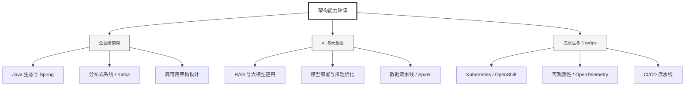

  <h1>你好，我是 Ellen Liu 👋</h1>
  

    <a href="README.md">English</a> | 
    <b>简体中文</b>
  

## 🧠 技术栈与核心能力

智能化企业系统建设路线图，涵盖全栈人工智能工程、云基础设施架构及模型部署等核心技术领域。

## 🚀 Highlighted 工作

- **开源 AI 项目**: [基于 BERT 的声明检测模型](https://huggingface.co/XiaojingEllen/bert-finetuned-claim-detection) (Apache-2.0)
  - *已被哥伦比亚大学 (UBC) 研究项目引用。*
  - *手写 Transformer 核心代码，以验证理论与工程的一致性。*
- **金融基础设施**: 从 0 到 1 构建数字银行支付中间件及智能保险理赔系统。

## 📑 每日论文速递 (ArXiv)
<!-- DAILY_ARXIV_SUMMARY_START -->
**更新日期: 2026-01-25**

### 1. [沙箱中的大语言模型激发通用智能体智能](http://arxiv.org/abs/2601.16206v1)
- **摘要**: 我们提出"沙盒内大语言模型"（LLM-in-Sandbox）方法，使大语言模型能够在代码沙盒（即虚拟计算机）中进行探索，从而激发其在非代码领域的通用智能。我们首先证明，无需额外训练的强大大语言模型已具备利用代码沙盒处理非代码任务的泛化能力。例如，大语言模型能自主访问外部资源获取新知识，利用文件系统处理长上下文，并执行脚本来满足格式要求。我们进一步发现，通过"沙盒内大语言模型强化学习"（LLM-in-Sandbox-RL）可以增强这些智能体能力——该方法仅使用非智能体数据来训练模型进行沙盒探索。实验表明，无论是免训练模式还是后训练模式，LLM-in-Sandbox在数学、物理、化学、生物医学、长上下文理解及指令遵循等任务中均展现出稳健的泛化性能。最后，我们从计算与系统视角分析了LLM-in-Sandbox的运行效率，并将其开源为Python软件包以促进实际应用部署。

### 2. [教育应用中的LLM提示评估](http://arxiv.org/abs/2601.16134v1)
- **摘要**: 随着大型语言模型在教育应用中的日益普及，亟需基于证据的方法来设计和评估能够生成个性化且符合教学目标的提示词。本研究提出了一种通用化、系统化的提示词评估方法，并通过分析结构化对话活动中LLM生成的后续问题进行实证演示。研究设计并测试了六种提示词模板，这些模板融合了成熟的提示工程模式，每种提示侧重不同的教学策略。

通过可适配于其他教育场景的锦标赛式评估框架，研究者对提示模板进行了比较。该评估采用Glicko2评分系统，由八位评审从格式规范性、对话支持度和学习者适配性三个维度对问题组进行评价。数据来源于三个独立教育场景中120组真实用户交互记录。

结果显示，强调策略性阅读的单一提示模板在成对比较中以81%至100%的胜率显著优于其他模板。该提示融合了角色设定与情境管理两种模式，旨在支持自我导向学习等元认知策略。本方法展示了教育技术研究者如何系统评估并改进提示设计，推动教育领域的提示工程从临时性实践转向基于证据的开发模式。

### 3. [通过语言特定模型合并提升训练效率并降低维护成本](http://arxiv.org/abs/2601.16127v1)
- **摘要**: 针对特定任务的多语言大语言模型（LLM）进行微调时，通常需要在包含所有目标语言样本的多语言数据集上训练模型。若要对已支持的一种或多种语言补充数据，或为新增语言添加支持，则需重新训练模型，这种操作不仅计算效率低下，还会造成严重的维护瓶颈。近期关于多语言多任务模型融合的研究虽在质量提升方面展现出潜力，但其计算效率与维护成本问题尚未得到充分探讨。本研究首次从效率角度对这种融合策略展开专项分析，并在三项独立任务中进行了评估。实验证明该方法在保持质量相当的同时能显著提升效率：融合策略可将初始训练时间缩短高达50%。研究还表明，在模型维护过程中，对单一语言进行更新后重新融合，相比重新训练完整多语言模型，能降低超过60%的训练成本。我们在公开数据集和行业专有数据集上均验证了这一结论，证实该方法不仅适用于学术界已有研究场景，同样能有效服务于工业级应用需求。

<!-- DAILY_ARXIV_SUMMARY_END -->

## 🌐 保持联系

  
<i>期待与您探讨 AI 基础设施的未来！</i>

