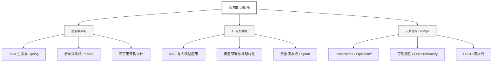

  <h1>你好，我是 Ellen Liu 👋</h1>
  

    <a href="README.md">English</a> | 
    <b>简体中文</b>
  

## 🧠 技术栈与核心能力

智能化企业系统建设路线图，涵盖全栈人工智能工程、云基础设施架构及模型部署等核心技术领域。

## 🚀 Highlighted 工作

- **开源 AI 项目**: [基于 BERT 的声明检测模型](https://huggingface.co/XiaojingEllen/bert-finetuned-claim-detection) (Apache-2.0)
  - *已被哥伦比亚大学 (UBC) 研究项目引用。*
  - *手写 Transformer 核心代码，以验证理论与工程的一致性。*
- **金融基础设施**: 从 0 到 1 构建数字银行支付中间件及智能保险理赔系统。

## 📑 每日论文速递 (ArXiv)
<!-- DAILY_ARXIV_SUMMARY_START -->
**更新日期: 2026-01-22**

### 1. [哪些推理轨迹能更好地教会学生推理？一种简单的信息对齐度量方法](http://arxiv.org/abs/2601.14249v1)
- **摘要**: 长链思维轨迹为从教师大语言模型向学生模型提炼推理能力提供了丰富的监督信号。然而，先前研究及我们的实验均表明，来自更强教师的轨迹未必能培养出更优秀的学生模型，这凸显了数据与学生模型适配性在知识蒸馏中的重要性。现有方法主要通过学生模型的似然度评估适配性，倾向于选择与模型当前行为高度一致的轨迹，却忽略了信息量更丰富的样本。针对这一问题，我们提出排序-惊异比这一简洁指标，它能同时捕捉对齐度和信息量，从而评估推理轨迹的适配性。该指标的提出基于以下观察：有效轨迹通常具备双重特征——在学生模型下既呈现较低的绝对概率，又对应相对高排名的词元，从而在信号强度与行为对齐间取得平衡。具体而言，排序-惊异比定义为轨迹在词元层面的平均排序与平均负对数似然之比，其计算与解释均十分直观。在涵盖五种学生模型和来自11位不同教师推理轨迹的实验中，该指标与训练后性能表现出强相关性（平均斯皮尔曼系数达0.86），优于现有评估指标。我们进一步展示了该指标在轨迹筛选和教师选择两个场景中的实际应用价值。

### 2. [Jet-RL：通过统一训练与部署精度流程实现基于策略的FP8强化学习](http://arxiv.org/abs/2601.14243v1)
- **摘要**: 强化学习（RL）对于提升大语言模型（LLM）的复杂推理能力至关重要。然而，现有的RL训练流程存在计算效率低、资源消耗大的问题，其中推演阶段占用了总训练时间的70%以上。量化RL训练，尤其是采用FP8精度，为解决这一瓶颈提供了可行路径。当前普遍采用的策略是在推演阶段使用FP8精度，同时在训练阶段保留BF16精度。本研究首次对FP8 RL训练进行了全面分析，并证明这种广泛使用的"BF16训练+FP8推演"策略在长序列推演和复杂任务中会出现严重的训练不稳定性和灾难性精度崩溃。分析表明，这些失败源于该方法的离策略特性，导致训练与推理之间存在显著的数值不匹配。基于这些发现，我们提出了Jet-RL——一个能够实现稳健稳定RL优化的FP8训练框架。其核心思想是采用统一的FP8精度流程同时处理训练和推演，从而最大限度减少数值差异，并消除低效的跨步骤校准需求。大量实验验证了Jet-RL的有效性：我们的方法在推演阶段实现了最高33%的加速，在训练阶段实现最高41%的加速，相比BF16训练获得16%的端到端加速，同时在所有设置下保持稳定收敛，且精度损失可忽略不计。

### 3. [APEX智能体](http://arxiv.org/abs/2601.14242v1)
- **摘要**: 我们推出面向智能体的AI生产力指数（APEX-Agents），这是一个用于评估AI智能体能否执行由投行分析师、管理顾问和企业律师创建的跨应用长周期任务的基准测试体系。APEX-Agents要求智能体在包含真实文件与工具的工作环境中进行操作。我们采用Pass@1指标对八个智能体进行排行榜测试，其中Gemini 3 Flash（思考模式=高）以24.0%得分位居榜首，紧随其后的是GPT-5.2（思考模式=高）、Claude Opus 4.5（思考模式=高）和Gemini 3 Pro（思考模式=高）。现开源APEX-Agents基准测试集（样本量=480），包含全部提示模板、评估标准、标准答案、相关文件及元数据。同时开源智能体执行与评估基础设施Archipelago。

<!-- DAILY_ARXIV_SUMMARY_END -->

## 🌐 保持联系

  
<i>期待与您探讨 AI 基础设施的未来！</i>

