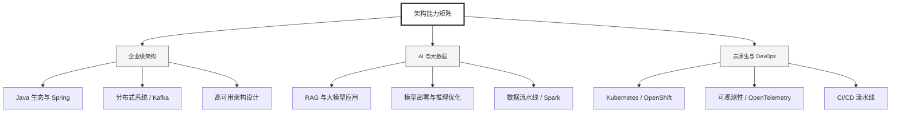

  <h1>你好，我是 Ellen Liu 👋</h1>
  

    <a href="README.md">English</a> | 
    <b>简体中文</b>
  

## 🧠 技术栈与核心能力

智能化企业系统建设路线图，涵盖全栈人工智能工程、云基础设施架构及模型部署等核心技术领域。

## 🚀 Highlighted 工作

- **开源 AI 项目**: [基于 BERT 的声明检测模型](https://huggingface.co/XiaojingEllen/bert-finetuned-claim-detection) (Apache-2.0)
  - *已被哥伦比亚大学 (UBC) 研究项目引用。*
  - *手写 Transformer 核心代码，以验证理论与工程的一致性。*
- **金融基础设施**: 从 0 到 1 构建数字银行支付中间件及智能保险理赔系统。

## 📑 每日论文速递 (ArXiv)
<!-- DAILY_ARXIV_SUMMARY_START -->
**更新日期: 2026-02-02**

### 1. [RedSage：网络安全通才大语言模型](http://arxiv.org/abs/2601.22159v1)
- **摘要**: 网络安全运营需要能够支持多样化工作流程且不暴露敏感数据的辅助性大语言模型。现有解决方案要么依赖存在隐私风险的专有API，要么采用缺乏领域适应性的开源模型。为弥补这一缺口，我们通过大规模网络过滤和人工收集高质量资源，构建了包含118亿标记的网络安全领域持续预训练数据集，涵盖框架、攻击技术和安全工具等28.6万份文档。在此基础上，我们设计了智能增强流程，通过模拟专家工作流生成了26.6万条多轮对话式网络安全样本用于监督微调。结合通用开源大语言模型数据，这些资源成功训练出RedSage——一个具备领域感知预训练与后训练能力、可本地部署的开源网络安全助手。为系统评估模型性能，我们推出RedSage-Bench基准测试，包含3万道选择题和240道开放式问答题，覆盖网络安全知识、技能与工具专长。RedSage还在既有网络安全基准（如CTI-Bench、CyberMetric、SECURE）及通用大语言模型基准上接受进一步评估，以检验其泛化能力。在80亿参数规模下，RedSage持续取得更优结果：在网络安全基准测试中超越基线模型最高达5.59分，在Open LLM Leaderboard任务中提升达5.05分。这些发现表明，领域感知的智能增强与预/后训练不仅能提升网络安全专业能力，还有助于增强通用推理与指令遵循能力。所有模型、数据集及代码均已开源发布。

### 2. [UEval：统一多模态生成基准测试平台](http://arxiv.org/abs/2601.22155v1)
- **摘要**: 我们推出UEval，一个用于评估统一模型（即能够同时生成图像和文本的模型）的基准测试。UEval包含1,000个由专家精心设计的问题，这些问题要求模型输出中同时包含图像和文本，这些问题来源于8个真实世界任务。我们设计的问题涵盖了广泛的推理类型，从分步指南到教科书式解释。评估开放式多模态生成并非易事，因为简单的“以LLM为评判者”的方法可能会忽略其中的微妙之处。与以往依赖多模态大语言模型（MLLMs）来评估图像质量或文本准确性的研究不同，我们在UEval中设计了一个基于评分标准的打分系统。针对每个问题，我们会向MLLM提供参考图像和文本答案，以生成一个包含多个评估标准的初始评分标准，随后由人类专家对这些标准进行细化和验证。UEval总共包含10,417个经过验证的评分标准，实现了可扩展且细粒度的自动评分。UEval对当前统一模型具有挑战性：GPT-5-Thinking的得分仅为66.4（满分100），而最佳开源模型仅达到49.1。我们观察到，推理模型通常优于非推理模型，并且将推理轨迹从推理模型迁移到非推理模型可以显著缩小两者之间的差距。这表明，对于需要复杂多模态理解和生成的任务，推理能力可能至关重要。

### 3. [探索智能体推理奖励模型](http://arxiv.org/abs/2601.22154v1)
- **摘要**: 智能体强化学习（Agentic RL）在实现智能体进行复杂推理与工具使用方面已取得显著成功。然而，现有方法大多仍依赖稀疏的结果型奖励进行训练。此类反馈无法区分中间推理过程的质量，导致训练效果欠佳。本文提出**智能体推理奖励模型（Agent-RRM）**——一种多维度奖励模型，可为智能体行为轨迹提供结构化反馈，包括：（1）显式推理轨迹，（2）聚焦式评析（通过突出推理缺陷提供改进指导），以及（3）评估过程整体表现的综合性评分。基于这些反馈信号，我们系统研究了三种集成策略：Reagent-C（文本增强优化）、Reagent-R（奖励增强引导）和Reagent-U（统一反馈集成）。在涵盖12个多样化基准测试的广泛评估中，Reagent-U实现了性能的跨越式提升，在GAIA基准上达到43.7%，在WebWalkerQA基准上达到46.2%，验证了所提推理奖励模型与训练方案的有效性。我们已公开代码、模型与数据集，以促进后续研究。

<!-- DAILY_ARXIV_SUMMARY_END -->

## 🌐 保持联系

  
<i>期待与您探讨 AI 基础设施的未来！</i>

