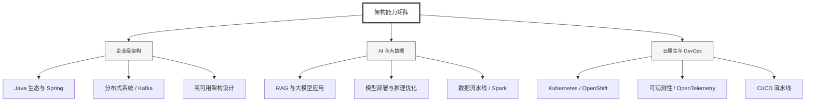

  <h1>你好，我是 Ellen Liu 👋</h1>
  

    <a href="README.md">English</a> | 
    <b>简体中文</b>
  

## 🧠 技术栈与核心能力

智能化企业系统建设路线图，涵盖全栈人工智能工程、云基础设施架构及模型部署等核心技术领域。

## 🚀 Highlighted 工作

- **开源 AI 项目**: [基于 BERT 的声明检测模型](https://huggingface.co/XiaojingEllen/bert-finetuned-claim-detection) (Apache-2.0)
  - *已被哥伦比亚大学 (UBC) 研究项目引用。*
  - *手写 Transformer 核心代码，以验证理论与工程的一致性。*
- **金融基础设施**: 从 0 到 1 构建数字银行支付中间件及智能保险理赔系统。

## 📑 每日论文速递 (ArXiv)
<!-- DAILY_ARXIV_SUMMARY_START -->
**更新日期: 2026-01-11**

### 1. [LELA：一种基于大语言模型的实体链接方法，具备零样本领域自适应能力](http://arxiv.org/abs/2601.05192v1)
- **摘要**: 实体链接（将文本中的歧义指称映射到知识库中的实体）是知识图谱构建、问答和信息抽取等任务的基础步骤。我们提出的LELA方法采用模块化的由粗到精处理流程，充分利用大语言模型的能力，无需任何微调阶段即可适配不同目标领域、知识库和大语言模型。在多种实体链接场景下的实验表明，LELA与经过微调的方法相比具有高度竞争力，并显著优于未经微调的方法。

### 2. [大语言模型在自我消耗式表演循环中的偏见观察与矫正措施](http://arxiv.org/abs/2601.05184v1)
- **摘要**: 大型语言模型（LLM）的快速发展引发了人们对使用合成数据训练未来模型的日益关注。然而，这形成了一个自我消耗的再训练循环——模型基于自身输出进行训练，可能导致性能下降并诱发新兴偏见。在实际应用中，先前部署的LLM可能影响其生成的数据，从而形成由用户反馈驱动的动态系统。例如，若模型持续对某一用户群体服务不足，从该特定人群收集的查询数据就会减少。本研究提出**自我消耗式表现循环**（SCPL）的概念，并在受控表现反馈条件下，探究合成数据在这些动态迭代训练过程中对偏见形成的影响。这一受控实验设计源于动态生产系统中真实用户偏好数据的难以获取性，使我们能够以系统化方式分离和分析反馈驱动的偏见演化过程。我们聚焦于两种循环类型：典型的再训练场景和尚未被充分探索的增量微调场景。通过在三个实际任务上的实验，我们发现表现循环会增强偏好偏见，同时降低差异性偏见。为此我们设计了一种基于奖励的拒绝采样策略来缓解偏见，推动自改进系统向更可信的方向发展。

### 3. [由内而外：面向长期个性化对话系统的用户中心核心记忆树演进](http://arxiv.org/abs/2601.05171v1)
- **摘要**: 现有长期个性化对话系统难以在无限交互流与有限上下文约束间取得平衡，常受困于记忆噪声累积、推理能力退化及人设一致性缺失等问题。为应对这些挑战，本文提出"由内向外"框架，通过全局维护的PersonaTree作为长期用户画像载体。该框架通过初始模式约束主干结构并动态更新枝叶，实现可控生长的记忆压缩与一致性保持。此外，我们通过基于过程的强化学习奖励机制训练轻量化记忆监听器，生成结构化、可执行、可解释的{添加、更新、删除、无操作}指令，从而支撑个性化树结构的动态演进。在响应生成阶段，PersonaTree可直接用于提升时延敏感场景的输出质量；当用户需要更多细节时，系统将触发代理模式，在PersonaTree约束下按需引入细节信息。实验表明，PersonaTree在抑制上下文噪声和保持人设一致性方面，优于全文拼接及多种个性化记忆系统。值得注意的是，小型记忆监听器模型在记忆操作决策性能上，已达到甚至超越DeepSeek-R1-0528和Gemini-3-Pro等强大推理模型的表现。

<!-- DAILY_ARXIV_SUMMARY_END -->

## 🌐 保持联系

  
<i>期待与您探讨 AI 基础设施的未来！</i>

