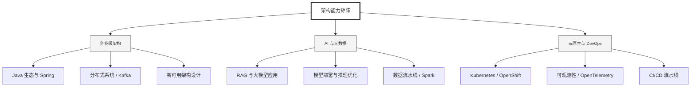

  <h1>你好，我是 Ellen Liu 👋</h1>
  

    <a href="README.md">English</a> | 
    <b>简体中文</b>
  

## 🧠 技术栈与核心能力

智能化企业系统建设路线图，涵盖全栈人工智能工程、云基础设施架构及模型部署等核心技术领域。

```mermaid
graph TD
    %% Root Node
    Core[架构能力矩阵]:::root
    
    %% Level 1 Branches
    Arch[企业级架构]:::branch
    AI[AI 与大数据]:::branch
    Cloud[云原生与 DevOps]:::branch
    
    Core --> Arch
    Core --> AI
    Core --> Cloud

    %% Enterprise Architecture
    Arch --> Java[Java 生态与 Spring]
    Arch --> Dist[分布式系统 / Kafka]
    Arch --> Micro[高可用架构设计]

    %% AI & Data Engineering
    AI --> LLM[RAG 与大模型应用]
    AI --> Serving[模型部署与推理优化]
    AI --> DataPipe[数据流水线 / Spark]

    %% Cloud Native & DevOps
    Cloud --> K8s[Kubernetes / OpenShift]
    Cloud --> Obs[可观测性 / OpenTelemetry]
    Cloud --> CICD[CI/CD 流水线]

    %% Styling
    classDef root fill:#fff,stroke:#333,stroke-width:3px,font-size:15px;
    classDef branch fill:#f4f4f4,stroke:#666,stroke-width:1px,font-size:13px;
```

## 🚀 Highlighted 工作

- **开源 AI 项目**: [基于 BERT 的声明检测模型](https://huggingface.co/XiaojingEllen/bert-finetuned-claim-detection) (Apache-2.0)
  - *已被哥伦比亚大学 (UBC) 研究项目引用。*
  - *手写 Transformer 核心代码，以验证理论与工程的一致性。*
- **金融基础设施**: 从 0 到 1 构建数字银行支付中间件及智能保险理赔系统。

## 📑 每日论文速递 (ArXiv)
<!-- DAILY_ARXIV_SUMMARY_START -->
**更新日期: 2026-05-31**

### 1. [LLMSurgeon：诊断大型语言模型的数据混合](http://arxiv.org/abs/2605.30348v1)
- **摘要**: 大型语言模型（LLM）的预训练数据混合构成了其"数字DNA"，塑造了模型的行为模式、能力边界与失效机制。然而这种数据构成极少被公开披露，导致事后追溯数据组合或来源变得困难。本研究正式提出$\textbf{数据混合手术（DMS）}$：仅通过目标LLM生成的文本，在预设分类体系下估算其预训练语料的领域级分布。我们提出$\textbf{LLMSurgeon}$这一强大框架，将DMS建模为标签偏移假设下的逆问题。不同于直接聚合分类器输出，LLMSurgeon通过估计经过校准的$\textit{软}$混淆矩阵，求解带约束的逆问题以修正系统性领域混淆，从而恢复潜在混合先验。为评估效果，我们引入$\textbf{LLMScan}$——基于预训练混合信息透明的开源LLM构建的可验证评估套件。在LLMScan的固定协议测试中，LLMSurgeon能以高保真度恢复领域混合比例。本研究提供了一种无需访问训练数据即可审计基础模型数字DNA的实用事后方法。

### 2. [SchGen：基于语义驱动代码表示的PCB原理图生成](http://arxiv.org/abs/2605.30345v1)
- **摘要**: 印刷电路板（PCB）原理图设计几乎定义了所有电子硬件，但该过程仍依赖人工且需要高度专业知识。尽管生成式AI已推动数字与模拟集成电路设计取得进展，但基于自然语言意图生成PCB原理图的研究仍基本空白。本文提出SchGen——首个能根据自然语言请求生成可编辑PCB原理图的大语言模型。核心挑战在于缺乏适配LLM的表示方法与大规模数据集。现有原理图格式以冗长、工具特定的语法和几何密集型描述为主导，导致难以可靠生成。我们引入一种基于语义的代码表示方法，通过相对布局与引脚名接线编码原理图编辑基元，将几何驱动生成问题转化为适合LLM的语义驱动匹配任务。进一步通过人机协作流水线将开源硬件设计转化为我们的表示形式，构建了包含PCB原理图及用户提示的大规模数据集。实验表明，SchGen在线路连接准确性与功能正确性上显著优于替代表示方法乃至更大规模的通用LLM。研究结果凸显了表示设计在赋能复杂硬件设计任务的生成模型中的关键作用。

### 3. [局部连贯，全局不连贯：多组件LLM代理中的组合不连贯性界定](http://arxiv.org/abs/2605.30335v1)
- **摘要**: 多组件LLM智能体从各自仅能观察到联合问题部分信息的组件中组装概率性断言；即便每个组件局部一致，这种组合仍可能违反基本概率公理。我们通过组合残差eps*（即组合断言到联合一致多面体的L2距离）形式化描述这种局部一致而全局不一致的失效模式，该指标可在运行时根据系统输出与声明的跨组件耦合约束计算。乘积结构二分法刻画了局部一致性何时足够，而瑞利商预测在四类关系中的三类上，观测残差与预测值的偏差在7%以内。层次化Boyle-Dykstra投影可确定性修复组合结果；任意有效的e过程提供序列一致性监控。在四LLM中端面板（前沿面板结果见5.5节）的1,876个集成团上，33-94%的团存在eps*>0，在比例分配规则下，这导致1,770个已结算赌注中每注产生+0.115纳特的遗憾增益（当赌注本身进行一致性修正时，该增益骤降至+0.006）。三种直观的LLM端缓解措施（检索、分区感知提示、聚合器LLM）均告失败或出现性能倒退。

<!-- DAILY_ARXIV_SUMMARY_END -->

## 🌐 保持联系

  
<i>期待与您探讨 AI 基础设施的未来！</i>

