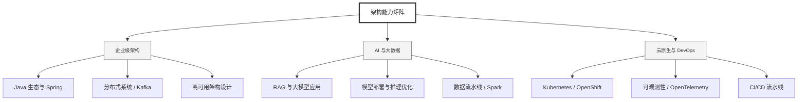

  <h1>你好，我是 Ellen Liu 👋</h1>
  

    <a href="README.md">English</a> | 
    <b>简体中文</b>
  

## 🧠 技术栈与核心能力

智能化企业系统建设路线图，涵盖全栈人工智能工程、云基础设施架构及模型部署等核心技术领域。

```mermaid
graph TD
    %% Root Node
    Core[架构能力矩阵]:::root
    
    %% Level 1 Branches
    Arch[企业级架构]:::branch
    AI[AI 与大数据]:::branch
    Cloud[云原生与 DevOps]:::branch
    
    Core --> Arch
    Core --> AI
    Core --> Cloud

    %% Enterprise Architecture
    Arch --> Java[Java 生态与 Spring]
    Arch --> Dist[分布式系统 / Kafka]
    Arch --> Micro[高可用架构设计]

    %% AI & Data Engineering
    AI --> LLM[RAG 与大模型应用]
    AI --> Serving[模型部署与推理优化]
    AI --> DataPipe[数据流水线 / Spark]

    %% Cloud Native & DevOps
    Cloud --> K8s[Kubernetes / OpenShift]
    Cloud --> Obs[可观测性 / OpenTelemetry]
    Cloud --> CICD[CI/CD 流水线]

    %% Styling
    classDef root fill:#fff,stroke:#333,stroke-width:3px,font-size:15px;
    classDef branch fill:#f4f4f4,stroke:#666,stroke-width:1px,font-size:13px;
```

## 🚀 Highlighted 工作

- **开源 AI 项目**: [基于 BERT 的声明检测模型](https://huggingface.co/XiaojingEllen/bert-finetuned-claim-detection) (Apache-2.0)
  - *已被哥伦比亚大学 (UBC) 研究项目引用。*
  - *手写 Transformer 核心代码，以验证理论与工程的一致性。*
- **金融基础设施**: 从 0 到 1 构建数字银行支付中间件及智能保险理赔系统。

## 📑 每日论文速递 (ArXiv)
<!-- DAILY_ARXIV_SUMMARY_START -->
**更新日期: 2026-02-26**

### 1. [Aletheia自主攻克FirstProof。](http://arxiv.org/abs/2602.21201v1)
- **摘要**: 我们报告了基于Gemini 3 Deep Think驱动的数学研究智能体Aletheia（Feng等人，2026b）在首届FirstProof挑战赛中的表现。在挑战赛规定的时间范围内，根据多数专家评估，Aletheia自主解决了10道题目中的6道（第2、5、7、8、9、10题）；需要说明的是，仅在第8题上专家意见未达成一致。为保持完全透明，我们阐述了自身对FirstProof的理解，并公开了实验细节与评估方法。原始提示词及输出结果可在https://github.com/google-deepmind/superhuman/tree/main/aletheia 查看。

### 2. [从试错中学习：具身大语言模型的反思性测试时规划](http://arxiv.org/abs/2602.21198v1)
- **摘要**: 具身大语言模型赋予机器人高层次的任务推理能力，但它们无法反思错误原因，导致部署过程成为一系列独立试错——错误不断重复而非转化为经验积累。受人类反思实践者启发，我们提出反射式测试时规划框架，融合两种反思模式：其一是"行动中反思"，智能体在行动前通过测试时扩展生成多个候选动作，并利用内部反思进行评分；其二是"行动后反思"，通过测试时训练，在执行后根据外部反馈同时更新内部反思模型与行动策略。我们还引入追溯性反思机制，使智能体能重新评估早期决策，并基于事后认知进行模型更新，实现有效的长周期信用分配。在新设计的长周期家庭任务基准与MuJoCo柜体装配基准上的实验表明，该方法显著超越基线模型，消融研究验证了行动中反思与行动后反思的互补作用。包含真实机器人试验的定性分析，进一步揭示了通过反思实现行为修正的过程。

### 3. [论数据工程在扩展大型语言模型终端能力中的作用](http://arxiv.org/abs/2602.21193v1)
- **摘要**: 尽管大型语言模型的终端能力近期取得了快速进展，但顶尖终端智能体背后的训练数据策略仍基本处于未公开状态。我们通过系统研究终端智能体的数据工程实践来填补这一空白，并做出两项关键贡献：(1) Terminal-Task-Gen——一个支持基于种子和基于技能的任务构建的轻量级合成任务生成流水线；(2) 对数据与训练策略的全面分析，包括数据过滤、课程学习、长上下文训练及扩展行为研究。我们的流水线产出了Terminal-Corpus——一个面向终端任务的大规模开源数据集。基于该数据集，我们训练了从Qwen3(8B, 14B, 32B)初始化的Nemotron-Terminal系列模型，在Terminal-Bench 2.0基准测试中取得显著提升：Nemotron-Terminal-8B从2.5%提升至13.0%，Nemotron-Terminal-14B从4.0%提升至20.2%，Nemotron-Terminal-32B从3.4%提升至27.4%，其性能已与规模显著更大的模型相当。为加速该领域研究，我们在https://huggingface.co/collections/nvidia/nemotron-terminal开源了模型检查点及大部分合成数据集。

<!-- DAILY_ARXIV_SUMMARY_END -->

## 🌐 保持联系

  
<i>期待与您探讨 AI 基础设施的未来！</i>

