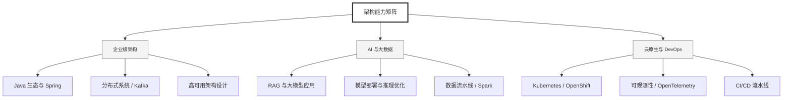

  <h1>你好，我是 Ellen Liu 👋</h1>
  

    <a href="README.md">English</a> | 
    <b>简体中文</b>
  

## 🧠 技术栈与核心能力

智能化企业系统建设路线图，涵盖全栈人工智能工程、云基础设施架构及模型部署等核心技术领域。

```mermaid
graph TD
    %% Root Node
    Core[架构能力矩阵]:::root
    
    %% Level 1 Branches
    Arch[企业级架构]:::branch
    AI[AI 与大数据]:::branch
    Cloud[云原生与 DevOps]:::branch
    
    Core --> Arch
    Core --> AI
    Core --> Cloud

    %% Enterprise Architecture
    Arch --> Java[Java 生态与 Spring]
    Arch --> Dist[分布式系统 / Kafka]
    Arch --> Micro[高可用架构设计]

    %% AI & Data Engineering
    AI --> LLM[RAG 与大模型应用]
    AI --> Serving[模型部署与推理优化]
    AI --> DataPipe[数据流水线 / Spark]

    %% Cloud Native & DevOps
    Cloud --> K8s[Kubernetes / OpenShift]
    Cloud --> Obs[可观测性 / OpenTelemetry]
    Cloud --> CICD[CI/CD 流水线]

    %% Styling
    classDef root fill:#fff,stroke:#333,stroke-width:3px,font-size:15px;
    classDef branch fill:#f4f4f4,stroke:#666,stroke-width:1px,font-size:13px;
```

## 🚀 Highlighted 工作

- **开源 AI 项目**: [基于 BERT 的声明检测模型](https://huggingface.co/XiaojingEllen/bert-finetuned-claim-detection) (Apache-2.0)
  - *已被哥伦比亚大学 (UBC) 研究项目引用。*
  - *手写 Transformer 核心代码，以验证理论与工程的一致性。*
- **金融基础设施**: 从 0 到 1 构建数字银行支付中间件及智能保险理赔系统。

## 📑 每日论文速递 (ArXiv)
<!-- DAILY_ARXIV_SUMMARY_START -->
**更新日期: 2026-07-02**

### 1. [QVal：低成本评估长周期LLM智能体的密集监督信号](http://arxiv.org/abs/2606.32034v1)
- **摘要**: 随着大语言模型（LLM）智能体越来越多地执行长周期任务（单个轨迹可能包含数百甚至数千个动作），仅依赖结果奖励的监督方式因过于稀疏而失效——它无法有效评估中间动作的优劣。密集监督方法通过为中间步骤评分来解决这一问题，其评分依据涵盖内在置信度、自蒸馏机制及嵌入相似度等多种维度。然而，当前评估这些方法的常规做法是衡量整合该方法的训练流程的最终性能，这不仅成本高昂，更将监督质量与训练工程中的混杂因素混为一谈，导致需要不同训练配置的方法论流派之间缺乏可比性。因此，密集监督方法始终缺乏统一的基准测试平台。

我们提出QVal——一个无需训练的测试平台，可直接评估密集监督信号的质量。对于给定的状态-动作对，QVal通过衡量方法评分与Q值的对齐程度（即能否按照强参考策略的Q值对动作进行排序），实现在任何训练运行前比较不同监督信号，并将信号质量与其他工程选择解耦。我们以QVal-v1.0版本实例化该平台，在四个多样化环境、七个方法论流派中基准测试了21种密集监督方法，跨越六个开放权重模型骨干网络执行超过1200次评估实验。研究发现：简单的提示基线方法始终优于文献中最新提出的密集监督方法，且不同方法流派呈现显著聚类特征。这些结论在模型规模、环境类型及观测模态维度均保持稳健。QVal设计具有高度可扩展性，支持研究者无需训练即可迭代优化密集监督方法。

### 2. [元认知反馈强化学习激发大语言模型中的忠实不确定性表达](http://arxiv.org/abs/2606.32032v1)
- **摘要**: 元认知是智能的关键组成部分，描述了个体监控和调节自身认知过程的能力。然而，大语言模型在核心元认知功能上存在系统性缺陷：它们以高置信度产生幻觉、无法识别知识边界、错误表征内部不确定性——这削弱了可信度与可靠性。由于监控任务表现并据此调整行为是元认知的核心，我们认为能够准确判断自身表现的模型更有可能提升其表现。我们通过两种新机制实现这一理念：基于元认知反馈的强化学习（RLMF），这是一种在偏好优化过程中根据模型自我判断质量改进补全排序的范式；以及元认知数据选择，该方法利用类似的自我判断识别高价值训练样本，其效果优于朴素主动学习。我们将这些创新应用于忠实校准（FC）任务——该任务本身具有根本性的元认知特性：目标在于使表达的不确定性与内在不确定性对齐，即使前沿大语言模型也难以完成。我们采用两阶段解耦方法：首先使用这些方法校准模型自报置信度分数的忠实性，随后通过定向输出编辑将其映射为自然且适应上下文的语言不确定性。大量实验表明，RLMF在保持准确性的同时，能在多样化任务中实现可泛化的最优FC性能。此外，RLMF相比标准强化学习提升高达63%，同时增强了模型评估和表达自身能力边界的能力。这使得RLMF成为增强大语言模型元认知能力以提升性能与对齐度的有前景范式，并表明元认知表现可作为有效强化学习信号，克服先前内在反馈方法的局限性。

### 3. [当大语言模型粗心阅读表格时：测量与减少数据引用错误](http://arxiv.org/abs/2606.32029v1)
- **摘要**: 尽管大型语言模型（LLMs）在表格任务中表现良好，但在理解表格结构的前提下，仍会出现数据引用错误（DREs），即错误引用或遗漏表格中的数值。除了最终答案的准确性，DREs还会直接损害中间推理步骤的正确性和可靠性。然而，此前的研究仅提供了有限的小规模分析。在本研究中，我们首次对不同模型和任务中的表格数据引用错误进行了系统性评估。结果显示，所有测试模型（参数规模从1.7B到20B）均存在DREs。此外，我们证明，通过基于批评机制的过滤和拒绝采样，将数据引用作为批评信号纳入模型，可将答案准确率提升高达12.0%。最后，我们训练了一个轻量级4B参数批评模型，该模型在检测分布内和分布外DREs时平均F1分数达到78.2%，并能有效辅助更大规模模型的推理过程。

<!-- DAILY_ARXIV_SUMMARY_END -->

## 🌐 保持联系

  
<i>期待与您探讨 AI 基础设施的未来！</i>

