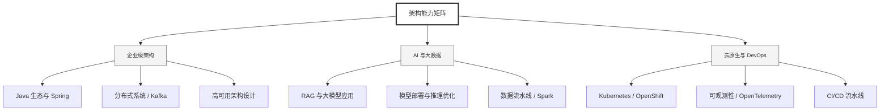

  <h1>你好，我是 Ellen Liu 👋</h1>
  

    <a href="README.md">English</a> | 
    <b>简体中文</b>
  

## 🧠 技术栈与核心能力

智能化企业系统建设路线图，涵盖全栈人工智能工程、云基础设施架构及模型部署等核心技术领域。

```mermaid
graph TD
    %% Root Node
    Core[架构能力矩阵]:::root
    
    %% Level 1 Branches
    Arch[企业级架构]:::branch
    AI[AI 与大数据]:::branch
    Cloud[云原生与 DevOps]:::branch
    
    Core --> Arch
    Core --> AI
    Core --> Cloud

    %% Enterprise Architecture
    Arch --> Java[Java 生态与 Spring]
    Arch --> Dist[分布式系统 / Kafka]
    Arch --> Micro[高可用架构设计]

    %% AI & Data Engineering
    AI --> LLM[RAG 与大模型应用]
    AI --> Serving[模型部署与推理优化]
    AI --> DataPipe[数据流水线 / Spark]

    %% Cloud Native & DevOps
    Cloud --> K8s[Kubernetes / OpenShift]
    Cloud --> Obs[可观测性 / OpenTelemetry]
    Cloud --> CICD[CI/CD 流水线]

    %% Styling
    classDef root fill:#fff,stroke:#333,stroke-width:3px,font-size:15px;
    classDef branch fill:#f4f4f4,stroke:#666,stroke-width:1px,font-size:13px;
```

## 🚀 Highlighted 工作

- **开源 AI 项目**: [基于 BERT 的声明检测模型](https://huggingface.co/XiaojingEllen/bert-finetuned-claim-detection) (Apache-2.0)
  - *已被哥伦比亚大学 (UBC) 研究项目引用。*
  - *手写 Transformer 核心代码，以验证理论与工程的一致性。*
- **金融基础设施**: 从 0 到 1 构建数字银行支付中间件及智能保险理赔系统。

## 📑 每日论文速递 (ArXiv)
<!-- DAILY_ARXIV_SUMMARY_START -->
**更新日期: 2026-06-24**

### 1. [随机化YaRN提升长上下文推理的长度泛化能力](http://arxiv.org/abs/2606.23687v1)
- **摘要**: 大型语言模型（LLMs）通常基于短序列进行预训练，随后通过额外训练扩展至长序列处理。然而，这类模型在进一步泛化至超长序列时仍存在困难。我们提出随机YaRN方法，通过结合基于YaRN的位置外推、随机位置编码与长度课程训练，提升长度泛化能力。在短上下文数据训练阶段，模型被分配从更大位置范围采样的YaRN位置编码，即使处理短上下文输入也能暴露于分布外位置表征。我们在两个具有挑战性的长上下文推理基准（BABILong与多轮共指消解MRCR）上评估了随机YaRN。当使用<8K上下文数据训练时，随机YaRN在16K至128K上下文长度范围内持续提升推理性能，且显著优于标准微调方法，其中最大增益出现在远距离分布外长度场景。实验结果表明，逐步暴露模型于分布外位置分布，为实现可泛化的长上下文推理提供了有效方案。

### 2. [大型语言模型能否可靠地自我报告对抗性预填充，以及如何实现？](http://arxiv.org/abs/2606.23671v1)
- **摘要**: 先前研究表明，大型语言模型（LLMs）在良性任务中展现出内省能力。本研究将这一议题延伸至安全领域，探究模型能否可靠识别自身先前回应系由对抗性前缀攻击所引发。在十个开放权重的指令微调LLM（参数规模从3B到70B）及四个安全基准测试中，没有任何模型能可靠识别自身受损输出，模型对预填充响应声称存在意图的平均比率达27.3%。内省信号主要源于安全相关推理与拒绝机制。将模型权重与拒绝方向正交化后，预填充输出与自然输出的声称率差距近乎归零，但该方向并非唯一中介因素。信号还呈现探测依赖性：针对相同模型，将问题框架设定为内部意图与外部篡改会引发性质迥异的响应。我们在8个参数规模3B至27B的模型上测试了三种LoRA微调方法（SFT、GRPO、DPO），所有方法均使8B至27B模型的意图探测差距扩大，方法排名因模型而异。该干预措施无法迁移至篡改探测任务，且反直觉地提升了多数模型在对抗性前缀攻击下的成功率，仅构成部分缓解效果。这些发现揭示了安全语境下内省信号的潜在机制，并凸显了LLM自我报告可靠性的风险。

### 3. [EnterpriseClawBench：基于真实工作场景的智能体基准测试](http://arxiv.org/abs/2606.23654v1)
- **摘要**: 企业级智能体越来越多地在工作空间内运行：它们读取异构文件、调用工具并交付业务工件。我们提出EnterpriseClawBench，一个基于专有真实智能体会话构建的企业级智能体基准测试。从大规模工作场所会话档案出发，EnterpriseClawBench生成了852个可复现任务，每个任务都配有恢复的测试夹具、重写的提示词、角色分类、技能子类、硬性规则和语义评估标准。由于这些会话包含企业内部内容，我们不会公开基准数据；相反，我们可复用的贡献在于构建与评估协议。在EnterpriseClawBench上，最佳配置仅达到0.663分（Codex搭配GPT-5.5）。这些结果表明，企业级智能体评估必须报告测试框架与模型组合、工件交付、视觉质量、成本、运行时以及技能迁移行为，而非将性能简化为单一分数。代码：https://github.com/FrontisAI/EnterpriseClawBench

<!-- DAILY_ARXIV_SUMMARY_END -->

## 🌐 保持联系

  
<i>期待与您探讨 AI 基础设施的未来！</i>

