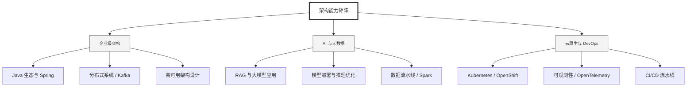

  <h1>你好，我是 Ellen Liu 👋</h1>
  

    <a href="README.md">English</a> | 
    <b>简体中文</b>
  

## 🧠 技术栈与核心能力

智能化企业系统建设路线图，涵盖全栈人工智能工程、云基础设施架构及模型部署等核心技术领域。

```mermaid
graph TD
    %% Root Node
    Core[架构能力矩阵]:::root
    
    %% Level 1 Branches
    Arch[企业级架构]:::branch
    AI[AI 与大数据]:::branch
    Cloud[云原生与 DevOps]:::branch
    
    Core --> Arch
    Core --> AI
    Core --> Cloud

    %% Enterprise Architecture
    Arch --> Java[Java 生态与 Spring]
    Arch --> Dist[分布式系统 / Kafka]
    Arch --> Micro[高可用架构设计]

    %% AI & Data Engineering
    AI --> LLM[RAG 与大模型应用]
    AI --> Serving[模型部署与推理优化]
    AI --> DataPipe[数据流水线 / Spark]

    %% Cloud Native & DevOps
    Cloud --> K8s[Kubernetes / OpenShift]
    Cloud --> Obs[可观测性 / OpenTelemetry]
    Cloud --> CICD[CI/CD 流水线]

    %% Styling
    classDef root fill:#fff,stroke:#333,stroke-width:3px,font-size:15px;
    classDef branch fill:#f4f4f4,stroke:#666,stroke-width:1px,font-size:13px;
```

## 🚀 Highlighted 工作

- **开源 AI 项目**: [基于 BERT 的声明检测模型](https://huggingface.co/XiaojingEllen/bert-finetuned-claim-detection) (Apache-2.0)
  - *已被哥伦比亚大学 (UBC) 研究项目引用。*
  - *手写 Transformer 核心代码，以验证理论与工程的一致性。*
- **金融基础设施**: 从 0 到 1 构建数字银行支付中间件及智能保险理赔系统。

## 📑 每日论文速递 (ArXiv)
<!-- DAILY_ARXIV_SUMMARY_START -->
**更新日期: 2026-05-07**

### 1. [在临床大语言模型中，安全性与准确性遵循不同的扩展规律。](http://arxiv.org/abs/2605.04039v1)
- **摘要**: 临床大语言模型通常通过增加模型规模、上下文长度、检索复杂度或推理时计算量来扩展，其隐含假设是更高的准确率意味着更安全的行为。这一假设在医学领域并不成立——在临床场景中，少数几个自信的高风险错误或与证据相矛盾的判断，其影响可能远超平均基准性能。我们提出SaFE-Scale框架，用于衡量临床大语言模型的安全性如何随模型规模、证据质量、检索策略、上下文暴露程度及推理时计算量变化。为实例化该框架，我们构建了RadSaFE-200基准测试集，包含200道放射学安全评估选择题，配有临床专家定义的清晰证据、矛盾证据，以及针对高风险错误、不安全答案和证据矛盾的选项级标注。我们评估了34个本地部署的大语言模型在六种部署条件下的表现：闭卷提示（零样本）、清晰证据、矛盾证据、标准RAG、智能体RAG及最大上下文提示。实验表明，清晰证据带来最显著的改进：平均准确率从73.5%提升至94.1%，同时高风险错误从12.0%降至2.6%，矛盾率从12.7%降至2.3%，危险过度自信从8.0%降至1.6%。标准RAG与智能体RAG未能复现这一安全特性：智能体RAG虽较标准RAG提升了准确率并降低了矛盾率，但高风险错误与危险过度自信仍居高不下。最大上下文提示在增加延迟的同时未能弥合安全差距，额外推理时计算量仅带来有限收益。最差情况分析显示，临床后果严重的错误集中在少量题目中。因此，临床大语言模型的安全性并非模型扩展的被动产物，而是由证据质量、检索设计、上下文构建及集体失效行为共同塑造的部署特性。

### 2. [OpenSeeker-v2：利用信息丰富且高难度的轨迹突破搜索代理的性能极限](http://arxiv.org/abs/2605.04036v1)
- **摘要**: 深度搜索能力已成为前沿大语言模型（LLM）智能体不可或缺的核心竞争力，但其发展仍由行业巨头主导。典型的工业级方案涉及高度资源密集型的流水线，涵盖预训练、持续预训练（CPT）、监督微调（SFT）和强化学习（RL）等环节。本报告表明，当配备信息丰富且高难度的轨迹数据时，简单的SFT方法也能出人意料地有效训练前沿搜索智能体。通过引入三项简单的数据合成改进——扩展知识图谱规模以增强探索深度、扩大工具集规模以拓展功能广度、以及严格筛选低步数轨迹——我们建立了一个更强的基线模型。仅基于10.6k数据点训练的OpenSeeker-v2，在四个基准测试（采用ReAct范式的30B参数智能体）中均达到业界领先水平：在BrowseComp上取得46.0%，BrowseComp-ZH上58.1%，Humanity's Last Exam上34.6%，xbench上78.0%，甚至超越了采用繁重CPT+SFT+RL流水线训练的Tongyi DeepResearch（其对应得分为43.4%、46.7%、32.9%和75.0%）。值得注意的是，OpenSeeker-v2是首个由纯学术团队仅通过SFT方法开发的、在其模型规模和范式内达到业界领先水平的搜索智能体。我们欣然开源OpenSeeker-v2模型权重，并分享这一简洁而高效的发现，以推动前沿搜索智能体研究更广泛地惠及社区。

### 3. [重新思考推理密集型检索：评估并推进智能体搜索系统中的检索器](http://arxiv.org/abs/2605.04018v1)
- **摘要**: 推理密集型检索旨在挖掘支持下游推理的证据，而非仅匹配主题相似性。这一能力对智能搜索系统日益重要——在此类系统中，检索器需在迭代搜索与综合过程中提供互补性证据。然而，现有工作在评估与训练方面仍存在局限：BRIGHT等基准测试仅提供狭窄的黄金标准集，且孤立评估检索器性能；而合成训练语料库往往优化单段落相关性，而非证据组合构建。我们提出BRIGHT-Pro——一个由专家标注的基准测试，为每个查询扩展多维度黄金证据，并在静态与智能搜索协议下评估检索器。进一步构建RTriever-Synth——一种基于方面分解的合成语料库，生成互补正例与正例条件化难负例，并基于Qwen3-Embedding-4B通过LoRA微调得到RTriever-4B。在词汇级、通用型与推理密集型检索器上的实验表明：方面感知与智能评估能揭示标准指标隐藏的行为模式，而RTriever-4B相较其基础模型取得显著提升。

<!-- DAILY_ARXIV_SUMMARY_END -->

## 🌐 保持联系

  
<i>期待与您探讨 AI 基础设施的未来！</i>

