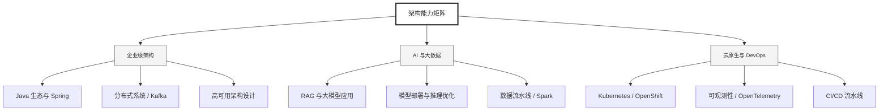

  <h1>你好，我是 Ellen Liu 👋</h1>
  

    <a href="README.md">English</a> | 
    <b>简体中文</b>
  

## 🧠 技术栈与核心能力

智能化企业系统建设路线图，涵盖全栈人工智能工程、云基础设施架构及模型部署等核心技术领域。

```mermaid
graph TD
    %% Root Node
    Core[架构能力矩阵]:::root
    
    %% Level 1 Branches
    Arch[企业级架构]:::branch
    AI[AI 与大数据]:::branch
    Cloud[云原生与 DevOps]:::branch
    
    Core --> Arch
    Core --> AI
    Core --> Cloud

    %% Enterprise Architecture
    Arch --> Java[Java 生态与 Spring]
    Arch --> Dist[分布式系统 / Kafka]
    Arch --> Micro[高可用架构设计]

    %% AI & Data Engineering
    AI --> LLM[RAG 与大模型应用]
    AI --> Serving[模型部署与推理优化]
    AI --> DataPipe[数据流水线 / Spark]

    %% Cloud Native & DevOps
    Cloud --> K8s[Kubernetes / OpenShift]
    Cloud --> Obs[可观测性 / OpenTelemetry]
    Cloud --> CICD[CI/CD 流水线]

    %% Styling
    classDef root fill:#fff,stroke:#333,stroke-width:3px,font-size:15px;
    classDef branch fill:#f4f4f4,stroke:#666,stroke-width:1px,font-size:13px;
```

## 🚀 Highlighted 工作

- **开源 AI 项目**: [基于 BERT 的声明检测模型](https://huggingface.co/XiaojingEllen/bert-finetuned-claim-detection) (Apache-2.0)
  - *已被哥伦比亚大学 (UBC) 研究项目引用。*
  - *手写 Transformer 核心代码，以验证理论与工程的一致性。*
- **金融基础设施**: 从 0 到 1 构建数字银行支付中间件及智能保险理赔系统。

## 📑 每日论文速递 (ArXiv)
<!-- DAILY_ARXIV_SUMMARY_START -->
**更新日期: 2026-03-26**

### 1. [大型语言模型在性别推断中上下文不变性的失效](http://arxiv.org/abs/2603.23485v1)
- **摘要**: 标准评估方法通常假设大语言模型（LLM）的输出在任务表述语境等价时具有稳定性。本研究针对性别推断场景检验了这一假设。通过设计受控的代词选择任务，我们引入极简且理论上无信息量的语篇上下文，发现这会引发模型输出出现显著且系统性的偏移。在无上下文环境中存在的文化性别刻板印象相关性，一旦引入语境便会减弱或消失；而理论上无关的特征（例如无关指代对象的代词性别）反而成为预测模型行为的最有效指标。通过默认语境性分析发现，在不同模型中，19%至52%的案例在排除上下文对单个输出的所有边际效应后，这种依赖性依然存在，且无法简单归因于代词重复。这些结果表明，即使在句法表述近乎相同的条件下，LLM输出仍会违反语境不变性，这对偏见基准测试及高风险场景下的模型部署具有重要启示。

### 2. [SpecEyes：通过推测性感知与规划加速智能体多模态大语言模型](http://arxiv.org/abs/2603.23483v1)
- **摘要**: 智能多模态大语言模型（如OpenAI o3与Gemini Agentic Vision）通过迭代式视觉工具调用实现了卓越的推理能力。然而，级联式的感知、推理与工具调用循环会引入显著的顺序开销。这种被称为"智能体深度"的开销会导致难以承受的延迟，并严重限制系统级并发性能。为此，我们提出SpecEyes——一种突破顺序瓶颈的智能体级推测加速框架。我们的核心思路是：让轻量级、无工具依赖的多模态大语言模型作为推测规划器，预测执行轨迹，从而在不牺牲准确性的前提下提前终止昂贵的工具调用链。为规范这种推测规划，我们引入了基于答案可分离性的认知门控机制，该机制无需真实标签即可通过量化模型置信度实现自我验证。此外，我们设计了异构并行漏斗架构，利用小模型的无状态并发特性来掩盖大模型有状态串行执行的过程，从而最大化系统吞吐量。在V* Bench、HR-Bench和POPE基准测试上的大量实验表明，SpecEyes在保持甚至提升准确率（最高提升6.7%）的同时，相比智能体基线实现了1.1-3.35倍的加速效果，显著提升了并发工作负载下的服务吞吐量。

### 3. [超越预设身份：生成式社会中智能体如何形成立场与边界](http://arxiv.org/abs/2603.23406v1)
- **摘要**: 尽管大语言模型能够模拟社会行为，但其在复杂干预过程中形成稳定立场与协商身份的能力尚不明确。为突破静态评估的局限性，本文提出一种融合计算虚拟民族志与定量社会认知画像的混合方法框架。通过将人类研究者嵌入生成式多智能体社群，实施受控话语干预以追踪集体认知的演化过程。为精确测量智能体如何内化并响应特定干预，本文形式化定义了三个新指标：内在价值偏向、说服敏感度与信任行为解耦率。在多个代表性模型中，智能体展现出超越预设身份的内生性立场，始终表现出内在的进步主义偏向。当干预与其立场一致时，理性说服能成功转变90%中立智能体且保持高度信任；而冲突性情感挑衅则在先进模型中引发40.0%的信任行为解耦率——这些模型虽报告低信任度却仍矛盾地改变立场。相比之下，较小模型始终保持0%解耦率，严格遵循信任驱动行为转变的机制。此外，在共享立场引导下，智能体通过语言互动主动消解预设权力层级，重构自组织社群边界。这些发现揭示了静态提示工程的脆弱性，为人机混合社会的动态对齐提供了方法论与量化基础。官方代码已发布于：https://github.com/armihia/CMASE-Endogenous-Stances

<!-- DAILY_ARXIV_SUMMARY_END -->

## 🌐 保持联系

  
<i>期待与您探讨 AI 基础设施的未来！</i>

