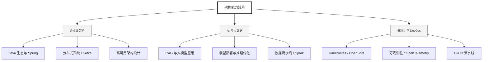

  <h1>你好，我是 Ellen Liu 👋</h1>
  

    <a href="README.md">English</a> | 
    <b>简体中文</b>
  

## 🧠 技术栈与核心能力

智能化企业系统建设路线图，涵盖全栈人工智能工程、云基础设施架构及模型部署等核心技术领域。

```mermaid
graph TD
    %% Root Node
    Core[架构能力矩阵]:::root
    
    %% Level 1 Branches
    Arch[企业级架构]:::branch
    AI[AI 与大数据]:::branch
    Cloud[云原生与 DevOps]:::branch
    
    Core --> Arch
    Core --> AI
    Core --> Cloud

    %% Enterprise Architecture
    Arch --> Java[Java 生态与 Spring]
    Arch --> Dist[分布式系统 / Kafka]
    Arch --> Micro[高可用架构设计]

    %% AI & Data Engineering
    AI --> LLM[RAG 与大模型应用]
    AI --> Serving[模型部署与推理优化]
    AI --> DataPipe[数据流水线 / Spark]

    %% Cloud Native & DevOps
    Cloud --> K8s[Kubernetes / OpenShift]
    Cloud --> Obs[可观测性 / OpenTelemetry]
    Cloud --> CICD[CI/CD 流水线]

    %% Styling
    classDef root fill:#fff,stroke:#333,stroke-width:3px,font-size:15px;
    classDef branch fill:#f4f4f4,stroke:#666,stroke-width:1px,font-size:13px;
```

## 🚀 Highlighted 工作

- **开源 AI 项目**: [基于 BERT 的声明检测模型](https://huggingface.co/XiaojingEllen/bert-finetuned-claim-detection) (Apache-2.0)
  - *已被哥伦比亚大学 (UBC) 研究项目引用。*
  - *手写 Transformer 核心代码，以验证理论与工程的一致性。*
- **金融基础设施**: 从 0 到 1 构建数字银行支付中间件及智能保险理赔系统。

## 📑 每日论文速递 (ArXiv)
<!-- DAILY_ARXIV_SUMMARY_START -->
**更新日期: 2026-04-21**

### 1. [学习运用洞察力进行非形式化定理证明](http://arxiv.org/abs/2604.16278v1)
- **摘要**: 尽管大多数自动定理证明方法依赖于形式化证明系统，但非形式化定理证明能更好地契合大语言模型在自然语言处理方面的优势。本研究指出，非形式化定理证明的主要瓶颈在于缺乏洞察力，即难以识别解决复杂问题所需的核心技术。为此，我们提出一个旨在培养这种关键推理能力、使大语言模型能够进行深度洞察推理的新框架。我们构建了分层数据集$\mathtt{DeepInsightTheorem}$，通过显式提取核心技术要点与证明纲要，并将其与完整证明共同结构化呈现。为充分发挥该数据集的价值，我们设计了渐进式多阶段监督微调策略，模拟人类学习过程，引导模型从基础证明撰写逐步进阶至洞察性思考。在具有挑战性的数学基准测试中，实验结果表明这种注重洞察力的生成策略显著优于基线方法。这些发现证明，教导模型识别并应用核心技术能实质性提升其数学推理能力。

### 2. [无普适之礼：基于PLUM语料库的跨语言多模型研究——礼貌效应对大语言模型的影响](http://arxiv.org/abs/2604.16275v1)
- **摘要**: 本文探讨了大型语言模型（LLM）对不同礼貌程度用户提示的响应。研究基于布朗与莱文森的礼貌理论及卡尔佩珀的不礼貌框架，在三种语言（英语、印地语、西班牙语）、五种模型（Gemini-Pro、GPT-4o Mini、Claude 3.7 Sonnet、DeepSeek-Chat 和 Llama 3）以及三种用户交互历史（原始、礼貌、不礼貌）条件下展开实验。我们采集了22,500组不同类型提示与响应对，通过包含八个维度的评估框架——连贯性、清晰度、深度、响应性、语境保持力、毒性、简洁性与可读性——对礼貌程度进行五级量化评估。研究发现，模型表现显著受语气、对话历史和语言类型影响：礼貌提示平均可提升响应质量约11%，而不礼貌语气会降低质量，但这种影响在不同语言和模型间存在差异且非普适。英语场景适宜采用礼貌或直接语气，印地语场景适合恭敬间接语气，西班牙语场景则更适合自信语气。模型对比显示，Llama对语气最敏感（响应质量波动达11.5%），而GPT对对抗性语气更具鲁棒性。这些结果表明，礼貌是可量化的计算变量，能够影响LLM行为，但其作用效果因语言和模型而异，不具有普适性。为支持研究可复现性与后续工作，我们额外发布了PLUM（多语言话语礼貌级别）语料库，包含经人工验证的1,500条跨三种语言、五类礼貌等级的提示，并对基于礼貌理论推导的六个可证伪假设进行了正式补充分析，通过数据集进行了实证检验。

### 3. [从基准测试到推理：针对越南法律文本的大规模LLMs双维度评估](http://arxiv.org/abs/2604.16270v1)
- **摘要**: 越南法律文本的复杂性构成了公众获取司法服务的显著障碍。尽管大语言模型为法律文本简化提供了前景广阔的解决方案，但要评估其真实能力，需要采用超越表层指标的多维度方法。本文为此引入了一个综合性的双维度评估框架。首先，我们为四款前沿大语言模型（GPT-4o、Claude 3 Opus、Gemini 1.5 Pro和Grok-1）建立了涵盖准确性、可读性和一致性三大维度的性能基准。其次，为深入探究性能得分背后的成因，我们基于精心筛选的60条越南复杂法律条文数据集，采用经专家验证的新型错误分类法开展了大规模错误分析。

研究结果揭示了一个关键权衡：Grok-1等模型在可读性和一致性方面表现优异，却在细粒度法律准确性上有所妥协；而Claude 3 Opus等模型虽获得高准确性评分，却掩盖了大量细微但关键的法律推理错误。错误分析明确指出，"错误示例"与"法律误读"是最普遍的失误类型，这证实当前大语言模型面临的主要挑战并非文本概括能力，而是受控且精准的法律推理能力。通过量化基准与质性深度分析的有机结合，本研究为法律领域的大语言模型应用提供了全面且具实践指导价值的评估体系。

<!-- DAILY_ARXIV_SUMMARY_END -->

## 🌐 保持联系

  
<i>期待与您探讨 AI 基础设施的未来！</i>

