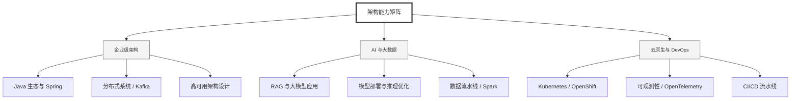

  <h1>你好，我是 Ellen Liu 👋</h1>
  

    <a href="README.md">English</a> | 
    <b>简体中文</b>
  

## 🧠 技术栈与核心能力

智能化企业系统建设路线图，涵盖全栈人工智能工程、云基础设施架构及模型部署等核心技术领域。

```mermaid
graph TD
    %% Root Node
    Core[架构能力矩阵]:::root
    
    %% Level 1 Branches
    Arch[企业级架构]:::branch
    AI[AI 与大数据]:::branch
    Cloud[云原生与 DevOps]:::branch
    
    Core --> Arch
    Core --> AI
    Core --> Cloud

    %% Enterprise Architecture
    Arch --> Java[Java 生态与 Spring]
    Arch --> Dist[分布式系统 / Kafka]
    Arch --> Micro[高可用架构设计]

    %% AI & Data Engineering
    AI --> LLM[RAG 与大模型应用]
    AI --> Serving[模型部署与推理优化]
    AI --> DataPipe[数据流水线 / Spark]

    %% Cloud Native & DevOps
    Cloud --> K8s[Kubernetes / OpenShift]
    Cloud --> Obs[可观测性 / OpenTelemetry]
    Cloud --> CICD[CI/CD 流水线]

    %% Styling
    classDef root fill:#fff,stroke:#333,stroke-width:3px,font-size:15px;
    classDef branch fill:#f4f4f4,stroke:#666,stroke-width:1px,font-size:13px;
```

## 🚀 Highlighted 工作

- **开源 AI 项目**: [基于 BERT 的声明检测模型](https://huggingface.co/XiaojingEllen/bert-finetuned-claim-detection) (Apache-2.0)
  - *已被哥伦比亚大学 (UBC) 研究项目引用。*
  - *手写 Transformer 核心代码，以验证理论与工程的一致性。*
- **金融基础设施**: 从 0 到 1 构建数字银行支付中间件及智能保险理赔系统。

## 📑 每日论文速递 (ArXiv)
<!-- DAILY_ARXIV_SUMMARY_START -->
**更新日期: 2026-04-07**

### 1. [BAS：一种评估大语言模型置信度的决策理论方法](http://arxiv.org/abs/2604.03216v1)
- **摘要**: 大型语言模型（LLM）在应当选择弃答更为稳妥的场景中，常会生成看似确定但实则错误的答案。然而，现有标准评估范式通常强制要求模型给出回答，且未考虑在不同风险偏好下应如何依据置信度进行决策。为填补这一空白，我们提出了行为对齐分数（BAS）——一种基于决策理论的度量指标，用于评估LLM的置信度在支持"可弃答"决策时的有效性。BAS源于一个显式的"作答或弃答"效用模型，通过聚合连续风险阈值下的实际效用，生成一个决策层面的可靠性度量，该度量同时依赖于置信度的大小与排序关系。

我们从理论上证明，真实的置信度估计能够唯一地最大化BAS的期望效用，从而将校准性与决策最优行为联系起来。BAS与对数损失等严格评分规则相关，但在结构上存在差异：对数损失对置信度不足和过度自信施加对称惩罚，而BAS采用非对称惩罚机制，更强调避免过度自信导致的错误。通过将BAS与广泛使用的预期校准误差（ECE）和风险覆盖曲线下面积（AURC）等指标结合，我们构建了一个涵盖多类LLM与任务的置信度可靠性基准测试。研究结果显示，不同模型在决策有效性置信度方面存在显著差异：尽管规模更大、准确性更高的模型往往获得更高的BAS，但即使是最先进的模型仍存在严重的过度自信问题。值得注意的是，具有相似ECE或AURC值的模型可能因过度自信错误而表现出完全不同的BAS，这揭示了传统指标的局限性。我们进一步证明，通过简单干预措施（如Top-$k$置信度激发与事后校准）可有效提升置信度可靠性。

总体而言，本研究不仅提出了评估LLM置信度可靠性的理论化度量标准，还建立了系统性的基准测试体系。

### 2. [可靠性门控多教师蒸馏用于低资源抽象摘要生成](http://arxiv.org/abs/2604.03192v1)
- **摘要**: 我们从可靠性感知的角度研究了低资源抽象摘要中的多教师知识蒸馏。我们提出了EWAD（熵加权一致性感知蒸馏）——一种基于教师间一致性在教师蒸馏与黄金监督之间进行监督路由的令牌级机制，以及CPDP（容量比例散度保持）——一种约束学生模型相对于异构教师模型位置的几何约束。通过在两个孟加拉语数据集、13个BanglaT5消融实验和八个Qwen2.5实验中的验证，我们发现对数级知识蒸馏能提供最稳定的性能提升，而更复杂的蒸馏方法虽能提升短摘要的语义相似度，却会损害长文本输出质量。跨十种语言的跨语言伪标签知识蒸馏在3.2倍压缩率下仍能保持教师模型71-122%的ROUGE-L分数。经人工验证的多评委大语言模型评估进一步揭示了单评委评估流程中存在的校准偏差。总体而言，我们的研究表明：可靠性感知蒸馏有助于界定多教师监督何时能改进摘要生成，以及数据扩展何时优于损失函数设计。

### 3. [PRISM：基于大语言模型引导的语义聚类实现高精度主题识别](http://arxiv.org/abs/2604.03180v1)
- **摘要**: 本文提出了一种名为"精确信息语义建模"的结构化主题建模框架，该框架融合了大型语言模型捕获丰富表征的优势与潜在语义聚类方法的低成本、可解释性特点。PRISM通过使用从目标语料库中抽取样本、并由大语言模型提供的稀疏标签集，对句子编码模型进行微调。我们采用阈值聚类方法对该嵌入空间进行划分，从而在特定狭窄领域内分离出紧密相关的主题簇。在多个语料库的测试中，PRISM在主题分离性方面超越了当前最先进的局部主题模型，甚至优于基于前沿大型嵌入模型的聚类方法，且仅需少量大语言模型查询即可完成训练。本研究的贡献主要体现在三个方面：(1)构建了师生式训练管道，将稀疏的大语言模型监督知识提炼为轻量级主题发现模型；(2)分析了采样策略对改善局部几何结构以提升聚类分离性的效能；(3)提出适用于网络规模文本分析的有效方法，使研究者和实践者能够通过可解释、可本地部署的框架在线追踪细微观点与子话题演变。

<!-- DAILY_ARXIV_SUMMARY_END -->

## 🌐 保持联系

  
<i>期待与您探讨 AI 基础设施的未来！</i>

