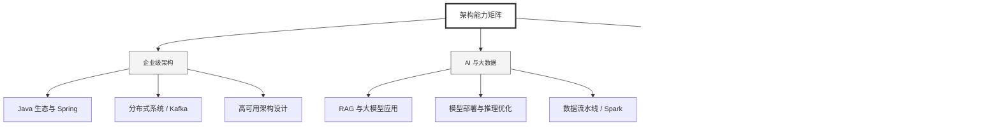

  <h1>你好，我是 Ellen Liu 👋</h1>
  

    <a href="README.md">English</a> | 
    <b>简体中文</b>
  

## 🧠 技术栈与核心能力

智能化企业系统建设路线图，涵盖全栈人工智能工程、云基础设施架构及模型部署等核心技术领域。

```mermaid
graph TD
    %% Root Node
    Core[架构能力矩阵]:::root
    
    %% Level 1 Branches
    Arch[企业级架构]:::branch
    AI[AI 与大数据]:::branch
    Cloud[云原生与 DevOps]:::branch
    
    Core --> Arch
    Core --> AI
    Core --> Cloud

    %% Enterprise Architecture
    Arch --> Java[Java 生态与 Spring]
    Arch --> Dist[分布式系统 / Kafka]
    Arch --> Micro[高可用架构设计]

    %% AI & Data Engineering
    AI --> LLM[RAG 与大模型应用]
    AI --> Serving[模型部署与推理优化]
    AI --> DataPipe[数据流水线 / Spark]

    %% Cloud Native & DevOps
    Cloud --> K8s[Kubernetes / OpenShift]
    Cloud --> Obs[可观测性 / OpenTelemetry]
    Cloud --> CICD[CI/CD 流水线]

    %% Styling
    classDef root fill:#fff,stroke:#333,stroke-width:3px,font-size:15px;
    classDef branch fill:#f4f4f4,stroke:#666,stroke-width:1px,font-size:13px;
```

## 🚀 Highlighted 工作

- **开源 AI 项目**: [基于 BERT 的声明检测模型](https://huggingface.co/XiaojingEllen/bert-finetuned-claim-detection) (Apache-2.0)
  - *已被哥伦比亚大学 (UBC) 研究项目引用。*
  - *手写 Transformer 核心代码，以验证理论与工程的一致性。*
- **金融基础设施**: 从 0 到 1 构建数字银行支付中间件及智能保险理赔系统。

## 📑 每日论文速递 (ArXiv)
<!-- DAILY_ARXIV_SUMMARY_START -->
**更新日期: 2026-06-16**

### 1. [Persona-Pruner：雕琢轻量化角色扮演模型](http://arxiv.org/abs/2606.14695v1)
- **摘要**: 语言模型（LMs）在角色扮演聊天机器人领域展现出显著潜力，能够根据角色或用户画像的设定提供一致且风格化的交互体验。然而，当这些能力被应用于现实场景（例如需要同时处理大量非玩家角色交互的生态系统）时，过高的计算成本暴露了其关键性效率缺陷。本文质疑了将完整通用模型专用于单一角色的必要性，提出特定角色身份仅需调用模型总容量中的部分能力。我们观察到，对语言模型进行简单剪枝往往会严重损害特定角色的扮演性能——这种方法无法区分冗余知识与核心角色特征。为此，我们提出Persona-Pruner框架，该框架通过从单一描述中提取角色专属子网络，构建轻量化角色扮演模型。实验一致表明，相较于现有最先进的大语言模型剪枝技术，Persona-Pruner能更有效地保持角色扮演性能：在RoleBench基准测试中，以LLM-as-a-judge评分衡量，该框架将密集模型的性能衰减幅度较最强基线降低了93.8%，同时仍保留通用大语言模型能力。代码已开源至https://github.com/jsu-kim/Persona-Pruner。

### 2. [AgentSpec：通过受控组合理解具身智能体框架](http://arxiv.org/abs/2606.14674v1)
- **摘要**: 大型语言模型（LLM）智能体的构建正逐渐从单一模型调用转向结合推理、记忆、反思、动作执行与学习的脚手架化系统。尽管此类脚手架系统常能提升性能，但它们通常嵌入紧密耦合的流水线中，导致难以分离组件贡献、比较替代设计方案，或理解模块交互如何塑造智能体行为。为此，我们提出AgentSpec——一种模块化规范框架，将具身智能体表示为具有标准化接口的可复用策略组件的类型化组合。AgentSpec标准化了感知、记忆、推理、反思、动作及可选学习模块间的接口，使组件可在受控条件下进行替换与重组。我们在DeliveryBench、ALFRED、MiniGrid和RoboTHOR平台上实例化该框架，并跨模型主干分析了推理、记忆、反思及强化学习模块。研究结果表明：智能体性能由脚手架兼容性与交互效应主导，而非孤立模块强度。具体而言，结构化多粒度记忆可改善长程状态追踪能力；推理与记忆在不同环境中呈现非均匀交互；反思机制需权衡修正效果与计算成本；基于强化学习训练的策略在与部署时脚手架结构协同优化时表现最佳。AgentSpec为研究、比较及设计可组合的LLM智能体提供了受控基础。我们的代码、基线模型及交互式演示平台已开源发布于https://agentspec-embodied.github.io。

### 3. [面向LLM-Agent工作流中并行分支的直接潜在空间合成](http://arxiv.org/abs/2606.14672v1)
- **摘要**: 大型语言模型日益成为智能体系统的执行引擎，但其仍通过顺序文本接口消耗上下文。这与现代结构化智能体工作流存在错配——独立分支在最终合成步骤前并行探索子任务、检索证据或生成候选方案。现有系统通常通过拼接各分支的文本输出来合并这些分支，这既丢弃了并行结构，又导致冗余的预填充计算。本研究提出即插即用框架Parallel-Synthesis，使合成器可直接消费并行工作智能体生成的KV缓存。该框架包含两个核心组件：校准独立生成分支缓存的缓存映射器，以及经微调后支持从非顺序缓存接口生成内容的合成器适配器。我们通过三类数据训练Parallel-Synthesis：使合成器接触并行缓存上下文的数据、教导跨缓存分支聚合的数据、以及从标准文本拼接式合成中蒸馏推理行为的数据。在涵盖数学、科学问答、代码生成、GAIA基准测试及多智能体数据库诊断的九个下游数据集上，Parallel-Synthesis在七个数据集中达到或超越基于文本的合成性能，在其余两个数据集中保持接近。同时，其将首令牌生成时间缩短2.5-11倍，表明基于缓存的直接合成是处理并行智能体分支时更原生高效的合成接口。

<!-- DAILY_ARXIV_SUMMARY_END -->

## 🌐 保持联系

  
<i>期待与您探讨 AI 基础设施的未来！</i>

