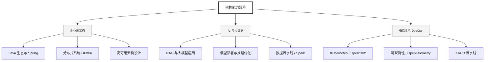

  <h1>你好，我是 Ellen Liu 👋</h1>
  

    <a href="README.md">English</a> | 
    <b>简体中文</b>
  

## 🧠 技术栈与核心能力

智能化企业系统建设路线图，涵盖全栈人工智能工程、云基础设施架构及模型部署等核心技术领域。

```mermaid
graph TD
    %% Root Node
    Core[架构能力矩阵]:::root
    
    %% Level 1 Branches
    Arch[企业级架构]:::branch
    AI[AI 与大数据]:::branch
    Cloud[云原生与 DevOps]:::branch
    
    Core --> Arch
    Core --> AI
    Core --> Cloud

    %% Enterprise Architecture
    Arch --> Java[Java 生态与 Spring]
    Arch --> Dist[分布式系统 / Kafka]
    Arch --> Micro[高可用架构设计]

    %% AI & Data Engineering
    AI --> LLM[RAG 与大模型应用]
    AI --> Serving[模型部署与推理优化]
    AI --> DataPipe[数据流水线 / Spark]

    %% Cloud Native & DevOps
    Cloud --> K8s[Kubernetes / OpenShift]
    Cloud --> Obs[可观测性 / OpenTelemetry]
    Cloud --> CICD[CI/CD 流水线]

    %% Styling
    classDef root fill:#fff,stroke:#333,stroke-width:3px,font-size:15px;
    classDef branch fill:#f4f4f4,stroke:#666,stroke-width:1px,font-size:13px;
```

## 🚀 Highlighted 工作

- **开源 AI 项目**: [基于 BERT 的声明检测模型](https://huggingface.co/XiaojingEllen/bert-finetuned-claim-detection) (Apache-2.0)
  - *已被哥伦比亚大学 (UBC) 研究项目引用。*
  - *手写 Transformer 核心代码，以验证理论与工程的一致性。*
- **金融基础设施**: 从 0 到 1 构建数字银行支付中间件及智能保险理赔系统。

## 📑 每日论文速递 (ArXiv)
<!-- DAILY_ARXIV_SUMMARY_START -->
**更新日期: 2026-05-06**

### 1. [SpecKV：基于压缩感知伽马选择的自适应推测解码](http://arxiv.org/abs/2605.02888v1)
- **摘要**: 推测解码通过使用小型草稿模型提出候选令牌，再由大型目标模型进行验证，从而加速大语言模型（LLM）推理。该过程中的关键超参数是推测长度~$γ$，它决定了草稿模型每步提出的令牌数量。现有系统几乎都采用固定~$γ$（通常为~4），但实验证据表明，最优值会随任务类型变化，且关键取决于目标模型应用的压缩级别。本文提出\textbf{SpecKV}——一种轻量级自适应控制器，通过从草稿模型自身提取信号，为每个推测步骤选择~$γ$。我们在4类任务、4种推测长度和3种压缩级别（FP16、INT8、NF4）下对推测解码进行性能分析，收集了5,112条步骤级记录，包含每步接受率、草稿熵和草稿置信度。研究表明，最优~$γ$会随压缩模式变化，且草稿模型的置信度和熵是接受率的强预测因子（相关性~$\approx 0.56$）。SpecKV利用基于这些信号训练的小型MLP，最大化每推测步骤的预期令牌数，在固定~$γ$=4的基准上实现了56.0%的改进，每次决策仅增加0.34毫秒开销（占步骤时间<0.5%）。该改进具有统计显著性（配对自助法检验，$p < 0.001$）。我们将所有性能分析数据、训练模型及代码笔记作为开源成果发布。

### 2. [FlexSQL：灵活的探索与执行打造更优的文本到SQL智能体](http://arxiv.org/abs/2605.02815v1)
- **摘要**: 针对大型分析数据库的文本到SQL转换，需要应对复杂模式导航、消除查询歧义，并基于实际数据做出决策。当前大多数系统采用固定流程：预先一次性检索模式元素，仅在事后修复时重新访问数据库，这限制了从早期错误中恢复的能力。我们提出FlexSQL——一种以灵活数据库交互为核心设计原则的文本到SQL智能体：该智能体可在推理过程中随时探索模式结构、检查数据值并运行验证查询。FlexSQL生成多样化执行计划以覆盖多种查询解释，根据任务类型用SQL或Python实现每个计划，并采用双层修复机制，支持从代码级错误回溯到计划级修正。在Spider2-Snow数据集上，使用gpt-oss-120b模型时，FlexSQL达到65.4%的得分，超越了使用更强更大模型（如gpt-o3和DeepSeek-R1）的强开源基线。当集成到通用编程智能体（作为Claude Code中的技能）时，我们的方法在Spider2-Snow上实现了超过10%的相对性能提升。进一步分析表明，灵活探索与灵活执行共同促成了我们方法的有效性，凸显了灵活性作为关键设计原则的重要性。我们的代码已开源：https://github.com/StringNLPLAB/FlexSQL

### 3. [基于编排轨迹的强化学习在基于大语言模型的多智能体系统中的应用](http://arxiv.org/abs/2605.02801v1)
- **摘要**: 随着大语言模型（LLM）智能体从孤立的工具使用者演变为协同团队，强化学习（RL）不仅需要优化个体行为，还需优化任务的生成、分配、通信、聚合与终止等流程。本文通过编排轨迹研究基于LLM的多智能体系统的强化学习：这些时序交互图中的事件包含子智能体生成、任务委派、通信、工具使用、结果返回、信息聚合及终止决策。基于这一视角，我们识别出三个技术维度。首先，奖励设计涵盖八大类别，包括针对并行加速、拆分正确性与聚合质量的编排奖励。其次，奖励与信用信号可附着于从词元到团队的八类信用/信号载体；在我们整理的论文池中，显式的反事实消息级信用分配仍尤为稀缺。第三，编排学习可分解为五个子决策：何时生成子智能体、委派给谁、如何通信、如何聚合以及何时终止。截至2026年5月4日的论文池中，我们未发现针对终止决策的显式RL训练方法。我们将学术方法与来自Kimi Agent Swarm、OpenAI Codex和Anthropic Claude Code的公开工业证据进行关联。由此产生的规模差距，是公开报道的部署规模与开放学术评估体系之间的差距，而非对工业训练轨迹的独立验证。我们已在https://github.com/xxzcc/awesome-llm-mas-rl发布相关资源，包含84篇带标签论文池、32条排除记录、脚本化语料统计，以及用于可回放编排轨迹的简易JSON模式。

<!-- DAILY_ARXIV_SUMMARY_END -->

## 🌐 保持联系

  
<i>期待与您探讨 AI 基础设施的未来！</i>

