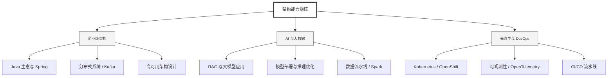

  <h1>你好，我是 Ellen Liu 👋</h1>
  

    <a href="README.md">English</a> | 
    <b>简体中文</b>
  

## 🧠 技术栈与核心能力

智能化企业系统建设路线图，涵盖全栈人工智能工程、云基础设施架构及模型部署等核心技术领域。

```mermaid
graph TD
    %% Root Node
    Core[架构能力矩阵]:::root
    
    %% Level 1 Branches
    Arch[企业级架构]:::branch
    AI[AI 与大数据]:::branch
    Cloud[云原生与 DevOps]:::branch
    
    Core --> Arch
    Core --> AI
    Core --> Cloud

    %% Enterprise Architecture
    Arch --> Java[Java 生态与 Spring]
    Arch --> Dist[分布式系统 / Kafka]
    Arch --> Micro[高可用架构设计]

    %% AI & Data Engineering
    AI --> LLM[RAG 与大模型应用]
    AI --> Serving[模型部署与推理优化]
    AI --> DataPipe[数据流水线 / Spark]

    %% Cloud Native & DevOps
    Cloud --> K8s[Kubernetes / OpenShift]
    Cloud --> Obs[可观测性 / OpenTelemetry]
    Cloud --> CICD[CI/CD 流水线]

    %% Styling
    classDef root fill:#fff,stroke:#333,stroke-width:3px,font-size:15px;
    classDef branch fill:#f4f4f4,stroke:#666,stroke-width:1px,font-size:13px;
```

## 🚀 Highlighted 工作

- **开源 AI 项目**: [基于 BERT 的声明检测模型](https://huggingface.co/XiaojingEllen/bert-finetuned-claim-detection) (Apache-2.0)
  - *已被哥伦比亚大学 (UBC) 研究项目引用。*
  - *手写 Transformer 核心代码，以验证理论与工程的一致性。*
- **金融基础设施**: 从 0 到 1 构建数字银行支付中间件及智能保险理赔系统。

## 📑 每日论文速递 (ArXiv)
<!-- DAILY_ARXIV_SUMMARY_START -->
**更新日期: 2026-07-17**

### 1. [同策略增量蒸馏](http://arxiv.org/abs/2607.15161v1)
- **摘要**: 同策略蒸馏是强化学习中一种替代性的后训练方法，通过教师模型提供的词元级监督来缓解奖励模型带来的约束。尽管同策略蒸馏已在多种场景中得到研究和应用，但其基础设计仍未被充分探索。本文提出一种名为"增量信号"的新型蒸馏奖励，而非直接模仿教师模型的输出分布。该增量信号定义为教师模型与其基础模型（在针对推理能力进行指令微调之前）之间的差异。因此，它捕捉了推理微调所引发的变化，并为迁移推理能力提供了更直接的信号。通过大量实证证据，我们证明增量信号显著改进了同策略蒸馏，并将这种新蒸馏方法称为同策略增量蒸馏（OPD$^2$）。在数学、科学和代码推理基准上的实验表明，OPD$^2$始终优于传统同策略蒸馏，使推理型大语言模型仅需短暂的后训练周期即可实现强劲性能。代码将发布于 https://github.com/naver-ai/opd2

### 2. [Grokipedia 对比 Wikipedia：基于大语言模型的政治中立性意识形态审计](http://arxiv.org/abs/2607.15146v1)
- **摘要**: 在线百科全书塑造政治观点，并通过政治观点影响民主话语。2025年末，由大语言模型Grok完全撰写的百科全书Grokipedia问世。该项目背后的动机之一，是提供一种替代维基百科的无偏见选择——后者长期面临"左翼"和"自由主义"偏见的指控。但由大语言模型撰写的百科全书是否真能实现更高程度的中立性，抑或只是嵌入了另一种意识形态？我们对Grokipedia和维基百科开展大规模政治偏见研究，分析1394组描述政府成员的条目，沿九项专家编码的意识形态维度，采用Grok、Claude、Mistral和DeepSeek四种大语言模型裁判评估中立性。鉴于大语言模型本身可能存在偏见，我们还研究了其判断模式。研究发现，包括Grok在内的所有大语言模型裁判均认为Grokipedia的中立性低于维基百科。两部百科全书整体上对政治人物呈现正面倾向，但针对不同意识形态群体：Grokipedia尤其偏袒经济右翼政治家，惩罚社会自由派；而维基百科则被判定对后者存在有利偏见。

### 3. [数字万神殿：利用大语言模型智能体模拟与审计联盟形成](http://arxiv.org/abs/2607.15095v1)
- **摘要**: 政治联盟的形成是一个复杂的谈判过程，既受具体政策目标的驱动，也受根深蒂固的意识形态信念影响。虽然大型语言模型为计算政治学开辟了新途径，但通过人类反馈强化学习注入的中立性和助益性偏见，使其无法维持坚定的党派行为。我们提出了一种多智能体框架，通过结合监督微调、直接偏好优化和检索增强生成，将事实基础与意识形态对齐相统一：直接偏好优化注入激进的特定政党人格，而每个政党的检索增强生成管道则使各智能体始终受限于其官方宣言。我们将该框架应用于2019年弗拉芒选举，在由组阁者仲裁的轮辐式谈判中部署党派智能体。为使涌现的谈判过程可解释，我们引入了多层信息谱系拓扑，可追溯最终协议中每项条款的宣言来源，并将其归类为五种溯源状态；同时提出联盟影响力评分，通过聚合这些可追溯贡献来识别塑造协议的政党；以及现实世界基准验证环节，将每项模拟条款与历史采纳的联盟协议进行比对。在三次独立模拟中，该框架产生了稳定的胜出者及排名（新弗拉芒联盟领先于基督教民主与弗拉芒党和开放弗拉芒自由民主党），且基于宣言的谱系能可靠预测现实世界的具体实施，而虚构内容则无法实现。最终成果是一个透明、可扩展的测试平台，用于事前探索政党兼容性及组阁者调解下的妥协方案。

<!-- DAILY_ARXIV_SUMMARY_END -->

## 🌐 保持联系

  
<i>期待与您探讨 AI 基础设施的未来！</i>

