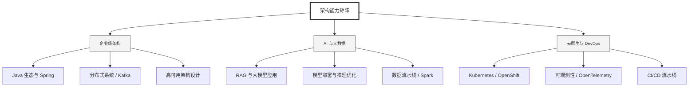

  <h1>你好，我是 Ellen Liu 👋</h1>
  

    <a href="README.md">English</a> | 
    <b>简体中文</b>
  

## 🧠 技术栈与核心能力

智能化企业系统建设路线图，涵盖全栈人工智能工程、云基础设施架构及模型部署等核心技术领域。

```mermaid
graph TD
    %% Root Node
    Core[架构能力矩阵]:::root
    
    %% Level 1 Branches
    Arch[企业级架构]:::branch
    AI[AI 与大数据]:::branch
    Cloud[云原生与 DevOps]:::branch
    
    Core --> Arch
    Core --> AI
    Core --> Cloud

    %% Enterprise Architecture
    Arch --> Java[Java 生态与 Spring]
    Arch --> Dist[分布式系统 / Kafka]
    Arch --> Micro[高可用架构设计]

    %% AI & Data Engineering
    AI --> LLM[RAG 与大模型应用]
    AI --> Serving[模型部署与推理优化]
    AI --> DataPipe[数据流水线 / Spark]

    %% Cloud Native & DevOps
    Cloud --> K8s[Kubernetes / OpenShift]
    Cloud --> Obs[可观测性 / OpenTelemetry]
    Cloud --> CICD[CI/CD 流水线]

    %% Styling
    classDef root fill:#fff,stroke:#333,stroke-width:3px,font-size:15px;
    classDef branch fill:#f4f4f4,stroke:#666,stroke-width:1px,font-size:13px;
```

## 🚀 Highlighted 工作

- **开源 AI 项目**: [基于 BERT 的声明检测模型](https://huggingface.co/XiaojingEllen/bert-finetuned-claim-detection) (Apache-2.0)
  - *已被哥伦比亚大学 (UBC) 研究项目引用。*
  - *手写 Transformer 核心代码，以验证理论与工程的一致性。*
- **金融基础设施**: 从 0 到 1 构建数字银行支付中间件及智能保险理赔系统。

## 📑 每日论文速递 (ArXiv)
<!-- DAILY_ARXIV_SUMMARY_START -->
**更新日期: 2026-06-17**

### 1. [面向智能体与多模态大语言模型的上下文感知强化学习](http://arxiv.org/abs/2606.17053v1)
- **摘要**: 大型语言模型（LLMs）在需要从长篇幅或复杂语境中识别关键性细微证据时（例如工具追踪日志中的单行记录或图像中的隐蔽细节），往往表现不佳。为此，我们提出ContextRL——一种基于上下文感知的强化学习方法，通过间接辅助目标提升长程推理与多模态任务性能。不同于仅监督最终答案的传统方式，ContextRL向模型提供查询、答案及两个高度相似的上下文，并奖励其选择支持查询-答案对的正确上下文，从而促进细粒度信息定位。我们在两个领域构建对比上下文数据：针对代码智能体，以执行轨迹作为上下文，通过条件过滤构建1千组对比对；针对多模态推理，以图像作为上下文，通过生成式编辑与相似度检索构建7千组对比对。在5项长程推理基准测试中，ContextRL相较标准GRPO方法平均提升2.2%；在12项多样化视觉问答基准测试中平均提升1.8%。为剥离目标函数改进与数据增量带来的影响，我们设置数据增强基线实验——将相同对比上下文重构为标准查询-上下文-答案示例。实验表明，此类基线方法几乎无性能提升，证实性能增益源于所提出的上下文选择目标函数，而非单纯依赖对比数据。

### 2. [对来自《自然》期刊系列的元分析文章进行LLM智能体基准测试](http://arxiv.org/abs/2606.17041v1)
- **摘要**: 元分析是一种要求严格的证据综合形式，它结合了文献检索、基于PI/ECO框架的研究筛选以及统计聚合。其结构化、可验证的工作流程使其成为评估系统性科学推理的理想载体，然而现有基准测试缺乏覆盖完整检索-筛选-综合流程的黄金标准。我们推出MetaSyn数据集，包含442项来自《自然》系列期刊、经专家精心筛选的元分析研究。每项条目均配备研究问题与PI/ECO标准、包含14万篇PubMed文章的检索语料库、经核实的阳性研究、主题相似但不符合PI/ECO标准的强负样本，以及完整的检索策略与时间范围。

对十二种流水线配置（九种RAG变体与一种协议驱动型智能体）的基准测试揭示了一个关键筛选瓶颈：尽管在K=200时检索召回率上限达90.9%，但所有系统恢复的黄金标准纳入文献比例均未超过52.7%。当前大语言模型在主题相关性相当的文献池中，无法可靠区分符合PI/ECO标准的研究与不符合标准的干扰项。分阶段归因指标能精准捕捉系统的成功与失败环节，而单一端到端评分则无法实现这一目标。

### 3. [KVEraser：学习引导KV缓存以实现高效的局部上下文擦除](http://arxiv.org/abs/2606.17034v1)
- **摘要**: 对KV缓存进行事后上下文擦除具有挑战性，因为局部编辑会产生全局影响：一旦某个片段被处理，其影响会传播到所有后续令牌的缓存状态中。这一问题在长上下文大语言模型应用中自然出现——过时的检索事实、错误的工具观测结果、被撤回的用户偏好或有害的提示注入，可能仅在预填充阶段之后才被识别。精确擦除必须重新计算被删除片段之后的所有令牌，导致其计算成本取决于后缀长度而非被擦除片段的长度。我们提出KVEraser，一种基于学习的KV缓存编辑方法，用于实现高效的局部上下文擦除。给定已处理的上下文和待移除片段，KVEraser仅用学习到的引导状态替换被擦除区间的KV状态，同时保持其余缓存不变。为学习可迁移的擦除机制，我们构建了两阶段训练流程：通用片段-邻域预训练使擦除器抑制被擦除片段的影响，而任务特定微调则将该能力适配至下游场景。实验表明，在1K至32K上下文长度的领域内任务中，KVEraser在擦除后性能上几乎与完全重计算持平，而其延迟仅增加24%（完全重计算延迟增加17.6倍）。KVEraser还能泛化至包含有害事实干扰项的未见长文档问答任务，在近似基线中取得最佳性能，相比完全重计算实现3至4倍加速。

<!-- DAILY_ARXIV_SUMMARY_END -->

## 🌐 保持联系

  
<i>期待与您探讨 AI 基础设施的未来！</i>

