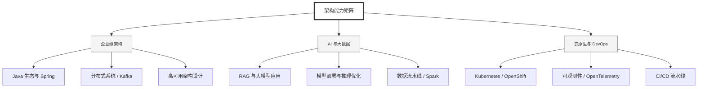

  <h1>你好，我是 Ellen Liu 👋</h1>
  

    <a href="README.md">English</a> | 
    <b>简体中文</b>
  

## 🧠 技术栈与核心能力

智能化企业系统建设路线图，涵盖全栈人工智能工程、云基础设施架构及模型部署等核心技术领域。

```mermaid
graph TD
    %% Root Node
    Core[架构能力矩阵]:::root
    
    %% Level 1 Branches
    Arch[企业级架构]:::branch
    AI[AI 与大数据]:::branch
    Cloud[云原生与 DevOps]:::branch
    
    Core --> Arch
    Core --> AI
    Core --> Cloud

    %% Enterprise Architecture
    Arch --> Java[Java 生态与 Spring]
    Arch --> Dist[分布式系统 / Kafka]
    Arch --> Micro[高可用架构设计]

    %% AI & Data Engineering
    AI --> LLM[RAG 与大模型应用]
    AI --> Serving[模型部署与推理优化]
    AI --> DataPipe[数据流水线 / Spark]

    %% Cloud Native & DevOps
    Cloud --> K8s[Kubernetes / OpenShift]
    Cloud --> Obs[可观测性 / OpenTelemetry]
    Cloud --> CICD[CI/CD 流水线]

    %% Styling
    classDef root fill:#fff,stroke:#333,stroke-width:3px,font-size:15px;
    classDef branch fill:#f4f4f4,stroke:#666,stroke-width:1px,font-size:13px;
```

## 🚀 Highlighted 工作

- **开源 AI 项目**: [基于 BERT 的声明检测模型](https://huggingface.co/XiaojingEllen/bert-finetuned-claim-detection) (Apache-2.0)
  - *已被哥伦比亚大学 (UBC) 研究项目引用。*
  - *手写 Transformer 核心代码，以验证理论与工程的一致性。*
- **金融基础设施**: 从 0 到 1 构建数字银行支付中间件及智能保险理赔系统。

## 📑 每日论文速递 (ArXiv)
<!-- DAILY_ARXIV_SUMMARY_START -->
**更新日期: 2026-04-02**

### 1. [基于神经UCB的在线大语言模型奖励路由](http://arxiv.org/abs/2603.30035v1)
- **摘要**: 本研究探讨了将NeuralUCB算法应用于成本感知型大语言模型（LLM）路由的可行性。现有路由方法可大致分为监督式路由与部分反馈式路由两类，二者在效率与适应性方面存在不同权衡。我们实现了基于NeuralUCB的路由策略，并在RouterBench模拟在线环境下进行评估。实验结果表明：所提方法在效用奖励方面持续优于随机路由和最小成本基线方法；相较于最高质量参照方法，本方法在保持竞争力奖励的同时显著降低了推理成本。这些发现表明NeuralUCB是成本感知型LLM路由的有效途径，同时也揭示了该方法在动作判别与探索机制方面仍存在的挑战。

### 2. [利用LLM衍生抽象概念增强叙事类比推理的结构映射](http://arxiv.org/abs/2603.29997v1)
- **摘要**: 类比推理是人类在问题解决与论证中进行泛化的关键驱动力。然而，机器在叙事结构间的类比推理仍面临挑战。现有的结构映射认知引擎无法直接适用，因其假设实体已预先提取，而大型语言模型的表现对提示格式及叙事间表层相似度极为敏感。这一差距引出了一个核心问题：利用大型语言模型生成的抽象表征来增强结构映射，会如何影响其在叙事中的类比推理能力？

为此，我们提出了名为YARN（叙事推理抽象生成框架）的模块化框架。该框架利用大型语言模型将叙事分解为单元，对这些单元进行抽象化处理，再将其传递至映射组件，通过跨故事元素对齐实现类比推理。基于既有框架研究基础，我们定义并实现了四个层次的抽象表征，既能捕捉单元的一般意义，又能体现其在故事中的角色功能。

实验表明，抽象化处理能持续提升模型性能，其表现达到甚至超越了端到端大型语言模型基线。进一步的错误分析揭示了当前仍存在的挑战：如何选择恰当的抽象层级、如何融入隐含的因果关系，以及对叙事中类比模式的新兴分类。YARN支持通过系统化调整实验设置来分析各组件贡献，为促进后续研究，我们已公开该框架的完整代码。

### 3. [生成式引擎优化的结构特征工程：内容结构如何塑造引用行为](http://arxiv.org/abs/2603.29979v1)
- **摘要**: 随着人工智能搜索引擎的普及，信息发现方式已从传统的链接检索转变为直接生成答案并选择性引用来源的模式，这为内容可见性带来了新的挑战。现有生成式引擎优化方法主要聚焦于语义内容调整，而结构特征对引用行为的影响机制尚未得到充分探索。本文提出GEO-SFE框架——一种面向生成式引擎优化的系统性结构特征工程方法。该框架将内容结构分解为三个层次：宏观结构（文档架构）、中观结构（信息分块）与微观结构（视觉强调），并建模分析它们在不同生成式引擎架构中对引用概率的影响。我们开发了兼顾架构感知的优化策略与预测模型，在保持语义完整性的同时提升结构有效性。在六大主流生成式引擎上的实验评估显示，该框架使引用率平均提升17.3%，主观质量评分提高18.5%，验证了其有效性与泛化能力。本研究确立了结构优化作为生成式引擎优化的基础组件，为增强大语言模型驱动信息生态中的内容可见性提供了数据驱动的方法论。

<!-- DAILY_ARXIV_SUMMARY_END -->

## 🌐 保持联系

  
<i>期待与您探讨 AI 基础设施的未来！</i>

