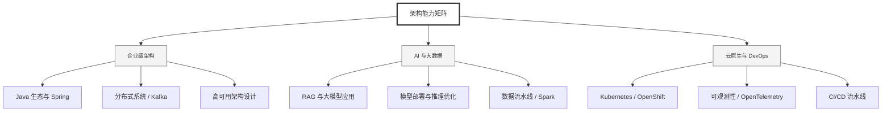

  <h1>你好，我是 Ellen Liu 👋</h1>
  

    <a href="README.md">English</a> | 
    <b>简体中文</b>
  

## 🧠 技术栈与核心能力

智能化企业系统建设路线图，涵盖全栈人工智能工程、云基础设施架构及模型部署等核心技术领域。

```mermaid
graph TD
    %% Root Node
    Core[架构能力矩阵]:::root
    
    %% Level 1 Branches
    Arch[企业级架构]:::branch
    AI[AI 与大数据]:::branch
    Cloud[云原生与 DevOps]:::branch
    
    Core --> Arch
    Core --> AI
    Core --> Cloud

    %% Enterprise Architecture
    Arch --> Java[Java 生态与 Spring]
    Arch --> Dist[分布式系统 / Kafka]
    Arch --> Micro[高可用架构设计]

    %% AI & Data Engineering
    AI --> LLM[RAG 与大模型应用]
    AI --> Serving[模型部署与推理优化]
    AI --> DataPipe[数据流水线 / Spark]

    %% Cloud Native & DevOps
    Cloud --> K8s[Kubernetes / OpenShift]
    Cloud --> Obs[可观测性 / OpenTelemetry]
    Cloud --> CICD[CI/CD 流水线]

    %% Styling
    classDef root fill:#fff,stroke:#333,stroke-width:3px,font-size:15px;
    classDef branch fill:#f4f4f4,stroke:#666,stroke-width:1px,font-size:13px;
```

## 🚀 Highlighted 工作

- **开源 AI 项目**: [基于 BERT 的声明检测模型](https://huggingface.co/XiaojingEllen/bert-finetuned-claim-detection) (Apache-2.0)
  - *已被哥伦比亚大学 (UBC) 研究项目引用。*
  - *手写 Transformer 核心代码，以验证理论与工程的一致性。*
- **金融基础设施**: 从 0 到 1 构建数字银行支付中间件及智能保险理赔系统。

## 📑 每日论文速递 (ArXiv)
<!-- DAILY_ARXIV_SUMMARY_START -->
**更新日期: 2026-03-18**

### 1. [混合深度注意力](http://arxiv.org/abs/2603.15619v1)
- **摘要**: 深度扩展是推动大语言模型（LLM）发展的关键因素。然而，随着模型深度增加，信号衰减问题日益凸显：浅层形成的有效特征在残差更新的反复作用下逐渐稀释，导致深层难以恢复这些信息。我们提出混合深度注意力机制（MoDA），该机制允许每个注意力头同时关注当前层的序列键值对以及来自先前层的深度键值对。我们还设计了一种硬件友好的MoDA算法，通过解决非连续内存访问模式问题，在64K序列长度下达到FlashAttention-2效率的97.3%。在15亿参数模型上的实验表明，MoDA始终优于现有基线方法：在10个验证基准测试中平均困惑度降低0.2，在10个下游任务中平均性能提升2.11%，而计算开销仅增加3.7%的FLOPs。研究还发现，MoDA与后归一化结合的效果优于前归一化。这些结果表明MoDA是实现深度扩展的有效基础模块。代码已开源：https://github.com/hustvl/MoDA。

### 2. [语言模型中道德冷漠的机制性根源](http://arxiv.org/abs/2603.15615v1)
- **摘要**: 现有的大型语言模型（LLM）行为对齐技术往往忽视表面合规性与内在未对齐表征之间的差异，使模型易受长尾风险影响。更重要的是，我们认为由于将不同道德概念压缩为统一的概率分布，LLM本质上处于道德无差异状态。我们基于原型理论和社会化学-101数据集构建的25.1万个道德向量，对LLM潜在表征中的这种无差异状态进行了验证与修正。首先，通过对23个模型的分析发现，当前LLM既无法表征对立道德范畴间的区别，也无法体现范畴内细粒度的典型性梯度；值得注意的是，无论是模型规模扩展、架构调整还是显式对齐训练，均未能改变这种无差异状态。随后，我们在Qwen3-8B模型上应用稀疏自编码器，分离出单语义道德特征，并针对性重构其拓扑关系以匹配真实道德向量。这种表征对齐自然提升了道德推理的精细度，在独立对抗性基准测试Flames中取得了75%的成对胜率。最后，我们从经验主义哲学视角阐释了当前干预方法的补救性质，主张内生对齐的人工智能可能需要实现从事后修正到主动培育的范式转变。

### 3. [Code-A1：基于强化学习的代码大语言模型与测试大语言模型对抗式协同进化](http://arxiv.org/abs/2603.15611v1)
- **摘要**: 基于单元测试通过率的可验证奖励是代码生成强化学习的依赖基础。然而高质量测试套件稀缺，现有数据集覆盖有限，且静态奖励无法随模型改进而动态调整。近期自博弈方法虽将代码与测试生成统一于单一模型，却面临固有困境：白盒访问会导致模型为获取简单奖励而生成琐碎测试的自我合谋问题，而黑盒限制又会产生通用测试，无法捕捉实现层面的特定缺陷。我们提出Code-A1对抗协同进化框架，通过目标对立的代码大语言模型与测试大语言模型进行联合优化：代码模型以获得更高测试通过率为奖励，测试模型则以暴露更多缺陷为目标。这种架构分离消除了自我合谋风险，并安全实现了白盒测试生成——测试模型可审查候选代码以构建针对性对抗测试。我们进一步引入错题本机制实现经验回放，以及平衡测试有效性与对抗难度的复合奖励机制。在Qwen2.5-Coder系列模型上的实验表明，Code-A1在代码生成性能上达到甚至超越了基于人工标注测试训练的模型，同时显著提升了测试生成能力。

<!-- DAILY_ARXIV_SUMMARY_END -->

## 🌐 保持联系

  
<i>期待与您探讨 AI 基础设施的未来！</i>

