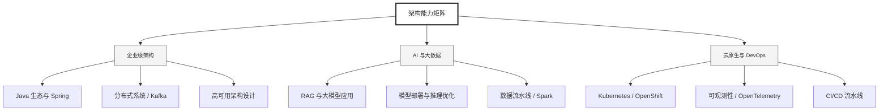

  <h1>你好，我是 Ellen Liu 👋</h1>
  

    <a href="README.md">English</a> | 
    <b>简体中文</b>
  

## 🧠 技术栈与核心能力

智能化企业系统建设路线图，涵盖全栈人工智能工程、云基础设施架构及模型部署等核心技术领域。

```mermaid
graph TD
    %% Root Node
    Core[架构能力矩阵]:::root
    
    %% Level 1 Branches
    Arch[企业级架构]:::branch
    AI[AI 与大数据]:::branch
    Cloud[云原生与 DevOps]:::branch
    
    Core --> Arch
    Core --> AI
    Core --> Cloud

    %% Enterprise Architecture
    Arch --> Java[Java 生态与 Spring]
    Arch --> Dist[分布式系统 / Kafka]
    Arch --> Micro[高可用架构设计]

    %% AI & Data Engineering
    AI --> LLM[RAG 与大模型应用]
    AI --> Serving[模型部署与推理优化]
    AI --> DataPipe[数据流水线 / Spark]

    %% Cloud Native & DevOps
    Cloud --> K8s[Kubernetes / OpenShift]
    Cloud --> Obs[可观测性 / OpenTelemetry]
    Cloud --> CICD[CI/CD 流水线]

    %% Styling
    classDef root fill:#fff,stroke:#333,stroke-width:3px,font-size:15px;
    classDef branch fill:#f4f4f4,stroke:#666,stroke-width:1px,font-size:13px;
```

## 🚀 Highlighted 工作

- **开源 AI 项目**: [基于 BERT 的声明检测模型](https://huggingface.co/XiaojingEllen/bert-finetuned-claim-detection) (Apache-2.0)
  - *已被哥伦比亚大学 (UBC) 研究项目引用。*
  - *手写 Transformer 核心代码，以验证理论与工程的一致性。*
- **金融基础设施**: 从 0 到 1 构建数字银行支付中间件及智能保险理赔系统。

## 📑 每日论文速递 (ArXiv)
<!-- DAILY_ARXIV_SUMMARY_START -->
**更新日期: 2026-06-15**

### 1. [EvoArena：动态环境中鲁棒性LLM代理的记忆演化追踪](http://arxiv.org/abs/2606.13681v1)
- **摘要**: 大型语言模型（LLM）智能体在众多基准测试中展现出强劲性能，但多数评估仍假设环境是静态的。然而，实际部署场景本质上是动态的，要求智能体持续调整其知识、技能和行为以适应变化的环境与更新的任务条件。为填补这一空白，我们提出EvoArena基准套件，将环境变化建模为终端、软件和社交领域中的渐进式更新序列。我们进一步提出EvoMem——一种基于补丁的记忆范式，将记忆演化记录为结构化的更新历史，使智能体能够通过记忆变化推理环境演化。实验表明，当前智能体在EvoArena上表现欠佳，在演化终端、软件和社交偏好领域的平均准确率仅为39.6%。EvoMem持续提升性能，在EvoArena上带来平均1.5%的提升，同时使GAIA和LoCoMo等标准基准测试分别提升6.1%和4.8%。除单任务外，EvoMem还将EvoArena的链式准确率提升3.7%，该指标要求成功完成一系列连续相关的演化子任务。机制分析显示，EvoMem改善了记忆中的证据捕获能力，表明其能更完整地保留演化环境状态。我们的研究结果凸显了在评估与记忆两个维度建模演化对智能体可靠部署的重要性。

### 2. [通过检索增强的强化微调学习类比推理](http://arxiv.org/abs/2606.13680v1)
- **摘要**: 检索增强生成（RAG）已成为将语言模型锚定于外部知识的标准机制，然而基于词汇或语义相似度的传统检索方法难以胜任复杂推理任务：语义相似的问题可能需要完全不同的解决策略，而表面不同的问题却可能共享相同的底层推理模式。我们提出检索增强强化微调（RA-RFT），这是一种通过类比推理训练语言模型的后训练框架。RA-RFT采用黄金相关性蒸馏技术训练检索器，使其依据预期推理收益而非语义重叠度对上下文进行排序；随后通过强化微调方法结合检索到的类比示例对策略模型进行微调，使模型学会在可验证结果奖励下利用推理轨迹。我们进一步分析了检索上下文的多样性，发现具备推理感知能力的检索能够呈现互补的解决策略，为不同问题提供差异化的推理框架。在多个具有挑战性的数学推理基准测试中，RA-RFT始终优于标准强化微调方法。例如，在AIME 2025平均@32准确率上，RA-RFT相比GRPO分别使Qwen3-1.7B和Qwen3-4B模型提升7.1和2.8个百分点——这表明推理感知检索是独立于奖励设计或训练课程优化的互补性改进维度。

### 3. [Influcoder：将解码器的梯度影响排名提炼为编码器，用于数据归因](http://arxiv.org/abs/2606.13668v1)
- **摘要**: 随着大语言模型（LLMs）能力的提升，通过筛选训练数据中的样本来构建高质量数据集的需求日益增长。通常而言，数据归因（Data Attribution, DA）方法旨在评估训练数据集中单个样本如何预先影响模型生成特定输出。例如，研究者可能希望识别训练数据中哪些样本会导致LLM在训练后产生毒性行为。许多方法通过影响函数（influence functions）范式来量化这种条件作用。尽管这类方法在功能上有效，但其处理速度和存储紧凑性不足，难以在大规模数据集上实际应用。为此，我们提出Influcoder方法，这是一种快速且经济高效的大规模基于影响函数的数据归因方案。

<!-- DAILY_ARXIV_SUMMARY_END -->

## 🌐 保持联系

  
<i>期待与您探讨 AI 基础设施的未来！</i>

