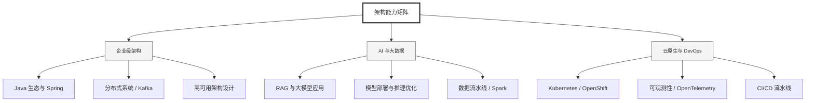

  <h1>你好，我是 Ellen Liu 👋</h1>
  

    <a href="README.md">English</a> | 
    <b>简体中文</b>
  

## 🧠 技术栈与核心能力

智能化企业系统建设路线图，涵盖全栈人工智能工程、云基础设施架构及模型部署等核心技术领域。

```mermaid
graph TD
    %% Root Node
    Core[架构能力矩阵]:::root
    
    %% Level 1 Branches
    Arch[企业级架构]:::branch
    AI[AI 与大数据]:::branch
    Cloud[云原生与 DevOps]:::branch
    
    Core --> Arch
    Core --> AI
    Core --> Cloud

    %% Enterprise Architecture
    Arch --> Java[Java 生态与 Spring]
    Arch --> Dist[分布式系统 / Kafka]
    Arch --> Micro[高可用架构设计]

    %% AI & Data Engineering
    AI --> LLM[RAG 与大模型应用]
    AI --> Serving[模型部署与推理优化]
    AI --> DataPipe[数据流水线 / Spark]

    %% Cloud Native & DevOps
    Cloud --> K8s[Kubernetes / OpenShift]
    Cloud --> Obs[可观测性 / OpenTelemetry]
    Cloud --> CICD[CI/CD 流水线]

    %% Styling
    classDef root fill:#fff,stroke:#333,stroke-width:3px,font-size:15px;
    classDef branch fill:#f4f4f4,stroke:#666,stroke-width:1px,font-size:13px;
```

## 🚀 Highlighted 工作

- **开源 AI 项目**: [基于 BERT 的声明检测模型](https://huggingface.co/XiaojingEllen/bert-finetuned-claim-detection) (Apache-2.0)
  - *已被哥伦比亚大学 (UBC) 研究项目引用。*
  - *手写 Transformer 核心代码，以验证理论与工程的一致性。*
- **金融基础设施**: 从 0 到 1 构建数字银行支付中间件及智能保险理赔系统。

## 📑 每日论文速递 (ArXiv)
<!-- DAILY_ARXIV_SUMMARY_START -->
**更新日期: 2026-07-06**

### 1. [LACUNA：评估大语言模型遗忘定位精度的测试平台](http://arxiv.org/abs/2607.02513v1)
- **摘要**: 大型语言模型会记忆敏感的训练数据，包括个人身份信息（PII），这催生了对可靠事后移除方法的迫切需求。遗忘学习作为一种有前景的解决方案应运而生，当前最先进的方法通常遵循"先定位、后遗忘"的范式，针对特定模型参数进行操作。然而现有基准测试仅在输出层面对遗忘效果进行评估，未能解答遗忘是否真正从模型参数中擦除知识，抑或只是掩盖了知识——这种担忧因重显攻击的成功而愈发凸显。为填补这一空白，我们提出LACUNA：首个具备真实参数级定位能力的遗忘测试平台。该平台通过掩码连续预训练，将合成个体的PII注入基于OLMo的1B和7B模型的预设参数中，从而直接评估遗忘方法是否精准作用于存储知识的权重。我们利用LACUNA对当前最先进的遗忘方法进行基准测试，发现尽管这些方法在输出层面表现优异，但存在精度不足且易受重显攻击的缺陷。进一步研究表明，当定位成功时，即便是简单的基于梯度的遗忘方法也能实现强效擦除并抵御重显攻击，这凸显了精准遗忘的重要性。我们开源LACUNA以补充行为评估体系，推动基于定位的鲁棒遗忘技术取得新突破。

### 2. [大语言模型的在线安全监控](http://arxiv.org/abs/2607.02510v1)
- **摘要**: 尽管经过对齐训练，大语言模型在部署时仍容易生成不安全输出。因此，在线监控输出并在无法确保安全性时及时发出警报至关重要。我们研究了一种简单的实时监控器，通过阈值化将外部模型生成的验证信号转化为警报决策，并利用风险控制方法校准阈值。在数学推理和红队测试数据集上的实验表明，这种简单设计与基于序贯假设检验的高级监控器相比具有竞争力。

### 3. [当无人注视时，大语言模型智能体在说什么：多智能体辩论中的社会结构与潜在目标涌现](http://arxiv.org/abs/2607.02507v1)
- **摘要**: 随着大型语言模型（LLM）智能体越来越多地介入具有社会结构的场景——其中角色定位、受众特征和关系背景会显著影响言论的利弊权衡，本研究探讨了在提示词中未设置明确目标的情况下，这种社会结构是否会导致智能体在公开场合的表达与同等条件下通过非公开渠道（OTR）获取的回应产生差异。我们提出双通道辩论框架：智能体在生成公开言论并进入共享对话历史的同时，还会产生被记录但绝不向其他参与者展示的非公开回应。通过对10个模型、3类场景及每类场景5种变体的实验发现，对齐诱导设置会使目标智能体产生系统性的公开-非公开分歧，其决策分歧度从约3%的基线水平跃升至约40%。该效应在四项聚合分析（立场分析、语义相似度、自然语言推理及问卷调查）中保持稳定。部分案例中，非公开回应明确将公开场合的顺应归因于关系压力（如职业风险或赞助义务）。研究结果表明，对智能体的评估应超越显性目标，需检测其涌现的隐性目标。我们提出双通道评估框架及配套行为测量指标，为这一评估提供可操作化方案。

<!-- DAILY_ARXIV_SUMMARY_END -->

## 🌐 保持联系

  
<i>期待与您探讨 AI 基础设施的未来！</i>

