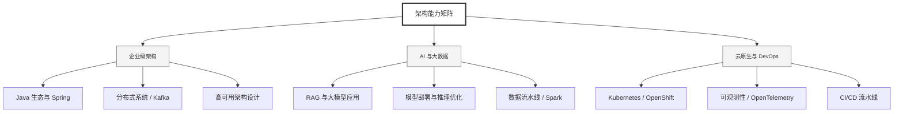

  <h1>你好，我是 Ellen Liu 👋</h1>
  

    <a href="README.md">English</a> | 
    <b>简体中文</b>
  

## 🧠 技术栈与核心能力

智能化企业系统建设路线图，涵盖全栈人工智能工程、云基础设施架构及模型部署等核心技术领域。

```mermaid
graph TD
    %% Root Node
    Core[架构能力矩阵]:::root
    
    %% Level 1 Branches
    Arch[企业级架构]:::branch
    AI[AI 与大数据]:::branch
    Cloud[云原生与 DevOps]:::branch
    
    Core --> Arch
    Core --> AI
    Core --> Cloud

    %% Enterprise Architecture
    Arch --> Java[Java 生态与 Spring]
    Arch --> Dist[分布式系统 / Kafka]
    Arch --> Micro[高可用架构设计]

    %% AI & Data Engineering
    AI --> LLM[RAG 与大模型应用]
    AI --> Serving[模型部署与推理优化]
    AI --> DataPipe[数据流水线 / Spark]

    %% Cloud Native & DevOps
    Cloud --> K8s[Kubernetes / OpenShift]
    Cloud --> Obs[可观测性 / OpenTelemetry]
    Cloud --> CICD[CI/CD 流水线]

    %% Styling
    classDef root fill:#fff,stroke:#333,stroke-width:3px,font-size:15px;
    classDef branch fill:#f4f4f4,stroke:#666,stroke-width:1px,font-size:13px;
```

## 🚀 Highlighted 工作

- **开源 AI 项目**: [基于 BERT 的声明检测模型](https://huggingface.co/XiaojingEllen/bert-finetuned-claim-detection) (Apache-2.0)
  - *已被哥伦比亚大学 (UBC) 研究项目引用。*
  - *手写 Transformer 核心代码，以验证理论与工程的一致性。*
- **金融基础设施**: 从 0 到 1 构建数字银行支付中间件及智能保险理赔系统。

## 📑 每日论文速递 (ArXiv)
<!-- DAILY_ARXIV_SUMMARY_START -->
**更新日期: 2026-02-24**

### 1. [VIRAASAT：探索印度文化推理的新路径](http://arxiv.org/abs/2602.18429v1)
- **摘要**: 大型语言模型（LLM）在数学与编程等领域的推理任务中已取得显著进展，但其在需要丰富社会文化知识与多元地域背景的任务中表现欠佳，尤其涉及印度文化的场景。现有文化评测基准存在三大局限：（一）依赖人工构建，（二）仅包含测试事实记忆的单跳问题，（三）扩展成本过高，导致该缺陷长期未被有效量化。为此，我们提出VIRAASAT——一种面向印度文化的半自动化多跳问答数据集生成方法。该方法基于包含700余个专家编撰文化实体的知识图谱，覆盖印度文化13个核心维度（历史、节庆等），涵盖全印度28个邦与8个中央直辖区，生成超过3,200道需要链式文化推理的多跳问题。

通过对当前前沿大语言模型在VIRAASAT上的评测，我们发现其推理存在关键缺陷：基于思维链（CoT）轨迹的微调难以有效关联与整合低概率文化事实。为弥补这一不足，我们提出名为符号化操作链（SCoM）的创新框架。该框架沿袭操作链范式，训练模型在内部模拟知识图谱的原子级操作，使其能够可靠遍历图谱的拓扑结构。监督微调实验表明，SCoM相较标准思维链基线的性能提升最高达20%。我们同步公开VIRAASAT数据集及研究成果，为构建具备文化感知能力的推理模型奠定坚实基础。

### 2. [RVR：检索-验证-再检索，实现全面问答](http://arxiv.org/abs/2602.18425v1)
- **摘要**: 全面检索多样化文档对于处理那些存在广泛有效答案的查询至关重要。我们提出了检索-验证-检索（RVR）框架，这是一种旨在最大化答案覆盖度的多轮检索方法。该框架首先通过检索器接收原始查询并返回候选文档集，随后由验证器筛选出高质量子集。在后续轮次中，查询会与先前已验证的文档相结合，以发掘前几轮尚未覆盖的答案。即使使用现成的检索器，RVR仍能保持高效，而针对我们的推理流程对检索器进行微调还能带来进一步提升。我们的方法在包括智能体搜索方法在内的基线模型上表现优异，在多答案检索数据集（QAMPARI）上实现了至少10%的相对提升和3%的绝对提升（以完整召回率为衡量标准）。在两个跨领域数据集（QUEST和WebQuestionsSP）上，使用不同基础检索器时也观察到一致的性能增益。本研究展示了一种利用验证器实现全面答案召回、并使检索器适应新推理场景的迭代方法，具有广阔的应用前景。

### 3. [SPQ：一种面向大语言模型压缩的集成技术](http://arxiv.org/abs/2602.18420v1)
- **摘要**: 本研究提出一种集成技术SPQ（SVD-剪枝-量化），用于大语言模型压缩，该方法结合了保留方差的奇异值分解、基于激活的剪枝以及训练后线性量化。各组件针对不同的低效来源：i) 剪枝移除MLP层中的冗余神经元；ii) SVD将注意力投影分解为紧凑的低秩因子；iii) 8位量化均匀压缩所有线性层。在相同压缩比下，SPQ在困惑度上优于单一方法（仅SVD、仅剪枝或仅量化），证明了互补技术组合的优势。应用于LLaMA-2-7B模型时，SPQ在保持或提升困惑度（如WikiText-2从5.47降至4.91）并维持下游基准测试（包括C4、TruthfulQA和GSM8K）准确性的同时，实现了高达75%的内存压缩。与GPTQ、SparseGPT等强基线相比，SPQ在减少内存占用的前提下（GPTQ需7.16 GB，SPQ仅需6.86 GB），仍保持具有竞争力的困惑度与准确性。此外，SPQ相比GPTQ提升了推理吞吐量，最高可实现1.9倍加速，进一步增强了实际部署的可行性。通过层感知与互补压缩技术，SPQ的鲁棒压缩效果有望为内存受限环境中的大语言模型部署提供实用解决方案。代码已开源：https://github.com/JiaminYao/SPQ_LLM_Compression/

<!-- DAILY_ARXIV_SUMMARY_END -->

## 🌐 保持联系

  
<i>期待与您探讨 AI 基础设施的未来！</i>

