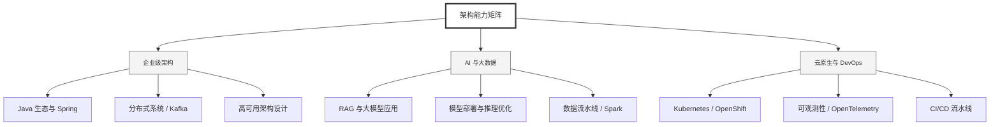

  <h1>你好，我是 Ellen Liu 👋</h1>
  

    <a href="README.md">English</a> | 
    <b>简体中文</b>
  

## 🧠 技术栈与核心能力

智能化企业系统建设路线图，涵盖全栈人工智能工程、云基础设施架构及模型部署等核心技术领域。

```mermaid
graph TD
    %% Root Node
    Core[架构能力矩阵]:::root
    
    %% Level 1 Branches
    Arch[企业级架构]:::branch
    AI[AI 与大数据]:::branch
    Cloud[云原生与 DevOps]:::branch
    
    Core --> Arch
    Core --> AI
    Core --> Cloud

    %% Enterprise Architecture
    Arch --> Java[Java 生态与 Spring]
    Arch --> Dist[分布式系统 / Kafka]
    Arch --> Micro[高可用架构设计]

    %% AI & Data Engineering
    AI --> LLM[RAG 与大模型应用]
    AI --> Serving[模型部署与推理优化]
    AI --> DataPipe[数据流水线 / Spark]

    %% Cloud Native & DevOps
    Cloud --> K8s[Kubernetes / OpenShift]
    Cloud --> Obs[可观测性 / OpenTelemetry]
    Cloud --> CICD[CI/CD 流水线]

    %% Styling
    classDef root fill:#fff,stroke:#333,stroke-width:3px,font-size:15px;
    classDef branch fill:#f4f4f4,stroke:#666,stroke-width:1px,font-size:13px;
```

## 🚀 Highlighted 工作

- **开源 AI 项目**: [基于 BERT 的声明检测模型](https://huggingface.co/XiaojingEllen/bert-finetuned-claim-detection) (Apache-2.0)
  - *已被哥伦比亚大学 (UBC) 研究项目引用。*
  - *手写 Transformer 核心代码，以验证理论与工程的一致性。*
- **金融基础设施**: 从 0 到 1 构建数字银行支付中间件及智能保险理赔系统。

## 📑 每日论文速递 (ArXiv)
<!-- DAILY_ARXIV_SUMMARY_START -->
**更新日期: 2026-06-19**

### 1. [原生主动感知作为全模态理解的推理机制](http://arxiv.org/abs/2606.19341v1)
- **摘要**: 长视频理解的被动模型通常依赖“全量观看”范式，即无论查询难度如何都统一处理所有帧，导致计算成本随视频时长线性增长。尽管已出现交互式框架，但这些方法往往需要全局预扫描，其上下文成本仍与视频长度成正比。我们提出OmniAgent——首个原生全模态智能体，将视频理解建模为基于POMDP的迭代式“观察-思考-行动”循环。该智能体通过按需行动，选择性地将音视频线索提炼为持久化文本记忆，从而有效解耦推理复杂度与原始视频时长。为实现这一目标，我们引入：（1）智能体监督微调——通过最佳N轨迹合成与双阶段质量控制，引导原生主动感知能力；（2）基于TAURA（回合感知自适应不确定性重缩放优势）的智能体强化学习，利用回合级熵值将信用分配导向关键发现回合。关键的是，OmniAgent展现出正向测试时扩展特性：随着推理回合数增加，性能持续提升，验证了主动感知的有效性。在十个基准测试（如VideoMME、LVBench）上的实验结果表明，OmniAgent在开源模型中达到最优性能。值得注意的是，在LVBench上，我们的7B参数智能体以50.5%的准确率超越10倍参数量的Qwen2.5-VL-72B（47.3%）。

### 2. [使用图灵奖励训练用户模拟器](http://arxiv.org/abs/2606.19336v1)
- **摘要**: 在交互式环境中学习模拟人类用户，能够推动智能助手训练、个性化系统评估、社会科学研究等多个领域的发展。现有方法通常通过训练大型语言模型（LLM）来匹配单一真实响应，具体方式包括最大化对数概率或使用相似度奖励。我们提出了一种基于图灵测试的强化学习方法——{Turing-RL}，用于训练用户模拟器模型。该方法采用判别式图灵奖励机制，借助LLM评判器评估生成响应与真实用户在历史语境下可能表达的不可区分程度，用户模拟器LLM通过此类奖励学习生成与用户真实表达难以区分的响应。在对话聊天和Reddit论坛讨论两个不同领域的实验中，{Turing-RL}在LLM评估和人工评估指标上均持续优于基线方法。研究表明，相较于响应匹配，优化不可区分性是训练用户模拟器的更有效策略。

### 3. [通过多智能体虚拟博弈，利用大型语言模型增强决策能力](http://arxiv.org/abs/2606.19308v1)
- **摘要**: 基于大型语言模型的多智能体系统（MAS）通过将子任务分配给协作智能体，在解决具有执行复杂性的任务方面展现出巨大潜力。然而，这种分而治之的范式在处理现实世界中同样普遍存在的决策任务时存在不足。这类任务要求所有利益相关者同时从各自立场进行推理，而他们的决策相互依存，因此无法孤立解决。我们将这一挑战定义为立场纠缠——一种区别于执行复杂性的决策复杂性。为解决该问题，我们提出多智能体虚拟博弈（MAFP），这是一种新型MAS范式，将利益相关者立场表征为智能体，并将决策制定建模为均衡寻求过程。基于虚拟博弈的博弈论原理，MAFP通过使每个智能体对其他智能体历史决策的经验混合做出最优响应，迭代更新其决策。这使得智能体能够暴露并弥补彼此的弱点，逐步提升决策质量与鲁棒性。我们在具有挑战性的决策任务上评估MAFP，这些任务测试了在行动前为竞争场景制定策略的能力。MAFP在锦标赛强度与鲁棒性这两个互补指标上均优于单轮和多轮基线方法，证明了其在解决立场纠缠问题上的有效性。

<!-- DAILY_ARXIV_SUMMARY_END -->

## 🌐 保持联系

  
<i>期待与您探讨 AI 基础设施的未来！</i>

