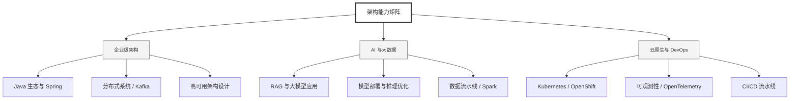

  <h1>你好，我是 Ellen Liu 👋</h1>
  

    <a href="README.md">English</a> | 
    <b>简体中文</b>
  

## 🧠 技术栈与核心能力

智能化企业系统建设路线图，涵盖全栈人工智能工程、云基础设施架构及模型部署等核心技术领域。

```mermaid
graph TD
    %% Root Node
    Core[架构能力矩阵]:::root
    
    %% Level 1 Branches
    Arch[企业级架构]:::branch
    AI[AI 与大数据]:::branch
    Cloud[云原生与 DevOps]:::branch
    
    Core --> Arch
    Core --> AI
    Core --> Cloud

    %% Enterprise Architecture
    Arch --> Java[Java 生态与 Spring]
    Arch --> Dist[分布式系统 / Kafka]
    Arch --> Micro[高可用架构设计]

    %% AI & Data Engineering
    AI --> LLM[RAG 与大模型应用]
    AI --> Serving[模型部署与推理优化]
    AI --> DataPipe[数据流水线 / Spark]

    %% Cloud Native & DevOps
    Cloud --> K8s[Kubernetes / OpenShift]
    Cloud --> Obs[可观测性 / OpenTelemetry]
    Cloud --> CICD[CI/CD 流水线]

    %% Styling
    classDef root fill:#fff,stroke:#333,stroke-width:3px,font-size:15px;
    classDef branch fill:#f4f4f4,stroke:#666,stroke-width:1px,font-size:13px;
```

## 🚀 Highlighted 工作

- **开源 AI 项目**: [基于 BERT 的声明检测模型](https://huggingface.co/XiaojingEllen/bert-finetuned-claim-detection) (Apache-2.0)
  - *已被哥伦比亚大学 (UBC) 研究项目引用。*
  - *手写 Transformer 核心代码，以验证理论与工程的一致性。*
- **金融基础设施**: 从 0 到 1 构建数字银行支付中间件及智能保险理赔系统。

## 📑 每日论文速递 (ArXiv)
<!-- DAILY_ARXIV_SUMMARY_START -->
**更新日期: 2026-04-16**

### 1. [场景评判家：三维室内场景合成的符号化评估器](http://arxiv.org/abs/2604.13035v1)
- **摘要**: 大型语言模型（LLM）与视觉语言模型（VLM）正日益通过布局和场景图等中间结构生成室内场景，但评估环节仍依赖LLM或VLM作为评判者，通过对渲染视图打分进行判断。这种方式使评估结果易受观察视角、提示词表述及模型幻觉的影响。当评估标准不稳定时，我们难以判断模型生成的场景是否具有空间合理性，亦无法确定输出分数究竟反映的是场景质量，还是视角选择、渲染效果或提示词的影响。

为此，我们提出SceneCritic——一种面向平面布局的符号化评估器。其约束体系基于我们构建的结构化空间本体SceneOnto，该本体通过整合3D-FRONT、ScanNet和Visual Genome数据集的室内场景先验知识构建而成。SceneCritic通过遍历该本体，可联合验证物体关系的语义一致性、方向合理性与几何协调性，提供物体级与关系级评估，精准定位违规现象与成功布局。

此外，我们将SceneCritic与迭代优化测试平台结合，探究不同批评模式下模型构建与修正空间结构的能力：包括基于碰撞约束的规则型批评器、以文本布局为输入的LLM批评器，以及基于渲染观察的VLM批评器。大量实验表明：（1）相较于基于VLM的评估器，SceneCritic与人类判断的一致性显著更高；（2）在语义布局质量评估方面，纯文本LLM可超越VLM；（3）基于图像的VLM优化模式在语义修正与方向校正方面效果最为显著。

### 2. [迈向机器学习研究的自主长程工程](http://arxiv.org/abs/2604.13018v1)
- **摘要**: 自主AI研究发展迅猛，但长周期机器学习研究工程仍面临挑战：智能体需要在任务理解、环境配置、代码实现、实验验证和调试纠错等环节中维持数小时乃至数天的连贯推进。我们提出AiScientist系统——基于"结构化编排与持久化状态连续性相结合是实现长周期高性能关键"这一核心原则构建的自主长周期机器学习研究工程系统。该系统融合分层编排架构与权限限定的"文件总线"工作空间：顶层编排器通过精炼摘要与工作空间地图维持阶段级控制，而专业化智能体则持续基于分析报告、实施计划、代码文件及实验证据等持久化工件进行动态校准，而非主要依赖对话式任务交接，由此实现对厚重状态的轻量级管控。

在两项互补性基准测试中，AiScientist将PaperBench分数较最佳匹配基线平均提升10.54分，并在MLE-Bench Lite上取得81.82%的任意奖牌达成率。消融实验进一步表明"文件总线"协议是性能提升的关键驱动因素，移除该协议会导致PaperBench分数下降6.41分、MLE-Bench Lite分数降低31.82分。这些结果揭示：长周期机器学习研究工程本质上是协调专业化工作与持久化项目状态的系统性问题，而非单纯的局部推理问题。

### 3. [一触即溃：指令微调助手的脆弱性](http://arxiv.org/abs/2604.13006v1)
- **摘要**: 经过指令微调的大语言模型能生成结构清晰的有益回复，但当面临微不足道的约束时，这种助益性是否稳健？我们发现，简单的词汇约束（禁止使用单个标点符号或常见词汇）会导致指令微调大语言模型的回复质量崩溃，在三个开源模型系列和一个闭源模型（GPT-4o-mini）的成对评估中，回复完整性下降14%至48%。在GPT-4o-mini与GPT-4o评判的1920组成对比较中，基线回复在77%至100%的情况下更受青睐。值得注意的是，GPT-4o-mini出现31%的完整性损失（基线胜率达99%），这表明脆弱性同样存在于商业部署的闭源模型中，这与先前关于格式约束的研究结论相悖。

通过机制分析，我们将其归因为规划失败：采用两阶段生成（首先生成自由回复，再进行约束重写）可恢复59%至96%的回复长度；对提示表征进行线性探测能在生成开始前预测回复长度（$R^2 = 0.51$--$0.93$），且$R^2$值随模型崩溃程度同步变化。相同探测方法在基础模型上呈现负$R^2$值，证实指令微调构建了编码崩溃决策的表征结构。关键的是，基础模型在相同约束下未出现系统性崩溃，其影响微弱、随机且双向波动，表明指令微调通过将任务能力与狭窄的表面形式模板耦合而催生了这种脆弱性。该现象在MT-Bench所有八类任务中均得到复现。

我们进一步发现，标准独立大语言模型评判方法仅检测到3.5%的平均质量下降，而成对评估揭示的下降幅度达23%，这暴露出约束生成评估方法存在盲区。

<!-- DAILY_ARXIV_SUMMARY_END -->

## 🌐 保持联系

  
<i>期待与您探讨 AI 基础设施的未来！</i>

