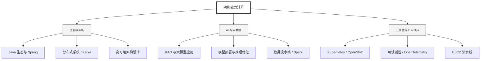

  <h1>你好，我是 Ellen Liu 👋</h1>
  

    <a href="README.md">English</a> | 
    <b>简体中文</b>
  

## 🧠 技术栈与核心能力

智能化企业系统建设路线图，涵盖全栈人工智能工程、云基础设施架构及模型部署等核心技术领域。

```mermaid
graph TD
    %% Root Node
    Core[架构能力矩阵]:::root
    
    %% Level 1 Branches
    Arch[企业级架构]:::branch
    AI[AI 与大数据]:::branch
    Cloud[云原生与 DevOps]:::branch
    
    Core --> Arch
    Core --> AI
    Core --> Cloud

    %% Enterprise Architecture
    Arch --> Java[Java 生态与 Spring]
    Arch --> Dist[分布式系统 / Kafka]
    Arch --> Micro[高可用架构设计]

    %% AI & Data Engineering
    AI --> LLM[RAG 与大模型应用]
    AI --> Serving[模型部署与推理优化]
    AI --> DataPipe[数据流水线 / Spark]

    %% Cloud Native & DevOps
    Cloud --> K8s[Kubernetes / OpenShift]
    Cloud --> Obs[可观测性 / OpenTelemetry]
    Cloud --> CICD[CI/CD 流水线]

    %% Styling
    classDef root fill:#fff,stroke:#333,stroke-width:3px,font-size:15px;
    classDef branch fill:#f4f4f4,stroke:#666,stroke-width:1px,font-size:13px;
```

## 🚀 Highlighted 工作

- **开源 AI 项目**: [基于 BERT 的声明检测模型](https://huggingface.co/XiaojingEllen/bert-finetuned-claim-detection) (Apache-2.0)
  - *已被哥伦比亚大学 (UBC) 研究项目引用。*
  - *手写 Transformer 核心代码，以验证理论与工程的一致性。*
- **金融基础设施**: 从 0 到 1 构建数字银行支付中间件及智能保险理赔系统。

## 📑 每日论文速递 (ArXiv)
<!-- DAILY_ARXIV_SUMMARY_START -->
**更新日期: 2026-07-13**

### 1. [面向QANTA 2026的基于置信度校准与增量推理的任务特定多模态问答智能体](http://arxiv.org/abs/2607.09623v1)
- **摘要**: 我们提交了参加ICML 2026高效多模态问答研讨会（EMM-QA）上QANTA 2026共享挑战赛的方案。Quanta评估多模态问答系统在逐步揭示的文本及配套图像中回答金字塔式问题的能力，同时要求系统在现实效率约束下运行。该挑战包含两个独立任务：抢答题（需在不确定条件下决定作答时机）和加分题（侧重精准答案选择与人类采纳度）。为应对不同目标，我们开发了任务特定的双智能体架构。抢答智能体采用GPT-4o-mini级模型（竞赛日志中称为GPT-4.1-mini），配备置信度校准应答机制和领域特定数值推理策略，可减少因孤立定量线索导致的过度自信预测。加分智能体使用GPT-4o级模型（竞赛日志中称为GPT-4.1），通过引入引导感知推理、结构化关系推理和多模态证据整合，提升精确答案选择能力。我们的方法不依赖检索流水线或模型集成，而是在纯托管环境中强调高效推理策略与置信度校准。最终系统以0.402的总分位居排行榜首位，其中抢答题得分0.238，加分效应得分0.164。实验结果表明，轻量级任务特定推理策略可在资源受限的多模态问答基准测试中展现强劲性能。

### 2. [Agora：基于拍卖式任务分配的LLM智能体推理增强方法](http://arxiv.org/abs/2607.09600v1)
- **摘要**: 提升大语言模型（LLM）智能体的推理能力需要有效协调各类专家模型与工具。然而，现有框架通常基于任务与专家模型或工具功能之间的粗粒度匹配来调用API，却忽略了功能相似替代方案之间的性能差异和成本效率等关键因素。为此，我们提出Agora框架，该框架引入激励相容的拍卖机制，将推理步骤视为可交易标的，使智能体能够基于其修正后的能力进行竞价——确保关键逻辑被分配给最有能力的求解器，而非最自信的求解器。在五个基准测试上的评估表明，在可比候选池条件下，Agora相较于匹配的单模型、路由和级联基线方法均有提升，同时通过单一拍卖参数实现了可控的成本-质量权衡。

### 3. [跨语言习语表达的概念网络：一种基于特征的图方法](http://arxiv.org/abs/2607.09576v1)
- **摘要**: 我们提出了一种基于可解释网络框架的方法，用于表征八种类型差异显著的语言中的习语和比喻意义，共计160个常规表达，其中绝大多数为习语。每个表达均依据认知语言学理论标注了二元概念特征（包含性、隐蔽性、情感性、社会性等），并通过成对杰卡德相似度构建加权图。社区检测显示，习语按概念图式而非语言聚类，形成的结构与认知语言学预测一致。该概念网络捕捉了分布式词嵌入中不存在的独特语义信息，可通过大语言模型自动标注实现扩展，提升下游习语检测性能，并在融入语料库频率后保持稳健性。跨语言迁移实验表明，仅凭概念邻近性即可在五个语系中识别可接受的翻译等价物，且显著优于基于嵌入的基线方法。消融研究证明，所有三个特征维度（图式、角色和效价）均对网络的组织属性及习语检测性能贡献非冗余信息，而特定图信号（社区归属、邻居相似性）尤为关键。该框架为习语意义提供了可解释、跨语言稳定的表征，兼具理论根基与实践效用。

<!-- DAILY_ARXIV_SUMMARY_END -->

## 🌐 保持联系

  
<i>期待与您探讨 AI 基础设施的未来！</i>

