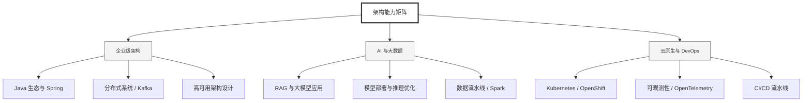

  <h1>你好，我是 Ellen Liu 👋</h1>
  

    <a href="README.md">English</a> | 
    <b>简体中文</b>
  

## 🧠 技术栈与核心能力

智能化企业系统建设路线图，涵盖全栈人工智能工程、云基础设施架构及模型部署等核心技术领域。

```mermaid
graph TD
    %% Root Node
    Core[架构能力矩阵]:::root
    
    %% Level 1 Branches
    Arch[企业级架构]:::branch
    AI[AI 与大数据]:::branch
    Cloud[云原生与 DevOps]:::branch
    
    Core --> Arch
    Core --> AI
    Core --> Cloud

    %% Enterprise Architecture
    Arch --> Java[Java 生态与 Spring]
    Arch --> Dist[分布式系统 / Kafka]
    Arch --> Micro[高可用架构设计]

    %% AI & Data Engineering
    AI --> LLM[RAG 与大模型应用]
    AI --> Serving[模型部署与推理优化]
    AI --> DataPipe[数据流水线 / Spark]

    %% Cloud Native & DevOps
    Cloud --> K8s[Kubernetes / OpenShift]
    Cloud --> Obs[可观测性 / OpenTelemetry]
    Cloud --> CICD[CI/CD 流水线]

    %% Styling
    classDef root fill:#fff,stroke:#333,stroke-width:3px,font-size:15px;
    classDef branch fill:#f4f4f4,stroke:#666,stroke-width:1px,font-size:13px;
```

## 🚀 Highlighted 工作

- **开源 AI 项目**: [基于 BERT 的声明检测模型](https://huggingface.co/XiaojingEllen/bert-finetuned-claim-detection) (Apache-2.0)
  - *已被哥伦比亚大学 (UBC) 研究项目引用。*
  - *手写 Transformer 核心代码，以验证理论与工程的一致性。*
- **金融基础设施**: 从 0 到 1 构建数字银行支付中间件及智能保险理赔系统。

## 📑 每日论文速递 (ArXiv)
<!-- DAILY_ARXIV_SUMMARY_START -->
**更新日期: 2026-04-27**

### 1. [基于生成式大语言模型的自动语音识别评估](http://arxiv.org/abs/2604.21928v1)
- **摘要**: 自动语音识别（ASR）传统上采用词错误率（WER）进行评估，但该指标对语义不敏感。基于嵌入的语义度量与人类感知的相关性更佳，然而基于解码器的大语言模型（LLMs）在此任务中的潜力尚未充分挖掘。本文通过三种方法评估其相关性：（1）在两个候选假设中择优选择；（2）利用生成式嵌入计算语义距离；（3）对错误进行定性分类。在HATS数据集上，最优LLMs在假设选择任务中与人工标注者的一致性达到92%-94%，而WER仅为63%，同时优于语义度量方法。基于解码器的LLMs生成的嵌入性能与编码器模型相当。最后，LLMs为可解释且语义化的ASR评估提供了富有前景的研究方向。

### 2. [MathDuels：评估大语言模型作为问题提出者与解决者的能力](http://arxiv.org/abs/2604.21916v1)
- **摘要**: 随着前沿语言模型在静态数学基准测试中达到近乎满分的表现，现有评估方法已难以区分模型能力差异——这主要是因为它们仅将模型视为固定问题集的求解器。我们提出MathDuels，一种自我对弈式基准测试，其中模型承担双重角色：每个模型在对抗性提示下编写数学问题，并解答其他参与者编写的题目。问题通过三阶段生成流程（元提示、问题生成、难度增强）产生，并由独立验证器排除不当问题。采用Rasch模型（Rasch, 1993）联合估算求解者能力与问题难度；作者质量则通过各模型所编问题的难度推导得出。对19个前沿模型的实验表明，出题能力与解题能力存在部分解耦，且双角色评估能揭示单角色基准测试中不可见的能力分化。当新模型进入竞技场时，它们会生成击败先前主导求解者的问题，因此基准测试的难度会随参与者实力共同进化，而非在固定上限处饱和。我们维护一个公开排行榜，随新模型发布持续更新。

### 3. [TingIS：企业级规模下从嘈杂客户事件中实时发现风险事件](http://arxiv.org/abs/2604.21889v1)
- **摘要**: 对于大规模云原生服务而言，技术异常的实时检测与缓解至关重要——即便是数分钟的停机也可能导致巨额经济损失和用户信任度下降。尽管客户事件是发现监控遗漏风险的关键信号，但受制于极端噪声、高吞吐量以及跨业务线的语义复杂性，从这类数据中提取可操作情报仍面临挑战。本文提出TingIS系统，这是一个面向企业级事件发现的端到端解决方案。其核心是多阶段事件关联引擎，该引擎通过协同高效索引技术与大语言模型（LLMs），对事件合并做出智能决策，从而仅凭少量多样化用户描述即可稳定提取可操作事件。该引擎辅以级联路由机制实现精准业务归因，并集成领域知识、统计模式与行为过滤的多维降噪流水线。在生产环境中，该系统需处理峰值吞吐量超过每分钟2000条消息、日均30万条消息的负载，实现了P90告警延迟3.5分钟、高优先级事件发现率95%的性能指标。基于真实数据构建的基准测试表明，TingIS在路由精度、聚类质量及信噪比方面显著优于基线方法。

<!-- DAILY_ARXIV_SUMMARY_END -->

## 🌐 保持联系

  
<i>期待与您探讨 AI 基础设施的未来！</i>

