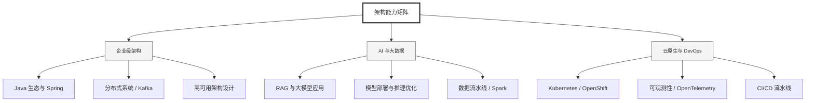

  <h1>你好，我是 Ellen Liu 👋</h1>
  

    <a href="README.md">English</a> | 
    <b>简体中文</b>
  

## 🧠 技术栈与核心能力

智能化企业系统建设路线图，涵盖全栈人工智能工程、云基础设施架构及模型部署等核心技术领域。

```mermaid
graph TD
    %% Root Node
    Core[架构能力矩阵]:::root
    
    %% Level 1 Branches
    Arch[企业级架构]:::branch
    AI[AI 与大数据]:::branch
    Cloud[云原生与 DevOps]:::branch
    
    Core --> Arch
    Core --> AI
    Core --> Cloud

    %% Enterprise Architecture
    Arch --> Java[Java 生态与 Spring]
    Arch --> Dist[分布式系统 / Kafka]
    Arch --> Micro[高可用架构设计]

    %% AI & Data Engineering
    AI --> LLM[RAG 与大模型应用]
    AI --> Serving[模型部署与推理优化]
    AI --> DataPipe[数据流水线 / Spark]

    %% Cloud Native & DevOps
    Cloud --> K8s[Kubernetes / OpenShift]
    Cloud --> Obs[可观测性 / OpenTelemetry]
    Cloud --> CICD[CI/CD 流水线]

    %% Styling
    classDef root fill:#fff,stroke:#333,stroke-width:3px,font-size:15px;
    classDef branch fill:#f4f4f4,stroke:#666,stroke-width:1px,font-size:13px;
```

## 🚀 Highlighted 工作

- **开源 AI 项目**: [基于 BERT 的声明检测模型](https://huggingface.co/XiaojingEllen/bert-finetuned-claim-detection) (Apache-2.0)
  - *已被哥伦比亚大学 (UBC) 研究项目引用。*
  - *手写 Transformer 核心代码，以验证理论与工程的一致性。*
- **金融基础设施**: 从 0 到 1 构建数字银行支付中间件及智能保险理赔系统。

## 📑 每日论文速递 (ArXiv)
<!-- DAILY_ARXIV_SUMMARY_START -->
**更新日期: 2026-04-03**

### 1. [通用YOCO：实现高效深度扩展](http://arxiv.org/abs/2604.01220v1)
- **摘要**: 测试时缩放技术的兴起显著提升了大型语言模型（LLM）的推理与智能体能力。然而，标准Transformer架构难以高效扩展推理时计算资源，因为传统的循环策略存在高计算开销，且键值缓存会随模型深度增加而膨胀。我们提出通用YOCO架构（YOCO-U），它将YOCO解码器-解码器结构与递归计算相结合，实现了超越单一方法的协同效应。基于YOCO框架，YOCO-U通过参数共享实现了通用自解码器，可在高效浅层注意力层中进行多轮迭代。这种组合形成了YOCO或递归单独无法实现的能力与效率平衡——YOCO架构提供恒定的全局键值缓存和线性预填充，而部分递归以有限开销增强了表征深度。两者结合使YOCO-U在保持高效推理的同时，显著提升了令牌利用率和扩展性能。实证结果表明，YOCO-U在通用与长上下文基准测试中保持强大竞争力，证明高效注意力架构与递归计算的融合是构建可扩展LLM的重要方向。

### 2. [$\texttt{YC-Bench}$：面向长期规划与一致性执行的智能体基准测试框架](http://arxiv.org/abs/2604.01212v1)
- **摘要**: 随着大语言模型智能体处理日益复杂的任务，一个关键问题在于它们能否在长周期任务中保持战略连贯性：即在不确定性下进行规划、从延迟反馈中学习，并在早期错误产生连锁影响时及时调整。我们推出$\texttt{YC-Bench}$基准测试，通过要求智能体在模拟创业环境中运营一整年（涵盖数百个决策轮次）来评估这些能力。智能体必须在部分可观测的环境中管理员工、选择任务合同并维持盈利能力——其中对抗性客户与不断增长的薪资支出会使错误决策产生连锁后果。我们对12个专有及开源模型各进行3次随机种子测试，仅三个模型能持续突破20万美元的初始资本。Claude Opus 4.6以平均127万美元的最终资金位列第一，GLM-5以121万美元紧随其后，且推理成本降低至前者的1/11。跨上下文截断的信息持久化唯一机制——草稿纸功能的使用是预测成功的最强指标，而对抗性客户检测则是主要失败模式，导致47%的破产案例。我们的分析表明，前沿模型仍会因过度并行化等典型故障模式而失败，这揭示了长周期性能的能力缺口。$\texttt{YC-Bench}$具有开源、可复现及可配置的特性。

### 3. [具有潜在迭代状态头的LLM回归](http://arxiv.org/abs/2604.01206v1)
- **摘要**: 我们提出RELISH（具有潜在迭代状态头的回归模型），这是一种专为大型语言模型文本回归设计的新型轻量级架构。不同于将数值目标解码为文本或聚合多个生成输出，RELISH通过交叉注意力机制在词元级表征上迭代优化学习到的潜在状态，直接从冻结的LLM表征中预测标量值，最终通过线性回归器将优化后的状态映射为点估计。在五个数据集、四种LLM主干架构和两种LLM训练机制下的实验表明，RELISH在自回归解码、回归感知推理和现有预测头方法这三大LLM回归家族的所有基线模型中均取得稳定优势。尽管性能显著提升，RELISH仍保持极高的参数效率——在冻结的LLM主干上仅需训练340-370万参数（仅增加0.01-0.04%的开销），远低于随模型规模增长的LoRA类方法（0.26-0.42%）。

<!-- DAILY_ARXIV_SUMMARY_END -->

## 🌐 保持联系

  
<i>期待与您探讨 AI 基础设施的未来！</i>

