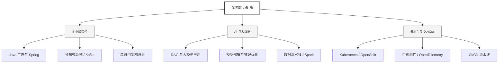

  <h1>你好，我是 Ellen Liu 👋</h1>
  

    <a href="README.md">English</a> | 
    <b>简体中文</b>
  

## 🧠 技术栈与核心能力

智能化企业系统建设路线图，涵盖全栈人工智能工程、云基础设施架构及模型部署等核心技术领域。

```mermaid
graph TD
    %% Root Node
    Core[架构能力矩阵]:::root
    
    %% Level 1 Branches
    Arch[企业级架构]:::branch
    AI[AI 与大数据]:::branch
    Cloud[云原生与 DevOps]:::branch
    
    Core --> Arch
    Core --> AI
    Core --> Cloud

    %% Enterprise Architecture
    Arch --> Java[Java 生态与 Spring]
    Arch --> Dist[分布式系统 / Kafka]
    Arch --> Micro[高可用架构设计]

    %% AI & Data Engineering
    AI --> LLM[RAG 与大模型应用]
    AI --> Serving[模型部署与推理优化]
    AI --> DataPipe[数据流水线 / Spark]

    %% Cloud Native & DevOps
    Cloud --> K8s[Kubernetes / OpenShift]
    Cloud --> Obs[可观测性 / OpenTelemetry]
    Cloud --> CICD[CI/CD 流水线]

    %% Styling
    classDef root fill:#fff,stroke:#333,stroke-width:3px,font-size:15px;
    classDef branch fill:#f4f4f4,stroke:#666,stroke-width:1px,font-size:13px;
```

## 🚀 Highlighted 工作

- **开源 AI 项目**: [基于 BERT 的声明检测模型](https://huggingface.co/XiaojingEllen/bert-finetuned-claim-detection) (Apache-2.0)
  - *已被哥伦比亚大学 (UBC) 研究项目引用。*
  - *手写 Transformer 核心代码，以验证理论与工程的一致性。*
- **金融基础设施**: 从 0 到 1 构建数字银行支付中间件及智能保险理赔系统。

## 📑 每日论文速递 (ArXiv)
<!-- DAILY_ARXIV_SUMMARY_START -->
**更新日期: 2026-02-27**

### 1. [翻译中的复原：高效自动化基准与数据集翻译流程](http://arxiv.org/abs/2602.22207v1)
- **摘要**: 当前，多语言大语言模型（LLM）评估的可靠性因翻译基准质量参差不齐而受到影响。现有资源常存在语义偏移和语境缺失问题，可能导致误导性的性能指标。本研究提出一种全自动化框架，旨在通过实现可扩展的高质量数据集与基准翻译来解决这些挑战。我们证明，采用测试时计算扩展策略——特别是通用自我改进（USI）与我们提出的多轮排序方法T-RANK——相比传统流程能显著提升输出质量。该框架确保基准在本地化过程中保持原始任务结构与语言细微差别。我们将此方法应用于八种东欧与南欧语言（乌克兰语、保加利亚语、斯洛伐克语、罗马尼亚语、立陶宛语、爱沙尼亚语、土耳其语、希腊语）的流行基准与数据集翻译。基于参考指标的评估与LLM-as-a-judge评估均表明，我们的翻译成果优于现有资源，能够实现更精准的下游模型评估。我们同时开源该框架与优化后的基准，以促进稳健且可复现的多语言人工智能发展。

### 2. [GUI-Libra：训练原生GUI智能体，通过动作感知监督与部分可验证强化学习实现推理与行动](http://arxiv.org/abs/2602.22190v1)
- **摘要**: 开源原生图形用户界面智能体在长程导航任务上仍落后于闭源系统。这一差距源于两大局限：高质量动作对齐推理数据的匮乏，以及直接采用通用后训练流程而忽视了图形用户界面智能体的独特挑战。我们发现这些流程存在两个根本问题：（一）采用思维链推理的标准监督微调往往会损害动作落地能力；（二）分步式强化学习与验证训练面临部分可验证性困境——多个动作可能都正确，但验证时仅采用单个演示动作。这导致离线分步指标难以有效预测在线任务成功率。本研究提出GUI-Libra，一种针对性训练方案以应对这些挑战。首先，为缓解动作对齐推理数据稀缺问题，我们设计了数据构建与过滤流程，并发布了精选的8.1万条图形用户界面推理数据集。其次，为协调推理与动作落地能力，我们提出动作感知监督微调方法，混合使用"推理后执行"与"直接执行"两类数据，并通过词元重加权机制强化动作与落地相关特征。再者，为在部分可验证性条件下稳定强化学习，我们揭示了强化学习与验证训练中被忽视的KL正则化重要性，证明KL信任区域对提升离线-在线预测一致性具有关键作用；进一步提出成功率自适应缩放机制，以降低不可靠负梯度的权重。在多样化网页与移动端基准测试中，GUI-Libra持续提升分步准确率与端到端任务完成率。实验结果表明，精心设计的后训练与数据策展方案能显著释放任务解决能力，无需昂贵的在线数据收集。我们公开数据集、代码与模型，以推动具备推理能力的图形用户界面智能体在数据高效后训练方向的深入研究。

### 3. [基于状态机的大型语言模型动态人格适配](http://arxiv.org/abs/2602.22157v1)
- **摘要**: 大型语言模型（LLM）无法根据对话动态演变调整其个性表达，这阻碍了其在复杂交互场景中的表现。我们提出了一种与模型无关的动态个性模拟框架，该框架采用状态机来表征潜在个性状态，其状态转移概率会根据对话语境动态调整。该架构的核心模块之一是持续个性评分流水线，它能够沿潜在维度评估对话过程，同时保持对具体个性模型、维度定义、状态转移机制及底层LLM的无关性。这些评分作为动态状态变量，系统性地重构系统提示，从而在交互过程中引导行为对齐。

我们通过在医学教育场景中实例化人际环状模型（IPC）对该框架进行评估。结果表明，系统不仅能成功适应用户输入调整个性状态，还能反作用于用户行为，从而促进冲突降级训练。值得注意的是，即使采用轻量化微调分类器替代大规模LLM，评分流水线仍能保持相当的精确度。这项工作证明了模块化、个性自适应架构在教育、客户服务及更广泛人机交互领域的可行性。

<!-- DAILY_ARXIV_SUMMARY_END -->

## 🌐 保持联系

  
<i>期待与您探讨 AI 基础设施的未来！</i>

