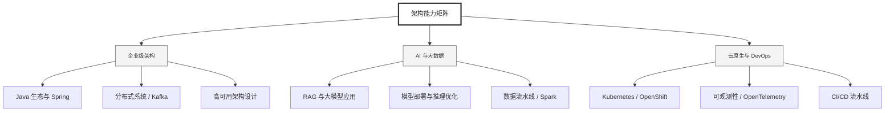

  <h1>你好，我是 Ellen Liu 👋</h1>
  

    <a href="README.md">English</a> | 
    <b>简体中文</b>
  

## 🧠 技术栈与核心能力

智能化企业系统建设路线图，涵盖全栈人工智能工程、云基础设施架构及模型部署等核心技术领域。

```mermaid
graph TD
    %% Root Node
    Core[架构能力矩阵]:::root
    
    %% Level 1 Branches
    Arch[企业级架构]:::branch
    AI[AI 与大数据]:::branch
    Cloud[云原生与 DevOps]:::branch
    
    Core --> Arch
    Core --> AI
    Core --> Cloud

    %% Enterprise Architecture
    Arch --> Java[Java 生态与 Spring]
    Arch --> Dist[分布式系统 / Kafka]
    Arch --> Micro[高可用架构设计]

    %% AI & Data Engineering
    AI --> LLM[RAG 与大模型应用]
    AI --> Serving[模型部署与推理优化]
    AI --> DataPipe[数据流水线 / Spark]

    %% Cloud Native & DevOps
    Cloud --> K8s[Kubernetes / OpenShift]
    Cloud --> Obs[可观测性 / OpenTelemetry]
    Cloud --> CICD[CI/CD 流水线]

    %% Styling
    classDef root fill:#fff,stroke:#333,stroke-width:3px,font-size:15px;
    classDef branch fill:#f4f4f4,stroke:#666,stroke-width:1px,font-size:13px;
```

## 🚀 Highlighted 工作

- **开源 AI 项目**: [基于 BERT 的声明检测模型](https://huggingface.co/XiaojingEllen/bert-finetuned-claim-detection) (Apache-2.0)
  - *已被哥伦比亚大学 (UBC) 研究项目引用。*
  - *手写 Transformer 核心代码，以验证理论与工程的一致性。*
- **金融基础设施**: 从 0 到 1 构建数字银行支付中间件及智能保险理赔系统。

## 📑 每日论文速递 (ArXiv)
<!-- DAILY_ARXIV_SUMMARY_START -->
**更新日期: 2026-05-01**

### 1. [选择思考：以局部充分性释放小语言模型潜力](http://arxiv.org/abs/2604.26940v1)
- **摘要**: 小语言模型（SLMs）在可扩展部署中具有计算效率优势，但其推理能力往往逊于大型语言模型（LLMs）。为弥合这一差距，现有方法会在推理分歧点调用LLM生成标记，但这种外部调用会引入显著的延迟和成本。另一方面，标准蒸馏方法常受限于容量瓶颈——SLMs难以准确模仿LLM复杂的生成分布。我们通过识别局部充分性来应对这一困境：在分歧点上，即使LLM偏好的标记未能成为SLM的top-1选择，它也始终存在于SLM的top-K预测候选集中。基于此，我们提出"选择即思考"（SELECT TO THINK, S2T）方法，将LLM的角色从开放式生成转变为对SLM候选方案的筛选，从而将监督信号简化为离散的候选排序。利用这一特性，我们进一步提出S2T-LOCAL，将选择逻辑蒸馏至SLM，使其能够自主执行重排序而无需推理时依赖LLM。实验表明，1.5B参数SLM的top-8候选集能以95%的命中率覆盖32B参数LLM的选择。将这一潜力转化为性能提升后，S2T-LOCAL在多个基准测试中平均将贪心解码性能提升24.1%，在保持单轨迹推理效率的同时，有效达到了8路径自洽性方法的同等效果。

### 2. [ClassEval-Pro：面向类级代码生成的跨领域基准](http://arxiv.org/abs/2604.26923v1)
- **摘要**: 大型语言模型在函数级代码合成和仓库级代码修改方面均取得了显著成果，但介于这两个极端之间的能力——组合式代码创建，即根据规范构建完整且内部结构化的类——仍未被充分满足。当前的评估要么局限于孤立函数，要么依赖人工策划的类级任务，这些任务不仅扩展成本高昂，而且越来越容易受到数据污染的影响。我们提出了ClassEval-Pro基准测试，包含300个涵盖11个领域的类级任务，通过自动化三阶段流程构建，该流程结合了复杂度增强、跨领域类组合以及整合2025年1月后贡献的真实GitHub代码。每个任务均由LLM评审集成验证，并必须通过行覆盖率超过90%的测试套件。我们在五种生成策略下评估了五款前沿LLM。最佳模型仅达到45.6%的类级Pass@1，最强与最弱模型之间存在17.7个百分点的差距，证实了该基准的区分能力。策略选择与模型能力存在强烈交互：自底向上等结构化方法可使较弱模型提升高达9.4个百分点，而组合式生成则骤降至1.3%。对500个手动标注的失败案例进行错误分析显示，逻辑错误（56.2%）和依赖错误（38.0%）占主导地位，跨方法协调被确认为核心瓶颈。

### 3. [ClawGym：构建高效爪爪智能体的可扩展框架](http://arxiv.org/abs/2604.26904v1)
- **摘要**: 爪式环境支持基于本地文件、工具及持久化工作区状态的多步骤工作流。然而，围绕此类环境的可扩展开发仍受限于缺乏系统性框架，尤其是缺乏用于合成可验证训练数据并将其与智能体训练及诊断评估相集成的框架。为解决这一挑战，我们提出ClawGym——一个支持爪式个人智能体开发全生命周期的可扩展框架。具体而言，我们构建了ClawGym-SynData数据集，包含从人格化意图与技能化操作中合成的13.5K个经过筛选的多样化任务，并配以模拟真实工作区及混合验证机制。随后，我们通过基于黑盒轨迹的监督微调训练出一系列高性能爪式模型（称为ClawGym-Agents），并进一步通过轻量级流水线（在每任务沙箱中并行化轨迹生成）探索强化学习。为支持可靠评估，我们进一步构建了ClawGym-Bench基准测试集，包含200个经自动筛选与人工-大模型联合校准的实例。相关资源即将在https://github.com/ClawGym发布。

<!-- DAILY_ARXIV_SUMMARY_END -->

## 🌐 保持联系

  
<i>期待与您探讨 AI 基础设施的未来！</i>

