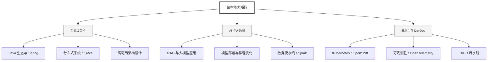

  <h1>你好，我是 Ellen Liu 👋</h1>
  

    <a href="README.md">English</a> | 
    <b>简体中文</b>
  

## 🧠 技术栈与核心能力

智能化企业系统建设路线图，涵盖全栈人工智能工程、云基础设施架构及模型部署等核心技术领域。

```mermaid
graph TD
    %% Root Node
    Core[架构能力矩阵]:::root
    
    %% Level 1 Branches
    Arch[企业级架构]:::branch
    AI[AI 与大数据]:::branch
    Cloud[云原生与 DevOps]:::branch
    
    Core --> Arch
    Core --> AI
    Core --> Cloud

    %% Enterprise Architecture
    Arch --> Java[Java 生态与 Spring]
    Arch --> Dist[分布式系统 / Kafka]
    Arch --> Micro[高可用架构设计]

    %% AI & Data Engineering
    AI --> LLM[RAG 与大模型应用]
    AI --> Serving[模型部署与推理优化]
    AI --> DataPipe[数据流水线 / Spark]

    %% Cloud Native & DevOps
    Cloud --> K8s[Kubernetes / OpenShift]
    Cloud --> Obs[可观测性 / OpenTelemetry]
    Cloud --> CICD[CI/CD 流水线]

    %% Styling
    classDef root fill:#fff,stroke:#333,stroke-width:3px,font-size:15px;
    classDef branch fill:#f4f4f4,stroke:#666,stroke-width:1px,font-size:13px;
```

## 🚀 Highlighted 工作

- **开源 AI 项目**: [基于 BERT 的声明检测模型](https://huggingface.co/XiaojingEllen/bert-finetuned-claim-detection) (Apache-2.0)
  - *已被哥伦比亚大学 (UBC) 研究项目引用。*
  - *手写 Transformer 核心代码，以验证理论与工程的一致性。*
- **金融基础设施**: 从 0 到 1 构建数字银行支付中间件及智能保险理赔系统。

## 📑 每日论文速递 (ArXiv)
<!-- DAILY_ARXIV_SUMMARY_START -->
**更新日期: 2026-07-12**

### 1. [UniClawBench：面向真实世界任务的主动型智能体通用基准测试](http://arxiv.org/abs/2607.08768v1)
- **摘要**: 大型语言模型与多模态大型语言模型的快速发展，加速了能够操作日常工具并在真实环境中辅助用户的主动型智能体的涌现。然而，现有基准测试难以有效评估此类智能体，因其常依赖沙盒环境与单轮评估范式。此外，基于场景的任务分类体系将多种模型能力混杂在同一任务类别中，导致难以定位智能体失效的根本原因。为解决这些局限，我们提出UniClawBench——首个面向动态真实环境、以能力为导向的主动型智能体评估基准。UniClawBench围绕五项基础模型能力构建：技能运用、探索探索、长上下文推理、多模态理解与跨平台协调。基于这些能力，我们设计了400项双语真实世界任务。与依赖静态预录答案的既有基准不同，本基准通过细粒度、分步骤的完成检查点，在实时Docker容器中评估智能体。此外，我们设计了一套闭环评估策略，包含执行智能体、隐藏监督智能体与用户智能体，以模拟真实多轮人类反馈，同时避免泄露评分标准。为解耦基础模型能力与框架级设计选择，我们在多种智能体框架下评估了当前最优模型。通过模型与框架的全面对比，我们揭示了基础模型能力与智能体框架设计如何共同影响真实环境中的表现。为促进后续研究，我们将基准测试与代码开源至https://github.com/HKU-MMLab/UniClawBench。

### 2. [LLM作为数据标注者的有效性：AMALIA在权威性方面的研究](http://arxiv.org/abs/2607.08731v1)
- **摘要**: 国家语言模型为语言社群提供了一种衡量公民言论与价值观的工具。葡萄牙的AMALIA——一个由公共资金支持的90亿参数欧洲葡萄牙语模型——仅在一致性上便展现出竞争力：在要求对“权威”道德基础进行编码时，其与经过训练的人类编码者的一致性，在F1分数上仅比规模大8至13倍的开源模型低6个百分点。然而，一致性代表的是可靠性，而非有效性。对于需要推断而非从表面特征直接读取的理论构念，问题在于模型是遵循构念的理论逻辑，还是通过相关捷径得出正确编码。我们通过“恢复差距”对此进行检验：当整体提示被分解为编码手册的原子条款，再通过理论显式规则重组时，性能的损失程度。若校准能弥合这一差距，则表明模型与语言间应存在一定可迁移性；若无法弥合，则构念-模型工具本身很可能是失败根源。我们探究校准后的英语工具能否迁移至AMALIA-9B及欧洲葡萄牙语。针对某一构念与特定语料库，答案是否定的。分解仅能恢复AMALIA整体性能的一半左右，而错误分析表明其依赖表面关联特征，尤其是权威人物附近的道德愤怒情绪。一个开源多语言大模型在相同指令下处理同一葡萄牙语语料库时，成功弥合了这一差距，表明语料库并非主要解释因素。AMALIA仍可进行大规模筛选与预编码，但尚不足以独立胜任该构念的测量工作。本研究仅为一个反例，并非对国家模型的最终定论；其核心论点在于：主权大语言模型的基准测试不仅应检验与人类编码者的一致性，更应验证达成该一致性所依赖的证据路径。

### 3. [铭记关键时刻：面向长周期任务的主动记忆智能体](http://arxiv.org/abs/2607.08716v1)
- **摘要**: 在长周期任务中，决策相关的状态信息往往分散在持续扩展的轨迹中，而行动主体必须从中提取关键信息并采取行动。随着轨迹不断增长，任务要求、环境事实、先前尝试、诊断结果及未完成的子目标可能被埋没在上下文窗口内，甚至被推至窗口之外，导致在需要时无法影响决策。我们将这种失效模式称为"行为状态衰减"。本研究将记忆视为主动干预机制而非被动检索工具。一个独立的记忆主体与未经修改的行动主体并行运行，从近期轨迹中更新结构化记忆库，并决定是注入基于记忆的提示还是保持静默。该模块可与前沿行动主体及现有主体框架实现即插即用。在Terminal-Bench 2.0和τ²-Bench基准测试中，该模块使弱行动主体与强行动主体的pass@1指标均获得提升，其中Terminal-Bench提升8.3个百分点，τ²-Bench提升6.8个百分点。消融实验表明，选择性干预优于被动记忆库暴露、持续注入、顾问式指导及通用检索方法。作为开放权重记忆策略的初步探索，我们采用SFT和GRPO方法在SETA数据集上训练Qwen3.5-27B模型，在提升验证奖励的同时，实现了向Terminal-Bench的部分能力迁移。

<!-- DAILY_ARXIV_SUMMARY_END -->

## 🌐 保持联系

  
<i>期待与您探讨 AI 基础设施的未来！</i>

