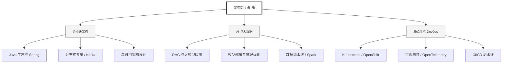

  <h1>你好，我是 Ellen Liu 👋</h1>
  

    <a href="README.md">English</a> | 
    <b>简体中文</b>
  

## 🧠 技术栈与核心能力

智能化企业系统建设路线图，涵盖全栈人工智能工程、云基础设施架构及模型部署等核心技术领域。

```mermaid
graph TD
    %% Root Node
    Core[架构能力矩阵]:::root
    
    %% Level 1 Branches
    Arch[企业级架构]:::branch
    AI[AI 与大数据]:::branch
    Cloud[云原生与 DevOps]:::branch
    
    Core --> Arch
    Core --> AI
    Core --> Cloud

    %% Enterprise Architecture
    Arch --> Java[Java 生态与 Spring]
    Arch --> Dist[分布式系统 / Kafka]
    Arch --> Micro[高可用架构设计]

    %% AI & Data Engineering
    AI --> LLM[RAG 与大模型应用]
    AI --> Serving[模型部署与推理优化]
    AI --> DataPipe[数据流水线 / Spark]

    %% Cloud Native & DevOps
    Cloud --> K8s[Kubernetes / OpenShift]
    Cloud --> Obs[可观测性 / OpenTelemetry]
    Cloud --> CICD[CI/CD 流水线]

    %% Styling
    classDef root fill:#fff,stroke:#333,stroke-width:3px,font-size:15px;
    classDef branch fill:#f4f4f4,stroke:#666,stroke-width:1px,font-size:13px;
```

## 🚀 Highlighted 工作

- **开源 AI 项目**: [基于 BERT 的声明检测模型](https://huggingface.co/XiaojingEllen/bert-finetuned-claim-detection) (Apache-2.0)
  - *已被哥伦比亚大学 (UBC) 研究项目引用。*
  - *手写 Transformer 核心代码，以验证理论与工程的一致性。*
- **金融基础设施**: 从 0 到 1 构建数字银行支付中间件及智能保险理赔系统。

## 📑 每日论文速递 (ArXiv)
<!-- DAILY_ARXIV_SUMMARY_START -->
**更新日期: 2026-06-12**

### 1. [基于上下文驱动的增量压缩技术实现多轮对话生成](http://arxiv.org/abs/2606.12411v1)
- **摘要**: 现代对话系统在每一轮交互中都需要处理不断增长的对话历史，导致冗余的注意力计算和编码成本随对话长度线性增长。简单的截断或摘要方法会降低生成内容的保真度，而现有上下文压缩技术缺乏跨轮次记忆共享与修正机制，在长对话中易造成信息丢失和错误累积。我们重新审视对话动态下的上下文压缩问题，并通过实验揭示了其脆弱性。为兼顾效率与鲁棒性，提出上下文驱动的增量压缩方法（C-DIC），将对话视为交织的上下文线程，为每个线程维护可修正的压缩状态，并整合为紧凑的对话记忆模块。在每轮交互中，通过轻量级的检索-修正-回写循环实现跨轮次信息共享与陈旧记忆更新，从而稳定长程对话行为。此外，我们针对多轮场景改进截断式时间反向传播（TBPTT），在不依赖完整历史反向传播的情况下学习跨轮次依赖关系。在长对话基准测试上的大量实验表明，C-DIC在性能与效率上均表现优异：尤其值得关注的是，在数百轮对话中，C-DIC的推理延迟与困惑度保持稳定，为高质量对话建模提供了可扩展的解决方案。

### 2. [CCL25-Eval任务5系统报告：新数据集与LoRA微调Qwen2.5](http://arxiv.org/abs/2606.12392v1)
- **摘要**: 近年来，大语言模型在古诗文翻译与古典诗歌生成领域取得了显著进展。然而，针对古典诗歌精准翻译与情感语义理解的领域专项研究仍较为有限。主要挑战在于：多数研究将诗歌鉴赏任务视为通用领域问题，忽视了诗歌鉴赏的独特特征，同时高质量领域专用数据集极度匮乏。为突破这一瓶颈，我们将任务分解为三个子任务：术语释义、语义解析与情感推断。基于多个开源数据集，通过数据清洗与对齐，构建了古典诗歌指令对数据集（CCPoetry-49K），包含49,404个针对该领域优化设计的高质量指令-响应对。随后，我们采用低秩适配方法对Qwen2.5-14B模型进行微调，提出领域专用大语言模型PoetryQwen。在CCL25-Eval任务5基准测试中，PoetryQwen取得0.757的评分，较Qwen2.5-14B-Instruct基线模型（0.690）提升9.7%。实验结果表明，PoetryQwen在古典诗歌精准翻译与情感理解方面实现了显著性能提升。我们提出的新数据集与方法论考量，旨在支持大语言模型的领域专项优化。

### 3. [我们的模型建立在哪些模型之上？审计现代大语言模型中的隐形依赖关系](http://arxiv.org/abs/2606.12385v1)
- **摘要**: 现代大语言模型（LLM）训练流程日益依赖其他模型来生成数据、过滤语料库、评判输出结果以及指导开发决策。这种依赖关系具有递归性：某个模型可能依赖于上游构件，而该构件自身的依赖关系仅记录在独立的发布版本和构件中。因此，完整的依赖结构分散在异构的公共构件中，其复杂性和递归深度远超人类追踪能力。我们提出ModSleuth系统，这是一种能够从公共构件中递归重建LLM依赖图并附带源证据的智能系统。研究发现，当前主要挑战已不再是信息提取，而是如何定义依赖关系、以及如何在不一致的文档中协调构件引用。我们通过以下形式化方法应对这些挑战：区分直接与间接依赖关系；通过以操作为中心的关系表征异构流水线角色；跨名称、版本和仓库解析构件身份标识。将ModSleuth应用于四个富含公共构件的LLM发布版本后，我们恢复了1060个经源验证的依赖关系，并构建了现代LLM开发的大规模依赖图。这些依赖图揭示了多跳许可证义务、训练-评估耦合、发布构件与训练时构件差异、以及文档不一致性等难以通过常规手段发现的问题。我们开源ModSleuth及其生成的依赖图，以支持对现代LLM日益复杂生态系统的透明化分析。

<!-- DAILY_ARXIV_SUMMARY_END -->

## 🌐 保持联系

  
<i>期待与您探讨 AI 基础设施的未来！</i>

