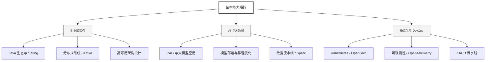

  <h1>你好，我是 Ellen Liu 👋</h1>
  

    <a href="README.md">English</a> | 
    <b>简体中文</b>
  

## 🧠 技术栈与核心能力

智能化企业系统建设路线图，涵盖全栈人工智能工程、云基础设施架构及模型部署等核心技术领域。

```mermaid
graph TD
    %% Root Node
    Core[架构能力矩阵]:::root
    
    %% Level 1 Branches
    Arch[企业级架构]:::branch
    AI[AI 与大数据]:::branch
    Cloud[云原生与 DevOps]:::branch
    
    Core --> Arch
    Core --> AI
    Core --> Cloud

    %% Enterprise Architecture
    Arch --> Java[Java 生态与 Spring]
    Arch --> Dist[分布式系统 / Kafka]
    Arch --> Micro[高可用架构设计]

    %% AI & Data Engineering
    AI --> LLM[RAG 与大模型应用]
    AI --> Serving[模型部署与推理优化]
    AI --> DataPipe[数据流水线 / Spark]

    %% Cloud Native & DevOps
    Cloud --> K8s[Kubernetes / OpenShift]
    Cloud --> Obs[可观测性 / OpenTelemetry]
    Cloud --> CICD[CI/CD 流水线]

    %% Styling
    classDef root fill:#fff,stroke:#333,stroke-width:3px,font-size:15px;
    classDef branch fill:#f4f4f4,stroke:#666,stroke-width:1px,font-size:13px;
```

## 🚀 Highlighted 工作

- **开源 AI 项目**: [基于 BERT 的声明检测模型](https://huggingface.co/XiaojingEllen/bert-finetuned-claim-detection) (Apache-2.0)
  - *已被哥伦比亚大学 (UBC) 研究项目引用。*
  - *手写 Transformer 核心代码，以验证理论与工程的一致性。*
- **金融基础设施**: 从 0 到 1 构建数字银行支付中间件及智能保险理赔系统。

## 📑 每日论文速递 (ArXiv)
<!-- DAILY_ARXIV_SUMMARY_START -->
**更新日期: 2026-06-30**

### 1. [迈向自动化科学评审：谷歌论文助手工具的应用](http://arxiv.org/abs/2606.28277v1)
- **摘要**: 人工智能正在推动科学发现的革命，从假设生成到数学定理证明，全面加速科研进程。然而，这种高速发展正带来系统性挑战：传统人工同行评审已无法匹配AI辅助科学产出的规模。要化解这一矛盾，最终必须借助AI来加速验证与评审流程本身。为构建这一转型的讨论框架，我们提出包含四个渐进式AI-人类协作层级的科学评估分类体系，并探讨各层级涉及的多重权衡。作为迈向这一未来的实践，我们推出论文辅助工具（PAT）——专为深度科学评审与验证设计的智能体AI框架。该工具可解析完整科学手稿，生成全面评估报告，涵盖理论结果校验、实验验证、改进建议及潜在缺陷识别。通过运用推理扩展技术，PAT能发现单次模型调用难以察觉的深层问题，在SPOT基准测试中数学错误识别零样本召回率提升34%。在STOC和ICML两大计算机科学顶级会议中，PAT作为作者投稿前工具的试点部署，已展现出识别关键错误、提出实质性改进建议的能力。通过早期错误拦截，PAT在保留评审者对结果掌控权的同时，显著减轻了审稿人的认知负荷。

### 2. [HPRO：基于偏好提取的分层渐进式奖励优化方法在情感文本转语音中的应用](http://arxiv.org/abs/2606.28249v1)
- **摘要**: 近期，基于大语言模型的文本转语音模型在自然度方面取得了显著进展。然而，标准的有监督微调范式往往收敛于统计平均韵律，限制了情感表现力。尽管偏好驱动优化提供了有前景的替代方案，但现有方法存在两个结构性错配：信息冲突——共享潜在空间中内容与情感产生冲突梯度，导致奖励攻击和语义退化；尺度鸿沟——稀疏的句子级奖励难以引导密集的帧级生成。为应对这些挑战，我们提出HPRO——一种层级渐进式奖励优化框架。在HPRO中，我们引入HD-Emo编解码器作为新型可微分奖励模型以解决信息冲突。该模型将语音提取为独立的内容与风格偏好标记，从结构上隔离情感优化与语义内容。基于这一结构化偏好空间，HPRO通过渐进对齐帧级、词级和句子级目标来弥合尺度鸿沟。实验表明，HPRO显著增强情感表现力的同时，有效保持了语言可理解性。代码与音频样本已公开于https://xxh333.github.io/hpro-demo/。

### 3. [LLM推理轨迹中的认知片段实现可解释的人类项目难度预测](http://arxiv.org/abs/2606.28186v1)
- **摘要**: 预测人类题目难度是教育评估的核心问题，可靠的难度估计有助于保障公平性和有效构建测试。现有方法通常依赖昂贵的人工校准或基于题目文本的表征，对导致题目困难的认知过程提供的证据有限。我们认为，难度不仅应被视为题目文本的属性，更应被看作题目引发的解题负担的可观测结果。大型推理模型（LRMs）通过推理轨迹提供可扩展的过程证据，但此类证据需经结构化处理才能支持可解释建模。为此，我们提出Epi2Diff（从推理片段到难度）框架，将LRM推理轨迹映射为基于认知的片段序列。这些片段将轨迹划分为功能性解题状态，从而通过推理规模、努力分配和状态转换来建模难度。Epi2Diff提取紧凑的片段动态特征，并将其与语义题目表征相结合，用于预测人类难度。在四个真实人类难度数据集上的实验表明，Epi2Diff持续优于强基线方法，包括微调小语言模型、大语言模型上下文学习及监督式大语言模型适配。在基于SAT的分类基准测试中，Epi2Diff相比监督式大语言模型微调基线实现了8.1%的平均相对提升。进一步分析显示，较难题目会引发更费力、更迭代且更侧重实现的片段动态，而非仅表现为更长的回答。这些结果表明，LRM推理轨迹中的认知片段为人类题目难度提供了可预测且可解释的过程表征，为基于推理模型的教育测量提供了新视角。

<!-- DAILY_ARXIV_SUMMARY_END -->

## 🌐 保持联系

  
<i>期待与您探讨 AI 基础设施的未来！</i>

