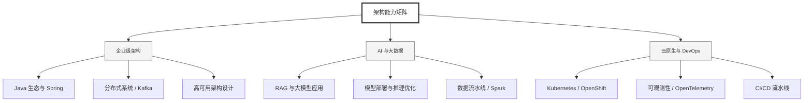

  <h1>你好，我是 Ellen Liu 👋</h1>
  

    <a href="README.md">English</a> | 
    <b>简体中文</b>
  

## 🧠 技术栈与核心能力

智能化企业系统建设路线图，涵盖全栈人工智能工程、云基础设施架构及模型部署等核心技术领域。

```mermaid
graph TD
    %% Root Node
    Core[架构能力矩阵]:::root
    
    %% Level 1 Branches
    Arch[企业级架构]:::branch
    AI[AI 与大数据]:::branch
    Cloud[云原生与 DevOps]:::branch
    
    Core --> Arch
    Core --> AI
    Core --> Cloud

    %% Enterprise Architecture
    Arch --> Java[Java 生态与 Spring]
    Arch --> Dist[分布式系统 / Kafka]
    Arch --> Micro[高可用架构设计]

    %% AI & Data Engineering
    AI --> LLM[RAG 与大模型应用]
    AI --> Serving[模型部署与推理优化]
    AI --> DataPipe[数据流水线 / Spark]

    %% Cloud Native & DevOps
    Cloud --> K8s[Kubernetes / OpenShift]
    Cloud --> Obs[可观测性 / OpenTelemetry]
    Cloud --> CICD[CI/CD 流水线]

    %% Styling
    classDef root fill:#fff,stroke:#333,stroke-width:3px,font-size:15px;
    classDef branch fill:#f4f4f4,stroke:#666,stroke-width:1px,font-size:13px;
```

## 🚀 Highlighted 工作

- **开源 AI 项目**: [基于 BERT 的声明检测模型](https://huggingface.co/XiaojingEllen/bert-finetuned-claim-detection) (Apache-2.0)
  - *已被哥伦比亚大学 (UBC) 研究项目引用。*
  - *手写 Transformer 核心代码，以验证理论与工程的一致性。*
- **金融基础设施**: 从 0 到 1 构建数字银行支付中间件及智能保险理赔系统。

## 📑 每日论文速递 (ArXiv)
<!-- DAILY_ARXIV_SUMMARY_START -->
**更新日期: 2026-07-01**

### 1. [面向大语言模型智能体规划的自我进化世界模型](http://arxiv.org/abs/2606.30639v1)
- **摘要**: 世界模型为长周期大语言模型智能体提供了一种原则性的前瞻能力：在执行前预测行动后果。然而，不可靠的前瞻可能被忽视、误用，甚至损害下游决策质量。本文提出WorldEvolver——一种自演进世界模型框架，该框架在保持下游智能体及所有模型参数冻结的前提下，仅通过修正部署阶段的上下文信息实现自我进化。WorldEvolver整合三个模块：(i) 情景记忆模块，通过基于检索的仿真利用真实行动转换；(ii) 语义记忆模块，从预测与观测的偏差中提取持久性启发规则；(iii) 选择性前瞻模块，在将低置信度预测整合至智能体推理上下文前进行过滤。我们在ALFWorld和ScienceWorld平台上评估WorldEvolver，通过Word2World衡量世界模型预测精度，通过AgentBoard评估下游智能体任务成功率。大量实验表明，WorldEvolver在三种骨干网络上均取得最高预测精度，并在下游智能体任务成功率上领先其他世界模型基线，证明测试阶段记忆修正能同时提升预测保真度与规划性能。

### 2. [拓展视野，而非参数规模：以35B智能体实现万亿参数级性能](http://arxiv.org/abs/2606.30616v1)
- **摘要**: 我们提出Agents-A1，一个350亿参数的混合专家智能体模型，通过扩展智能体任务范围达到万亿参数级别的性能。我们从两个维度研究智能体任务范围扩展：扩展长程任务轨迹与扩展异构智能体能力。为实现这一目标，我们构建了长程知识-动作基础设施，将外部知识、动作、观察结果与验证器输出相连接，生成平均长度达4.5万token的智能体轨迹。基于此，我们采用三阶段训练方案训练Agents-A1：首先进行全领域监督微调，使基础模型对齐广泛的智能体行为；其次训练领域级教师模型，捕获各领域的专业特长；最后提出多教师领域路由在线蒸馏方法，结合显著词汇对齐技术提升跨领域知识迁移效率，将六个异构领域统一为可部署的学生模型。Agents-A1在长程智能体基准测试中展现出强大且广泛的性能。与万亿参数模型（如Kimi-K2.6和DeepSeek-V4-pro）相比，Agents-A1在SEAL-0（56.4）、IFBench（80.6）、HiPhO（46.4）、FrontierScience-Olympiad（79.0）和MolBench-Bind（56.8）上取得领先结果，同时在SciCode（44.3）、HLE（47.6）和BrowseComp（75.5）上保持高度竞争力。我们希望这项工作能为社区提供一条实用路径：通过350亿参数的智能体在长程任务中达到或匹配万亿参数模型的性能。

### 3. [不确定性感知生成与模糊情境下的决策制定](http://arxiv.org/abs/2606.30578v1)
- **摘要**: 随着能力的快速提升，大语言模型（LLMs）正越来越多地被应用于复杂的现实任务中。这些任务不仅需要深厚的知识和推理能力，还往往具有高度主观性，并要求模型的输出值得信赖。尽管在训练更优模型方面已取得诸多进展，但决策算法的研究相对较少。本研究基于贝叶斯决策理论和风险规避决策方法，针对辅导任务和自动同行评审任务，提出并评估了多种不确定性感知的决策算法。具体而言，我们在生成辅导回应或评审意见时，会考虑辅导策略和评审分数的不确定性，并利用保形预测为策略和分数提供保障。实验表明，这些算法能提升生成内容的效用，但在高度模糊的场景中需谨慎实施。例如，风险规避规则可能因追求通用输出而降低性能，而贝叶斯方法通常表现更优。本研究运用决策理论技术优化基于LLM的决策过程，并为学界梳理了待解决的开放挑战。

<!-- DAILY_ARXIV_SUMMARY_END -->

## 🌐 保持联系

  
<i>期待与您探讨 AI 基础设施的未来！</i>

