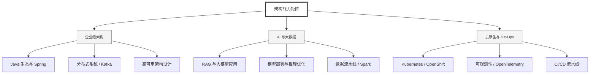

  <h1>你好，我是 Ellen Liu 👋</h1>
  

    <a href="README.md">English</a> | 
    <b>简体中文</b>
  

## 🧠 技术栈与核心能力

智能化企业系统建设路线图，涵盖全栈人工智能工程、云基础设施架构及模型部署等核心技术领域。

```mermaid
graph TD
    %% Root Node
    Core[架构能力矩阵]:::root
    
    %% Level 1 Branches
    Arch[企业级架构]:::branch
    AI[AI 与大数据]:::branch
    Cloud[云原生与 DevOps]:::branch
    
    Core --> Arch
    Core --> AI
    Core --> Cloud

    %% Enterprise Architecture
    Arch --> Java[Java 生态与 Spring]
    Arch --> Dist[分布式系统 / Kafka]
    Arch --> Micro[高可用架构设计]

    %% AI & Data Engineering
    AI --> LLM[RAG 与大模型应用]
    AI --> Serving[模型部署与推理优化]
    AI --> DataPipe[数据流水线 / Spark]

    %% Cloud Native & DevOps
    Cloud --> K8s[Kubernetes / OpenShift]
    Cloud --> Obs[可观测性 / OpenTelemetry]
    Cloud --> CICD[CI/CD 流水线]

    %% Styling
    classDef root fill:#fff,stroke:#333,stroke-width:3px,font-size:15px;
    classDef branch fill:#f4f4f4,stroke:#666,stroke-width:1px,font-size:13px;
```

## 🚀 Highlighted 工作

- **开源 AI 项目**: [基于 BERT 的声明检测模型](https://huggingface.co/XiaojingEllen/bert-finetuned-claim-detection) (Apache-2.0)
  - *已被哥伦比亚大学 (UBC) 研究项目引用。*
  - *手写 Transformer 核心代码，以验证理论与工程的一致性。*
- **金融基础设施**: 从 0 到 1 构建数字银行支付中间件及智能保险理赔系统。

## 📑 每日论文速递 (ArXiv)
<!-- DAILY_ARXIV_SUMMARY_START -->
**更新日期: 2026-04-14**

### 1. [大型语言模型通过一种独特且统一的机制生成有害内容](http://arxiv.org/abs/2604.09544v1)
- **摘要**: 大型语言模型（LLM）经过对齐训练以避免有害行为，但其安全防护机制仍显脆弱：越狱攻击常能绕过这些防护，而在特定领域进行微调可能引发广泛泛化的"涌现性失调"。这种脆弱性是否源于模型内部对有害性缺乏连贯的组织结构，目前尚不明确。本文通过定向权重剪枝作为因果干预手段，探究LLM内部有害性的组织结构。研究发现，有害内容生成依赖于一组紧凑的权重，这些权重在不同有害类型间具有通用性，且与良性能力权重相分离。对齐模型比未对齐模型表现出更强的有害生成权重压缩特征，表明对齐过程在模型内部重塑了有害表征——尽管表层安全防护机制仍显脆弱。这种压缩现象解释了涌现性失调的成因：若有害能力权重被高度压缩，在某一领域微调时激活这些权重可能引发广泛失调。与此一致的是，在特定领域剪除有害生成权重可显著降低涌现性失调。值得注意的是，LLM生成有害内容的能力与其识别和解释此类内容的能力存在解耦。这些发现共同揭示了LLM内部存在连贯的有害性组织结构，或可为构建更原理化的安全方法奠定基础。

### 2. [VisionFoundry：利用合成图像教授视觉语言模型视觉感知](http://arxiv.org/abs/2604.09531v1)
- **摘要**: 视觉语言模型（VLMs）在空间理解和视角识别等视觉感知任务上仍面临挑战。一个可能的原因是，自然图像数据集对底层视觉技能提供的监督信息有限。这引出了一个实际问题：仅通过任务关键词（如深度顺序）生成的有针对性的合成监督数据，能否弥补这些不足？为探究此问题，我们提出了VisionFoundry——一种任务感知的合成数据生成流程。该流程仅以任务名称作为输入，利用大语言模型（LLMs）生成问题、答案及文生图提示，再通过文生图模型合成图像，并借助专有VLM验证一致性，整个过程无需参考图像或人工标注。

基于VisionFoundry，我们构建了包含10个任务、共计1万组图像-问题-答案三元组的合成视觉问答数据集VisionFoundry-10K。使用该数据集训练的模型在视觉感知基准测试中取得显著提升：MMVP指标提升7%，CV-Bench-3D指标提升10%，同时保持了广泛的任务能力，并展现出随数据规模扩大的良好扩展性。我们的研究表明，缺乏针对特定任务的监督数据是制约VLM性能的关键瓶颈之一，而合成监督数据为构建更系统化的VLM训练体系提供了可行路径。

### 3. [VL-Calibration：面向大型视觉语言模型推理的解耦置信度校准](http://arxiv.org/abs/2604.09529v1)
- **摘要**: 大型视觉语言模型（LVLMs）在多模态推理方面表现出色，但常以高置信度产生幻觉和错误响应，这阻碍了其在高风险领域的应用。现有的言语化置信度校准方法主要针对纯文本大语言模型开发，通常基于二元答案级正确性优化单一整体置信度。这种设计与LVLMs存在不匹配：错误预测可能源于感知失败，也可能源于正确感知下的推理错误，而单一置信度会混淆这些误差来源，同时视觉不确定性常被语言先验主导。

为解决这些问题，我们提出VL-Calibration——一个将置信度显式解耦为视觉置信度与推理置信度的强化学习框架。为在没有真实感知标注的情况下监督视觉置信度，我们引入了一种内在视觉确定性估计方法，该方法结合了：（1）通过图像扰动下KL散度度量的视觉基础性；（2）通过词元熵度量的内部确定性。我们进一步提出词元级优势重加权方法，基于视觉确定性聚焦优化词元，从而抑制无根据的幻觉同时保留有效感知。

在十三个基准测试上的实验表明，VL-Calibration在提升视觉推理准确率的同时有效改进了校准效果，并且能够泛化至不同模型规模和架构的分布外基准测试。

<!-- DAILY_ARXIV_SUMMARY_END -->

## 🌐 保持联系

  
<i>期待与您探讨 AI 基础设施的未来！</i>

