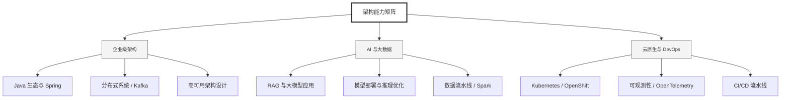

  <h1>你好，我是 Ellen Liu 👋</h1>
  

    <a href="README.md">English</a> | 
    <b>简体中文</b>
  

## 🧠 技术栈与核心能力

智能化企业系统建设路线图，涵盖全栈人工智能工程、云基础设施架构及模型部署等核心技术领域。

```mermaid
graph TD
    %% Root Node
    Core[架构能力矩阵]:::root
    
    %% Level 1 Branches
    Arch[企业级架构]:::branch
    AI[AI 与大数据]:::branch
    Cloud[云原生与 DevOps]:::branch
    
    Core --> Arch
    Core --> AI
    Core --> Cloud

    %% Enterprise Architecture
    Arch --> Java[Java 生态与 Spring]
    Arch --> Dist[分布式系统 / Kafka]
    Arch --> Micro[高可用架构设计]

    %% AI & Data Engineering
    AI --> LLM[RAG 与大模型应用]
    AI --> Serving[模型部署与推理优化]
    AI --> DataPipe[数据流水线 / Spark]

    %% Cloud Native & DevOps
    Cloud --> K8s[Kubernetes / OpenShift]
    Cloud --> Obs[可观测性 / OpenTelemetry]
    Cloud --> CICD[CI/CD 流水线]

    %% Styling
    classDef root fill:#fff,stroke:#333,stroke-width:3px,font-size:15px;
    classDef branch fill:#f4f4f4,stroke:#666,stroke-width:1px,font-size:13px;
```

## 🚀 Highlighted 工作

- **开源 AI 项目**: [基于 BERT 的声明检测模型](https://huggingface.co/XiaojingEllen/bert-finetuned-claim-detection) (Apache-2.0)
  - *已被哥伦比亚大学 (UBC) 研究项目引用。*
  - *手写 Transformer 核心代码，以验证理论与工程的一致性。*
- **金融基础设施**: 从 0 到 1 构建数字银行支付中间件及智能保险理赔系统。

## 📑 每日论文速递 (ArXiv)
<!-- DAILY_ARXIV_SUMMARY_START -->
**更新日期: 2026-05-20**

### 1. [DashAttention：可微分且自适应的稀疏分层注意力机制](http://arxiv.org/abs/2605.18753v1)
- **摘要**: 当前的层级注意力方法（如NSA和InfLLMv2）基于粗粒度注意力分数选择前k个相关键值块，随后对所选令牌应用细粒度softmax注意力。然而，top-k操作假设任意查询的相关令牌数量固定，且阻断了稀疏阶段与密集阶段之间的梯度流动。本文提出DashAttention（可微分自适应稀疏层级注意力），该方法在第一阶段利用自适应稀疏的α-entmax变换，根据当前查询选择可变数量的块，从而为第二阶段的softmax注意力提供先验信息，使整个层级结构保持完全可微分。与其他层级注意力方法不同，我们证明DashAttention具有非弥散特性，这转化为更优的长上下文建模能力。在大语言模型上的实验表明，DashAttention在75%稀疏度下可实现与全注意力相当的精度，且在高稀疏度场景中比NSA和InfLLMv2具有更优的帕累托前沿。我们还提供了基于Triton的高效GPU感知实现，其推理速度最高可超过FlashAttention-3。总体而言，DashAttention为长上下文建模提供了一种经济高效的策略。

### 2. [代码作为代理工具](http://arxiv.org/abs/2605.18747v1)
- **摘要**: 近期，大型语言模型（LLMs）在代码理解与生成方面展现出强大能力，应用范围从竞赛编程延伸至仓库级软件工程。在新兴的智能体系统中，代码不再仅是目标输出，更日益成为智能体推理、行动、环境建模及基于执行的验证的操作基础。我们通过智能体框架的视角审视这一转变，提出"代码即智能体框架"的统一观点，将代码定位为智能体基础设施的核心。为系统研究这一视角，本综述围绕三个关联层面展开：首先探讨框架接口层，分析代码如何连接智能体的推理、行动与环境建模；其次研究框架机制层，涵盖面向长周期执行的规划、记忆与工具使用，以及使框架具备可靠性与自适应能力的反馈驱动控制与优化；最后讨论框架扩展层，从单智能体系统延伸至多智能体场景，其中共享代码制品支撑多智能体协作、审查与验证。在各层面中，我们系统梳理了"代码即智能体框架"的代表性方法与应用实践，涵盖编程助手、图形界面/操作系统自动化、具身智能体、科学发现、个性化推荐、开发运维及企业工作流。进一步，我们提出框架工程面临的开放性挑战，包括超越最终任务成功的评估、不完整反馈下的验证、无回归的框架改进、多智能体间一致共享状态、安全关键操作的人类监督，以及向多模态环境的扩展。通过确立代码作为智能体AI框架的核心地位，本综述为构建可执行、可验证、有状态的AI智能体系统提供了统一路线图。

### 3. [ESI-Bench：迈向闭环感知-行动的具身空间智能](http://arxiv.org/abs/2605.18746v1)
- **摘要**: 空间智能通过感知-行动循环展开：智能体通过行动获取观测结果，并推理观测结果如何随行动变化。它们并非被动处理所见信息，而是主动揭示不可见的内容——被遮挡的结构、动态过程、包含关系以及功能特性，这些仅靠被动感知无法解析。我们突破以往将观测视为神谕式输入的空间智能范式，将观察者重新定义为行动者。基于OmniGibson平台，我们引入ESI-BENCH——一个涵盖10个任务类别和29个子类别的具身空间智能综合基准测试，其理论基础源于Spelke的核心知识系统。智能体需自主决策应部署何种能力（感知、移动、操作）及其执行顺序，以主动积累任务相关证据。我们对当前最先进的多模态大语言模型进行大量实验，发现主动探索显著优于被动策略：智能体能在无明确指令的情况下自发发现涌现性空间策略，而随机多视角方法尽管消耗更多图像，却往往引入噪声而非有效信号。多数失败并非源于感知能力薄弱，而是行动盲视——错误的行动选择导致劣质观测，进而引发级联错误。在深度敏感任务中，显式三维空间推理虽能稳定推理过程，但非完美的三维表征反而比二维基线更易扭曲空间关系，造成更大危害。人类研究进一步揭示：与人类主动寻求证伪视角并在矛盾中修正信念不同，模型会不顾证据质量过早做出高置信度判断，暴露出既无法通过提升感知能力、也无法通过增强具身交互来弥补的元认知鸿沟。

<!-- DAILY_ARXIV_SUMMARY_END -->

## 🌐 保持联系

  
<i>期待与您探讨 AI 基础设施的未来！</i>

