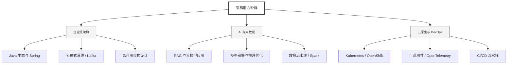

  <h1>你好，我是 Ellen Liu 👋</h1>
  

    <a href="README.md">English</a> | 
    <b>简体中文</b>
  

## 🧠 技术栈与核心能力

智能化企业系统建设路线图，涵盖全栈人工智能工程、云基础设施架构及模型部署等核心技术领域。

```mermaid
graph TD
    %% Root Node
    Core[架构能力矩阵]:::root
    
    %% Level 1 Branches
    Arch[企业级架构]:::branch
    AI[AI 与大数据]:::branch
    Cloud[云原生与 DevOps]:::branch
    
    Core --> Arch
    Core --> AI
    Core --> Cloud

    %% Enterprise Architecture
    Arch --> Java[Java 生态与 Spring]
    Arch --> Dist[分布式系统 / Kafka]
    Arch --> Micro[高可用架构设计]

    %% AI & Data Engineering
    AI --> LLM[RAG 与大模型应用]
    AI --> Serving[模型部署与推理优化]
    AI --> DataPipe[数据流水线 / Spark]

    %% Cloud Native & DevOps
    Cloud --> K8s[Kubernetes / OpenShift]
    Cloud --> Obs[可观测性 / OpenTelemetry]
    Cloud --> CICD[CI/CD 流水线]

    %% Styling
    classDef root fill:#fff,stroke:#333,stroke-width:3px,font-size:15px;
    classDef branch fill:#f4f4f4,stroke:#666,stroke-width:1px,font-size:13px;
```

## 🚀 Highlighted 工作

- **开源 AI 项目**: [基于 BERT 的声明检测模型](https://huggingface.co/XiaojingEllen/bert-finetuned-claim-detection) (Apache-2.0)
  - *已被哥伦比亚大学 (UBC) 研究项目引用。*
  - *手写 Transformer 核心代码，以验证理论与工程的一致性。*
- **金融基础设施**: 从 0 到 1 构建数字银行支付中间件及智能保险理赔系统。

## 📑 每日论文速递 (ArXiv)
<!-- DAILY_ARXIV_SUMMARY_START -->
**更新日期: 2026-04-10**

### 1. [个性化奖励基准：以人类对齐的个性化方式评估奖励模型](http://arxiv.org/abs/2604.07343v1)
- **摘要**: 多元化对齐已成为大型语言模型发展的关键前沿领域，其中奖励模型作为捕捉多样化人类价值观的核心机制。尽管针对通用响应质量的基准测试已较为普遍，但如何评估奖励模型对个体用户偏好的建模能力仍是一个开放挑战。为填补这一空白，我们提出了个性化奖励基准——这是一个旨在严格评估奖励模型个性化偏好建模能力的新型基准框架。我们基于对用户特定评分标准的严格遵守（或违反）构建了优选与劣选响应配对，确保偏好区分完全针对个体特征量身定制。特别值得注意的是，人工评估证实配对间的主要区分因素严格限定于个人偏好，且两个响应均保持较高的通用质量（如正确性、相关性与实用性）。大量测试表明，现有最先进的奖励模型在个性化任务上表现欠佳，最高准确率仅为75.94%。关键在于，有效的奖励模型基准应能预测其在下游任务中的表现。我们通过实验证明：相较于现有基线方法，该基准在最佳N采样和近端策略优化两种下游任务中，与奖励模型性能的相关性显著更高。这些发现确立了个性化奖励基准作为评估奖励模型下游应用性能的稳健且精确的代理标准。

### 2. [Appear2Meaning：一个跨文化基准，用于从图像中推断结构化文化元数据](http://arxiv.org/abs/2604.07338v1)
- **摘要**: 视觉语言模型（VLM）的最新进展提升了文化遗产领域的图像描述能力。然而，从视觉输入中推断结构化文化元数据（如创作者、起源地、年代）的研究仍显不足。为此，我们针对该任务构建了一个多类别、跨文化的评测基准，并采用"大语言模型即评判者"框架评估视觉语言模型，通过测量其输出与参考标注的语义对齐程度进行分析。为考察文化推理能力，我们报告了跨文化区域的精确匹配、部分匹配及属性级准确率。结果显示，现有模型仅能捕捉碎片化信号，且在不同文化背景与元数据类型间表现出显著性能差异，导致预测结果不一致且缺乏可靠依据。这些发现揭示了当前视觉语言模型在超越视觉感知的结构化文化元数据推断方面存在明显局限。

### 3. [基于同步上下文无关文法的语境翻译评估](http://arxiv.org/abs/2604.07320v1)
- **摘要**: 低资源语言对基于大语言模型（LLM）的机器翻译构成挑战，因为这类模型通常需要大量训练数据。一种潜在的解决方案是利用LLM理解语境中语言描述（如教科书和词典）的能力。要实现这一点，LLM必须能够推断出语言语法描述与目标句子之间的关联。本研究通过形式化模拟任务来分离这种能力：基于语境中提供的形式语法进行字符串转换。我们构建了同步上下文无关语法，这些语法定义了成对的形式语言，旨在模拟自然语言语法、形态及书写表征的特定方面。借助这些语法，我们测量了当同时提供语法规则和源语言句子时，LLM将句子从一种形式语言翻译至另一种的表现。实验中我们系统调整了语法规模、句子长度、语言的句法与形态特性以及书写文字体系。研究得出三个关键发现：首先，LLM的翻译准确率随语法规模扩大和句子长度增加而显著下降；其次，源语言与目标语言在形态和书写表征上的差异会严重削弱模型性能；最后，通过分析模型错误类型，我们发现其最常出现的问题包括错误调用目标语言词汇、虚构新词以及未能翻译源语言词汇。

<!-- DAILY_ARXIV_SUMMARY_END -->

## 🌐 保持联系

  
<i>期待与您探讨 AI 基础设施的未来！</i>

