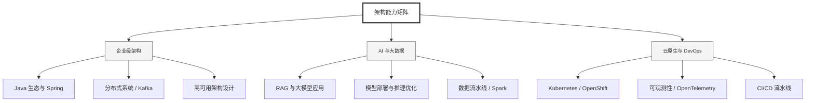

  <h1>你好，我是 Ellen Liu 👋</h1>
  

    <a href="README.md">English</a> | 
    <b>简体中文</b>
  

## 🧠 技术栈与核心能力

智能化企业系统建设路线图，涵盖全栈人工智能工程、云基础设施架构及模型部署等核心技术领域。

```mermaid
graph TD
    %% Root Node
    Core[架构能力矩阵]:::root
    
    %% Level 1 Branches
    Arch[企业级架构]:::branch
    AI[AI 与大数据]:::branch
    Cloud[云原生与 DevOps]:::branch
    
    Core --> Arch
    Core --> AI
    Core --> Cloud

    %% Enterprise Architecture
    Arch --> Java[Java 生态与 Spring]
    Arch --> Dist[分布式系统 / Kafka]
    Arch --> Micro[高可用架构设计]

    %% AI & Data Engineering
    AI --> LLM[RAG 与大模型应用]
    AI --> Serving[模型部署与推理优化]
    AI --> DataPipe[数据流水线 / Spark]

    %% Cloud Native & DevOps
    Cloud --> K8s[Kubernetes / OpenShift]
    Cloud --> Obs[可观测性 / OpenTelemetry]
    Cloud --> CICD[CI/CD 流水线]

    %% Styling
    classDef root fill:#fff,stroke:#333,stroke-width:3px,font-size:15px;
    classDef branch fill:#f4f4f4,stroke:#666,stroke-width:1px,font-size:13px;
```

## 🚀 Highlighted 工作

- **开源 AI 项目**: [基于 BERT 的声明检测模型](https://huggingface.co/XiaojingEllen/bert-finetuned-claim-detection) (Apache-2.0)
  - *已被哥伦比亚大学 (UBC) 研究项目引用。*
  - *手写 Transformer 核心代码，以验证理论与工程的一致性。*
- **金融基础设施**: 从 0 到 1 构建数字银行支付中间件及智能保险理赔系统。

## 📑 每日论文速递 (ArXiv)
<!-- DAILY_ARXIV_SUMMARY_START -->
**更新日期: 2026-03-04**

### 1. [在生态系统规模上组织、编排与基准化代理技能](http://arxiv.org/abs/2603.02176v1)
- **摘要**: Claude智能体技能的快速扩散引发了一个核心问题：如何有效利用、管理和扩展智能体技能生态系统。本文提出AgentSkillOS——首个面向技能选择、编排与生态系统级管理的原则性框架。该框架包含两个阶段：（一）技能管理阶段，通过节点级递归分类将技能组织成能力树以实现高效检索；（二）任务解决阶段，通过基于有向无环图（DAG）的流程实现多技能的检索、编排与执行。为评估智能体调用技能的能力，我们构建了包含30个高复杂度任务的基准测试集，涵盖五大类别：数据计算、文档生成、动态视频、视觉设计与网页交互。我们采用基于大语言模型的成对评估方法衡量任务输出质量，并通过布拉德利-特里模型聚合结果生成统一质量评分。在三种技能生态规模（200至20万技能）上的实验表明：基于树结构的检索能有效逼近理想技能选择效果；即使使用相同技能集合，基于DAG的编排方式也显著优于原生扁平化调用模式。我们的研究证实：结构化组合是释放技能潜力的关键。项目代码已开源：https://github.com/ynulihao/AgentSkillOS。

### 2. [扩展检索增强生成：RAG融合的行业部署经验分享](http://arxiv.org/abs/2603.02153v1)
- **摘要**: 检索增强生成（RAG）系统通常采用多查询检索与互逆排序融合等检索融合技术来提升文档召回率，其假设在于更高的召回率会带来更优的答案质量。尽管这些方法在独立检索基准测试中展现出稳定的性能提升，但在实际生产环境约束下的有效性仍缺乏深入探究。本研究基于企业知识库构建生产级RAG流程，在固定检索深度、重排序预算和延迟约束条件下评估检索融合技术的实际效果。

通过对多种融合配置的测试，我们发现检索融合确实能提升原始召回率，但这些增益在重排序与结果截断环节基本被抵消。在我们的实验场景中，各类融合方案在知识库层级的Top-$k$准确率上均未能超越单查询基线，其中Hit@10指标在多个配置中从$0.51$下降至$0.48$。此外，由于查询重写和候选集扩大带来的额外计算负载，融合技术会引入显著的延迟开销，却未能相应提升下游任务效果。

分析表明，当施加实际的重排序限制与上下文预算后，面向召回优化的融合技术呈现收益递减现象。我们得出结论：检索层级的改进并不能稳定转化为生产环境RAG系统的端到端性能提升，并主张建立同时考量检索质量、系统效率与下游影响的综合评价框架。

### 3. [LongRLVR：长上下文强化学习需依赖可验证的上下文奖励](http://arxiv.org/abs/2603.02146v1)
- **摘要**: 基于可验证奖励的强化学习（RLVR）通过优化大语言模型（LLM）使其符合事实结果，显著提升了模型的推理能力。然而，在长上下文场景中，该范式因过度依赖内部参数化知识而难以适应需要上下文锚定（即从外部提供的信息中查找并进行推理）的任务。我们发现其失败的关键原因在于：仅基于最终答案的奖励过于稀疏，无法有效引导模型识别相关证据。我们通过严格证明指出，仅依赖结果奖励会导致上下文锚定过程的梯度显著消失，从而使学习变得不可行。

为突破这一瓶颈，我们提出LongRLVR方法，通过引入稠密且可验证的上下文奖励来增强稀疏的答案奖励。这一辅助信号直接激励模型选择正确的锚定信息，提供稳健的学习梯度以解决底层优化难题。我们在Qwen和LLaMA模型上使用具有挑战性的长上下文基准测试验证了该方法。LongRLVR在所有模型和基准测试中均持续且显著优于标准RLVR，例如将140亿参数模型在RULER-QA上的得分从73.17提升至88.90，在LongBench v2上从39.8提升至46.5。我们的研究表明，显式奖励锚定过程是释放LLM在长上下文应用中完整推理潜力的关键有效策略。代码已开源：https://github.com/real-absolute-AI/LongRLVR。

<!-- DAILY_ARXIV_SUMMARY_END -->

## 🌐 保持联系

  
<i>期待与您探讨 AI 基础设施的未来！</i>

