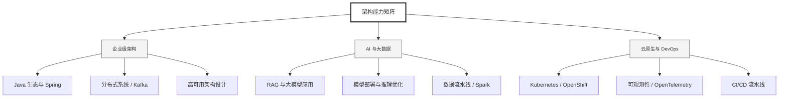

  <h1>你好，我是 Ellen Liu 👋</h1>
  

    <a href="README.md">English</a> | 
    <b>简体中文</b>
  

## 🧠 技术栈与核心能力

智能化企业系统建设路线图，涵盖全栈人工智能工程、云基础设施架构及模型部署等核心技术领域。

```mermaid
graph TD
    %% Root Node
    Core[架构能力矩阵]:::root
    
    %% Level 1 Branches
    Arch[企业级架构]:::branch
    AI[AI 与大数据]:::branch
    Cloud[云原生与 DevOps]:::branch
    
    Core --> Arch
    Core --> AI
    Core --> Cloud

    %% Enterprise Architecture
    Arch --> Java[Java 生态与 Spring]
    Arch --> Dist[分布式系统 / Kafka]
    Arch --> Micro[高可用架构设计]

    %% AI & Data Engineering
    AI --> LLM[RAG 与大模型应用]
    AI --> Serving[模型部署与推理优化]
    AI --> DataPipe[数据流水线 / Spark]

    %% Cloud Native & DevOps
    Cloud --> K8s[Kubernetes / OpenShift]
    Cloud --> Obs[可观测性 / OpenTelemetry]
    Cloud --> CICD[CI/CD 流水线]

    %% Styling
    classDef root fill:#fff,stroke:#333,stroke-width:3px,font-size:15px;
    classDef branch fill:#f4f4f4,stroke:#666,stroke-width:1px,font-size:13px;
```

## 🚀 Highlighted 工作

- **开源 AI 项目**: [基于 BERT 的声明检测模型](https://huggingface.co/XiaojingEllen/bert-finetuned-claim-detection) (Apache-2.0)
  - *已被哥伦比亚大学 (UBC) 研究项目引用。*
  - *手写 Transformer 核心代码，以验证理论与工程的一致性。*
- **金融基础设施**: 从 0 到 1 构建数字银行支付中间件及智能保险理赔系统。

## 📑 每日论文速递 (ArXiv)
<!-- DAILY_ARXIV_SUMMARY_START -->
**更新日期: 2026-03-09**

### 1. [POET-X：通过扩展正交变换实现内存高效的大语言模型训练](http://arxiv.org/abs/2603.05500v1)
- **摘要**: 高效且稳定地训练大语言模型（LLM）仍是现代机器学习系统的核心挑战。为应对这一挑战，研究者提出了重参数化正交等价训练（POET）——一种通过正交等价变换优化各权重矩阵的谱保持框架。尽管POET具备优异的训练稳定性，但其原始实现因密集的矩阵乘法运算导致内存消耗与计算开销过高。为突破这些限制，我们提出POET-X：一种可扩展且内存高效的改进方案，能以显著降低的计算成本实现正交等价变换。POET-X在保持POET泛化性与稳定性优势的同时，大幅提升了训练吞吐量与内存效率。实验表明，POET-X可在单张英伟达H100 GPU上完成数十亿参数规模LLM的预训练；相比之下，AdamW等标准优化器在相同配置下会出现内存耗尽问题。

### 2. [被审查的大型语言模型作为秘密知识提取的自然试验场](http://arxiv.org/abs/2603.05494v1)
- **摘要**: 大型语言模型有时会产生虚假或误导性回答。针对此问题主要有两种解决思路：诚实诱导——通过修改提示词或权重使模型如实作答，以及谎言检测——对给定回答进行真伪分类。先前研究通常在专门训练用于说谎或隐瞒信息的模型上评估这些方法，但这类人为构造场景可能与自然发生的欺骗行为存在差异。我们转而研究中国开发者发布的开源权重大语言模型，这些模型被训练用于审查政治敏感话题：以Qwen3系列模型为例，它们经常对法轮功或天安门抗议等话题编造虚假信息，但偶尔也能给出正确答案，这表明模型实际掌握着其被训练所压制的知识。基于这一测试平台，我们系统评估了多种诱导与检测技术。在诚实诱导方面，去除对话模板的采样、少样本提示以及在通用诚实数据上的微调最能有效提升真实回答比例。对于谎言检测，直接要求被审查模型对其自身回答进行分类的效果接近未审查模型的理论上限，而基于无关数据训练的线性探针则提供了更经济的替代方案。最强的诚实诱导技术同样适用于前沿开源权重模型（如DeepSeek R1）。值得注意的是，没有任何技术能完全消除虚假回答。我们已公开全部提示词、代码及对话记录。

### 3. [利用LLM参数化知识进行无需检索的事实核查](http://arxiv.org/abs/2603.05471v1)
- **摘要**: 可信度是基于大语言模型构建的智能体系统的核心研究挑战。为增强可信度，通常需要对外部来源（包括人工撰写的文本、网络内容及模型输出）的自然语言主张进行事实核查，具体方法是通过检索外部知识，并利用大语言模型验证主张与检索证据的忠实度。然而，这类方法受限于检索误差和外部数据可用性，且未能充分利用模型内在的事实核查能力。我们提出无需检索的事实核查任务，专注于验证任意自然语言主张，而不受其来源限制。为研究这一设定，我们引入了一个聚焦泛化能力的综合评估框架，测试其对以下四方面的鲁棒性：（一）长尾知识，（二）主张来源的多样性，（三）多语言处理能力，（四）长文本生成。通过对9个数据集、18种方法和3个模型的实验，我们发现基于逻辑概率的方法通常逊色于利用内部模型表征的方法。基于这一发现，我们提出了INTRA方法，该方法通过挖掘内部表征间的交互关系，实现了卓越性能与强大泛化能力。更广泛而言，我们的研究确立了无需检索的事实核查作为一个前景广阔的研究方向，它既能与基于检索的框架形成互补，又可提升系统可扩展性，还能在训练中作为奖励信号或作为生成过程的集成组件发挥作用。

<!-- DAILY_ARXIV_SUMMARY_END -->

## 🌐 保持联系

  
<i>期待与您探讨 AI 基础设施的未来！</i>

