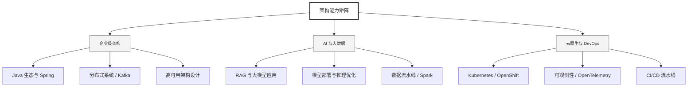

  <h1>你好，我是 Ellen Liu 👋</h1>
  

    <a href="README.md">English</a> | 
    <b>简体中文</b>
  

## 🧠 技术栈与核心能力

智能化企业系统建设路线图，涵盖全栈人工智能工程、云基础设施架构及模型部署等核心技术领域。

```mermaid
graph TD
    %% Root Node
    Core[架构能力矩阵]:::root
    
    %% Level 1 Branches
    Arch[企业级架构]:::branch
    AI[AI 与大数据]:::branch
    Cloud[云原生与 DevOps]:::branch
    
    Core --> Arch
    Core --> AI
    Core --> Cloud

    %% Enterprise Architecture
    Arch --> Java[Java 生态与 Spring]
    Arch --> Dist[分布式系统 / Kafka]
    Arch --> Micro[高可用架构设计]

    %% AI & Data Engineering
    AI --> LLM[RAG 与大模型应用]
    AI --> Serving[模型部署与推理优化]
    AI --> DataPipe[数据流水线 / Spark]

    %% Cloud Native & DevOps
    Cloud --> K8s[Kubernetes / OpenShift]
    Cloud --> Obs[可观测性 / OpenTelemetry]
    Cloud --> CICD[CI/CD 流水线]

    %% Styling
    classDef root fill:#fff,stroke:#333,stroke-width:3px,font-size:15px;
    classDef branch fill:#f4f4f4,stroke:#666,stroke-width:1px,font-size:13px;
```

## 🚀 Highlighted 工作

- **开源 AI 项目**: [基于 BERT 的声明检测模型](https://huggingface.co/XiaojingEllen/bert-finetuned-claim-detection) (Apache-2.0)
  - *已被哥伦比亚大学 (UBC) 研究项目引用。*
  - *手写 Transformer 核心代码，以验证理论与工程的一致性。*
- **金融基础设施**: 从 0 到 1 构建数字银行支付中间件及智能保险理赔系统。

## 📑 每日论文速递 (ArXiv)
<!-- DAILY_ARXIV_SUMMARY_START -->
**更新日期: 2026-03-19**

### 1. [边缘高效推理](http://arxiv.org/abs/2603.16867v1)
- **摘要**: 具备思维链推理能力的大语言模型在复杂问题解决任务中实现了最先进的性能，但其冗长的推理轨迹和庞大的上下文需求使其难以在边缘设备上部署。这些挑战包括高昂的令牌生成成本、庞大的键值缓存占用空间，以及将推理能力蒸馏到移动设备小型模型时的效率低下问题。现有方法通常依赖将大型模型的推理轨迹蒸馏到小型模型，这些轨迹往往冗长且存在风格冗余，不利于设备端推理。本研究提出一种轻量级方法，通过结合监督微调的LoRA适配器实现小型大语言模型的推理能力。我们进一步引入基于强化学习的预算约束机制，在精度损失最小化的前提下显著缩短响应长度。针对内存受限的解码问题，我们采用并行测试时扩展技术，以微小延迟代价提升推理精度。最后，我们提出动态适配器切换机制——仅在需要时激活推理模块，以及在提示编码阶段采用键值缓存共享策略，从而缩短设备端推理的首令牌生成时间。基于Qwen2.5-7B模型的实验表明，我们的方法能在严格资源限制下实现高效精准的推理，使大语言模型推理在移动场景中具备实用性。演示移动设备运行效果的视频已发布于项目页面。

### 2. [时序感知对话代理Chronos：基于结构化事件检索的长期记忆系统](http://arxiv.org/abs/2603.16862v1)
- **摘要**: 大型语言模型（LLM）的最新进展使得对话式人工智能代理能够进行持续数周甚至数月的多轮交互。然而，现有记忆系统难以对跨越数月交互过程中随时间演变的客观事实与用户偏好进行推理，也缺乏针对长对话历史中多跳、时间敏感查询的有效检索策略。我们提出Chronos——一种新颖的时序感知记忆框架，该系统将原始对话分解为主谓宾事件元组，并解析出明确的时间范围与实体别名，将其与完整保留对话语境的轮次日历共同索引至结构化事件日历中。查询时，Chronos通过动态提示为每个问题生成定制化检索指引，指导代理确定检索内容、跨时间范围筛选策略，并通过在双日历系统上迭代调用工具链实现多跳推理。我们在包含六类对话历史任务、共计500道问题的LongMemEvalS基准测试中，对8种开源与闭源LLM进行了评估。Chronos Low版本取得92.60%准确率，Chronos High版本达到95.60%准确率，以7.67%的显著优势刷新了当前最佳性能记录。消融实验显示：事件日历组件带来58.9%的基线性能提升，其余组件各自贡献15.5%至22.3%的增益。值得注意的是，仅Chronos Low版本在最强模型配置下的表现就已超越所有现有方法。

### 3. [平庸性是LLM作为评判锚点选择的关键所在。](http://arxiv.org/abs/2603.16848v1)
- **摘要**: "LLM-as-a-judge"范式已成为评估开放式生成任务的标准方法。为应对成对比较带来的二次方级可扩展性成本，主流基准测试（如Arena-Hard和AlpacaEval）采用将所有模型与单一锚点模型对比的策略。然而，尽管该方法被广泛使用，锚点选择对结果可靠性的影响却尚未得到充分探索。本研究通过系统评估Arena-Hard-v2.0数据集上的22个不同锚点，揭示了锚点选择的关键性：不当的锚点会显著降低与人类排序的相关性。我们发现常见锚点选择（最佳性能与最差性能模型）效果欠佳，因为这些极端锚点始终优于或劣于所有其他模型，几乎无法反映模型间的相对排序差异。我们进一步量化了锚点选择的影响程度，证明其重要性可与评判模型的选择相提并论。最后提出两项可操作性建议：首先通过功效分析计算锚点基准测试所需规模，发现现有基准测试规模既不足以支撑可靠的成对评估，也无法有效区分竞争模型；其次提供筛选信息量充足锚点的指导原则，以保障评估实践的可靠性与高效性。

<!-- DAILY_ARXIV_SUMMARY_END -->

## 🌐 保持联系

  
<i>期待与您探讨 AI 基础设施的未来！</i>

