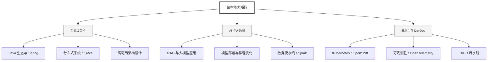

  <h1>你好，我是 Ellen Liu 👋</h1>
  

    <a href="README.md">English</a> | 
    <b>简体中文</b>
  

## 🧠 技术栈与核心能力

智能化企业系统建设路线图，涵盖全栈人工智能工程、云基础设施架构及模型部署等核心技术领域。

```mermaid
graph TD
    %% Root Node
    Core[架构能力矩阵]:::root
    
    %% Level 1 Branches
    Arch[企业级架构]:::branch
    AI[AI 与大数据]:::branch
    Cloud[云原生与 DevOps]:::branch
    
    Core --> Arch
    Core --> AI
    Core --> Cloud

    %% Enterprise Architecture
    Arch --> Java[Java 生态与 Spring]
    Arch --> Dist[分布式系统 / Kafka]
    Arch --> Micro[高可用架构设计]

    %% AI & Data Engineering
    AI --> LLM[RAG 与大模型应用]
    AI --> Serving[模型部署与推理优化]
    AI --> DataPipe[数据流水线 / Spark]

    %% Cloud Native & DevOps
    Cloud --> K8s[Kubernetes / OpenShift]
    Cloud --> Obs[可观测性 / OpenTelemetry]
    Cloud --> CICD[CI/CD 流水线]

    %% Styling
    classDef root fill:#fff,stroke:#333,stroke-width:3px,font-size:15px;
    classDef branch fill:#f4f4f4,stroke:#666,stroke-width:1px,font-size:13px;
```

## 🚀 Highlighted 工作

- **开源 AI 项目**: [基于 BERT 的声明检测模型](https://huggingface.co/XiaojingEllen/bert-finetuned-claim-detection) (Apache-2.0)
  - *已被哥伦比亚大学 (UBC) 研究项目引用。*
  - *手写 Transformer 核心代码，以验证理论与工程的一致性。*
- **金融基础设施**: 从 0 到 1 构建数字银行支付中间件及智能保险理赔系统。

## 📑 每日论文速递 (ArXiv)
<!-- DAILY_ARXIV_SUMMARY_START -->
**更新日期: 2026-02-25**

### 1. [骑士：基于知识图谱驱动的自适应难度校准多项选择题生成](http://arxiv.org/abs/2602.20135v1)
- **摘要**: 随着大型语言模型（LLM）的兴起，它们在检索增强生成（RAG）等应用中发挥着关键作用。然而，评估这些系统仍受限于构建专业评估数据集所需的时间与成本。我们提出了KNIGHT——一个基于LLM、以知识图谱驱动的框架，能够从外部资源生成多项选择题（MCQ）数据集。KNIGHT构建了主题特定的知识图谱，即对实体与关系的结构化精简总结，该图谱可重复用于生成由使用者控制难度的问题（包括多跳推理问题），而无需反复输入完整源文本。这种知识图谱作为一种压缩且可复用的状态，使得问题生成过程简化为对图谱的低成本读取操作。

我们在维基百科/维基数据上实现了KNIGHT，同时保持该框架的领域无关性与本体无关性。作为案例研究，KNIGHT在历史、生物学和数学领域生成了六个MCQ数据集。我们从五个维度评估生成质量：流畅性、无歧义性（单一正确答案）、主题相关性、选项独特性，以及基于给定来源的可解答性（作为检测幻觉的代理指标）。结果表明，KNIGHT能够通过可复用的图谱表征实现高效且低成本的生成，在所有评估维度上均表现出高质量，其生成的模型排名与MMLU风格基准测试结果一致，同时支持主题特定和难度可控的评估。

### 2. [AdaEvolve：基于自适应大语言模型的零阶优化方法](http://arxiv.org/abs/2602.20133v1)
- **摘要**: 自动化程序生成的范式正从一次性生成转向推理时搜索，其中大型语言模型（LLM）在进化循环中充当语义变异算子。尽管这类系统行之有效，但目前它们受制于静态调度策略，未能适应搜索过程中的非稳态动态特性。这种僵化机制导致大量计算资源浪费——资源被不加区分地分配给停滞的种群，而具有潜力的探索方向却未得到充分开发。我们提出AdaEvolve框架，将LLM驱动的进化过程重构为分层自适应优化问题。该框架通过"累积改进信号"统一三个层级的决策：局部适应层动态调节候选解种群内的探索强度；全局适应层通过多臂老虎机调度机制在不同候选解种群间分配全局资源预算；元引导层则在进展停滞时，基于已生成解及其对应改进值生成新型解题策略。我们在185个开放式优化问题（涵盖组合优化、系统优化与算法设计等领域）上的实验表明，AdaEvolve始终优于开源基线方法。

### 3. [推理与否：医学问答中的选择性思维链](http://arxiv.org/abs/2602.20130v1)
- **摘要**: **目的**：通过避免不必要的推理过程，在保持准确性的同时提升大型语言模型（LLM）在医学问答（MedQA）任务中的效率。  
**方法**：我们提出选择性思维链（Selective CoT），一种在推理阶段先预测问题是否需要推理、仅在必要时生成依据的策略。在两个开源LLM（Llama-3.1-8B 和 Qwen-2.5-7B）上，使用四个生物医学问答基准数据集（HeadQA、MedQA-USMLE、MedMCQA 和 PubMedQA）进行评估。评估指标包括准确率、生成总词元数和推理时间。  
**结果**：Selective CoT 在准确率损失极小（≤4%）的情况下，将推理时间降低13-45%，词元使用量减少8-47%。在某些模型-任务组合中，其准确率与效率均优于标准CoT。与固定长度CoT相比，Selective CoT 以显著更低的计算成本达到相近或更高的准确率。  
**讨论**：Selective CoT 通过仅在有益时触发显式推理，动态平衡推理深度与效率，在减少回忆类问题冗余计算的同时保持可解释性。  
**结论**：Selective CoT 为医学问答提供了一种简单、模型无关且经济高效的方法，通过使推理投入与问题复杂度相匹配，提升了基于LLM的临床系统在真实场景中的部署可行性。

<!-- DAILY_ARXIV_SUMMARY_END -->

## 🌐 保持联系

  
<i>期待与您探讨 AI 基础设施的未来！</i>

