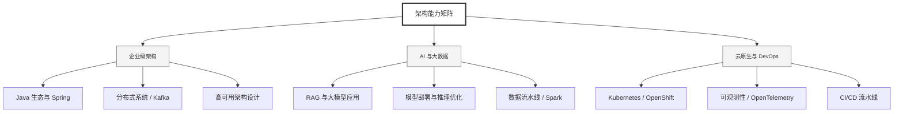

  <h1>你好，我是 Ellen Liu 👋</h1>
  

    <a href="README.md">English</a> | 
    <b>简体中文</b>
  

## 🧠 技术栈与核心能力

智能化企业系统建设路线图，涵盖全栈人工智能工程、云基础设施架构及模型部署等核心技术领域。

```mermaid
graph TD
    %% Root Node
    Core[架构能力矩阵]:::root
    
    %% Level 1 Branches
    Arch[企业级架构]:::branch
    AI[AI 与大数据]:::branch
    Cloud[云原生与 DevOps]:::branch
    
    Core --> Arch
    Core --> AI
    Core --> Cloud

    %% Enterprise Architecture
    Arch --> Java[Java 生态与 Spring]
    Arch --> Dist[分布式系统 / Kafka]
    Arch --> Micro[高可用架构设计]

    %% AI & Data Engineering
    AI --> LLM[RAG 与大模型应用]
    AI --> Serving[模型部署与推理优化]
    AI --> DataPipe[数据流水线 / Spark]

    %% Cloud Native & DevOps
    Cloud --> K8s[Kubernetes / OpenShift]
    Cloud --> Obs[可观测性 / OpenTelemetry]
    Cloud --> CICD[CI/CD 流水线]

    %% Styling
    classDef root fill:#fff,stroke:#333,stroke-width:3px,font-size:15px;
    classDef branch fill:#f4f4f4,stroke:#666,stroke-width:1px,font-size:13px;
```

## 🚀 Highlighted 工作

- **开源 AI 项目**: [基于 BERT 的声明检测模型](https://huggingface.co/XiaojingEllen/bert-finetuned-claim-detection) (Apache-2.0)
  - *已被哥伦比亚大学 (UBC) 研究项目引用。*
  - *手写 Transformer 核心代码，以验证理论与工程的一致性。*
- **金融基础设施**: 从 0 到 1 构建数字银行支付中间件及智能保险理赔系统。

## 📑 每日论文速递 (ArXiv)
<!-- DAILY_ARXIV_SUMMARY_START -->
**更新日期: 2026-06-03**

### 1. [ClinEnv：面向智能体的交互式多阶段长周期电子健康记录环境](http://arxiv.org/abs/2606.02568v1)
- **摘要**: 临床实践并非从预设选项中选择答案：医生需逐步收集异质性信息，并在不确定性下做出不可逆的序列决策。静态基准无法评估这一过程，而现有交互式医疗基准均至少在一项关键维度上存在缺陷。我们提出ClinEnv——一个交互式基准测试框架，通过我们称之为"纵向住院模拟"的范式，评估大语言模型作为主治医师处理真实住院病例的能力。每个病例被自动构建为有序的决策阶段序列；在每个阶段，模型必须主动查询四个专业智能体，才能确定用药方案、诊疗操作和诊断结论。ClinEnv通过确定性本体匹配评估模型决策质量，同时量化其信息获取过程。在七个测试模型中，最优模型仅达到0.31的决策F1值，且结果质量与过程质量呈现显著脱节。难度集中于管理决策与后期阶段——模型对出院诊断的复现可靠性（F1值0.51）远高于管理操作（F1值0.17），且随病程推进持续产生冗余查询。ClinEnv使这种仅关注结果评估时不可见的信息获取差距变得可量化。

### 2. [从层到子模块：重新思考基于替换的大语言模型压缩中的粒度问题](http://arxiv.org/abs/2606.02559v1)
- **摘要**: 大型语言模型（LLMs）的后训练压缩通过移除或替换完整架构组件实现。现有基于替换的方法存在两个设计约束：全层粒度和连续选择。我们认为这种约束过于严格——实际上，预训练Transformer中的冗余既非局限于连续区域，也非均匀分布在注意力机制与前馈网络输出之间，这意味着不同子模块类型需要不同的最优近似策略，且可移除组件无需聚集在连续深度范围内。基于这一认知，我们提出SubFit（子模块级拟合残差替换），该方法在子模块层级压缩LLM：注意力机制与前馈子模块采用非连续选择，每个子模块配备独立的轻量级拟合残差旁路。SubFit仅需后训练阶段和校准数据即可运行。在十个LLM（五个基础模型、五个指令微调模型）、五种稀疏度（12.5%至37.5%）及四种基于替换的基线方法中，SubFit在评估的稀疏度范围内实现了最优的困惑度-准确率综合权衡，在激进压缩场景下优势更为显著。在25%稀疏度下，该方法保留了84.6%的稠密下游准确率，困惑度仅退化2.42倍，而最强基线方法对应指标为81.6%和4.34倍，同时实现了可测量的推理加速和KV缓存节省。代码已开源：https://github.com/eliacunegatti/SubFit。

### 3. [英雄之旅：通过文本游戏测试复杂规则归纳](http://arxiv.org/abs/2606.02556v1)
- **摘要**: 我们提出《英雄之旅》（HERO'S JOURNEY），这是一个面向目标导向型情节任务中规则归纳的基准测试。在该任务中，智能体必须从示范中推断隐藏规则，并通过多步执行来应用这些规则。《英雄之旅》涵盖属性归纳与程序归纳两大类别中的八项任务，每项任务包含四种结构规则形式、可控的词汇基础以及可识别性条件。通过评估最先进的大语言模型，我们发现模型虽展现出规则归纳能力，但这种能力有限且在不同任务间表现不均衡。同时，过程执行对模型形成了执行瓶颈，而表层语义的影响微乎其微。针对归纳的引导方法能提升属性任务的性能，但在程序任务上未呈现可靠增益，这表明程序归纳的差距仍是一个待解决的开放性挑战。

<!-- DAILY_ARXIV_SUMMARY_END -->

## 🌐 保持联系

  
<i>期待与您探讨 AI 基础设施的未来！</i>

