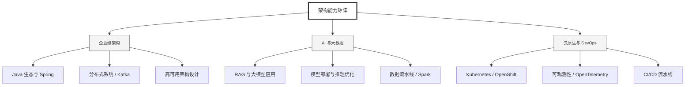

  <h1>你好，我是 Ellen Liu 👋</h1>
  

    <a href="README.md">English</a> | 
    <b>简体中文</b>
  

## 🧠 技术栈与核心能力

智能化企业系统建设路线图，涵盖全栈人工智能工程、云基础设施架构及模型部署等核心技术领域。

```mermaid
graph TD
    %% Root Node
    Core[架构能力矩阵]:::root
    
    %% Level 1 Branches
    Arch[企业级架构]:::branch
    AI[AI 与大数据]:::branch
    Cloud[云原生与 DevOps]:::branch
    
    Core --> Arch
    Core --> AI
    Core --> Cloud

    %% Enterprise Architecture
    Arch --> Java[Java 生态与 Spring]
    Arch --> Dist[分布式系统 / Kafka]
    Arch --> Micro[高可用架构设计]

    %% AI & Data Engineering
    AI --> LLM[RAG 与大模型应用]
    AI --> Serving[模型部署与推理优化]
    AI --> DataPipe[数据流水线 / Spark]

    %% Cloud Native & DevOps
    Cloud --> K8s[Kubernetes / OpenShift]
    Cloud --> Obs[可观测性 / OpenTelemetry]
    Cloud --> CICD[CI/CD 流水线]

    %% Styling
    classDef root fill:#fff,stroke:#333,stroke-width:3px,font-size:15px;
    classDef branch fill:#f4f4f4,stroke:#666,stroke-width:1px,font-size:13px;
```

## 🚀 Highlighted 工作

- **开源 AI 项目**: [基于 BERT 的声明检测模型](https://huggingface.co/XiaojingEllen/bert-finetuned-claim-detection) (Apache-2.0)
  - *已被哥伦比亚大学 (UBC) 研究项目引用。*
  - *手写 Transformer 核心代码，以验证理论与工程的一致性。*
- **金融基础设施**: 从 0 到 1 构建数字银行支付中间件及智能保险理赔系统。

## 📑 每日论文速递 (ArXiv)
<!-- DAILY_ARXIV_SUMMARY_START -->
**更新日期: 2026-06-11**

### 1. [数据新闻记者智能体：将数据转化为可验证的多模态报道](http://arxiv.org/abs/2606.11176v1)
- **摘要**: 数据讲述着塑造社会的故事；数据记者的职责是将原始信息转化为非专业人士能够信任的报道。一篇高质量的新闻特写需要新闻编辑部团队花费数周时间：寻找背景信息、进行统计分析、确定报道角度并设计可视化呈现。现有智能体虽能出色完成单个环节——数据科学智能体可闭环分析流程，设计智能体则能整合出精美的网站——但能否有一个智能体端到端地承担数据记者的全部工作？我们提出数据记者智能体（Data2Story），这是一个多智能体框架，将专业角色整合为统一的虚拟新闻编辑部。Data2Story 贡献了两项创新：（i）基于证据的主张验证：审查员将每个数据、角度和素材与原始数据、代码或外部参考文献建立关联；（ii）多模态生成式文章：不同于默认的纯文本和静态图表，Data2Story 会推理读者希望看到的内容，然后部署多模态工具，例如地理信息的交互式地图和音乐相关的音频。我们沿四个维度对 Data2Story 进行了评估，涉及18篇文章（每篇均配有原始专家发表版本）：（a）人类与智能体的报道角度覆盖度；（b）53名参与者从五个维度进行的评分评估；（c）以计算机使用型智能体作为评审员（一种节省成本的替代方案，用于模拟读者浏览交互式文章的行为）；（d）可验证性：由代码验证器根据数据重新执行陈述，并对照参考文献核查主张。Data2Story 能生成具有竞争力且证据可追溯的多媒体报道，尤其在透明度和可审计性方面表现突出。人类撰写的文章在编辑视角、创意设计和呈现方式上仍具优势。我们将 Data2Story 定位为记者的协作工具，助力实现更基于证据、更透明且可验证的新闻报道。代码和演示请访问 https://data2story.github.io。

### 2. [全双工语音模型中的多维度交互对齐](http://arxiv.org/abs/2606.11167v1)
- **摘要**: 全双工语音对话模型能够同时进行听和说，使其成为实现自然对话的理想架构。然而，当前模型仅通过基于词元级似然最大化的监督学习进行训练，这种方式无法直接优化交互层面的行为，导致出现过度沉默、轮次切换时机不当等交互性问题。近期研究尝试应用强化学习（RL）来提升交互性，但现有方法仅针对有限类型的交互行为设计奖励机制。本研究提出一种通过强化学习实现全双工语音对话模型交互性全面优化的后训练对齐方法。我们聚焦交互性的四个核心维度：停顿处理、轮次切换、反馈信号生成及用户打断。针对每个维度，我们从人类对话语料中提取短音频片段，并采用维度特定的奖励函数优化模型。同时引入基于大语言模型（LLM）的响应质量奖励机制，防止语义退化。我们将该方法应用于Moshi和PersonaPlex两个开源模型，在预录音频离线评估与实时多轮对话评估中均验证了交互性的持续提升。

### 3. [合成后训练数据策展中的来源锚定门控与自适应恢复机制](http://arxiv.org/abs/2606.11127v1)
- **摘要**: 合成后训练流程通常使用奖励模型或整体式LLM评判器对生成样本进行过滤，然而两种实践仍鲜少被共同审视：过滤信号是否根植于诱发每次生成的源证据，以及被拒绝的样本能否被系统性恢复而非永久丢弃。我们通过对抗性注入语料库提供真实失败标签，在门控配置、恢复策略和生成器规模维度上对这两个问题展开受控研究。研究发现：精确的源出处能提升强评判器的忠实度门控效果；幻觉门控与奖励门控拒绝的样本群体基本不重叠，因此两者缺一不可；结合故障诊断与定向再生成的自适应恢复流程，在产出率、恢复率和注入召回率方面均优于朴素重采样。下游微调质量主要由生成器规模驱动，过滤与恢复条件虽具显著影响但属次要因素。

<!-- DAILY_ARXIV_SUMMARY_END -->

## 🌐 保持联系

  
<i>期待与您探讨 AI 基础设施的未来！</i>

