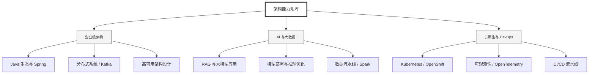

  <h1>你好，我是 Ellen Liu 👋</h1>
  

    <a href="README.md">English</a> | 
    <b>简体中文</b>
  

## 🧠 技术栈与核心能力

智能化企业系统建设路线图，涵盖全栈人工智能工程、云基础设施架构及模型部署等核心技术领域。

```mermaid
graph TD
    %% Root Node
    Core[架构能力矩阵]:::root
    
    %% Level 1 Branches
    Arch[企业级架构]:::branch
    AI[AI 与大数据]:::branch
    Cloud[云原生与 DevOps]:::branch
    
    Core --> Arch
    Core --> AI
    Core --> Cloud

    %% Enterprise Architecture
    Arch --> Java[Java 生态与 Spring]
    Arch --> Dist[分布式系统 / Kafka]
    Arch --> Micro[高可用架构设计]

    %% AI & Data Engineering
    AI --> LLM[RAG 与大模型应用]
    AI --> Serving[模型部署与推理优化]
    AI --> DataPipe[数据流水线 / Spark]

    %% Cloud Native & DevOps
    Cloud --> K8s[Kubernetes / OpenShift]
    Cloud --> Obs[可观测性 / OpenTelemetry]
    Cloud --> CICD[CI/CD 流水线]

    %% Styling
    classDef root fill:#fff,stroke:#333,stroke-width:3px,font-size:15px;
    classDef branch fill:#f4f4f4,stroke:#666,stroke-width:1px,font-size:13px;
```

## 🚀 Highlighted 工作

- **开源 AI 项目**: [基于 BERT 的声明检测模型](https://huggingface.co/XiaojingEllen/bert-finetuned-claim-detection) (Apache-2.0)
  - *已被哥伦比亚大学 (UBC) 研究项目引用。*
  - *手写 Transformer 核心代码，以验证理论与工程的一致性。*
- **金融基础设施**: 从 0 到 1 构建数字银行支付中间件及智能保险理赔系统。

## 📑 每日论文速递 (ArXiv)
<!-- DAILY_ARXIV_SUMMARY_START -->
**更新日期: 2026-07-15**

### 1. [MemOps：长时对话中生命周期内存操作的基准测试](http://arxiv.org/abs/2607.12893v1)
- **摘要**: 长期记忆已成为基于大语言模型的智能体在跨会话、多轮交互场景中的基础能力。然而现有基准几乎仅通过下游问答任务评估此类记忆，仅对最终答案的正确性进行评分。这种黑箱式评估将记忆失效的异质性原因混为一谈，例如遗漏相关事实的引入、将操作绑定到错误目标、或在修正后仍依赖过时数值。因此，即使答案依赖不一致或不安全的记忆状态，系统仍可能获得高分。本文认为，在动态长期交互中，记忆并非静态事实集合，而是包含记忆、遗忘、更新、反思及其组合的显式操作生命周期。我们提出MemOps基准，将对话记忆重构为生命周期操作序列，并通过结构化追踪记录每个记忆事件的触发条件、目标对象、作用范围、状态转换及支撑证据。可控生成流水线将这些操作嵌入长程任务导向对话中，生成黄金操作轨迹及六类操作级探针，在相邻证据与长上下文两种设置下进行评估。在长上下文、检索增强、参数化及托管记忆系统中，MemOps揭示了最终答案准确性所掩盖的失效模式，表明现有系统远未达到统一可靠性。例如，会话级检索优于轮次级检索，而长上下文模型在重构有序记忆状态轨迹方面仍显著薄弱。这些成果将长期记忆评估从最终答案评分转向可解释的操作级诊断。

### 2. [当缺乏参考答案时，大语言模型评判者可能过于宽容。](http://arxiv.org/abs/2607.12885v1)
- **摘要**: LLM裁判正越来越多地被用于评估开放式模型回答，通常是在无参考设置下进行，即缺乏标准答案。然而，在这种评估框架下，它们能否可靠地进行评判？本文通过两阶段流程探讨这一问题：a) 校准实验，评估裁判模型对评估任务的认知水平；b) 敏感性实验，分析提示中参考答案的存在与否及位置对裁判模型表现的影响。涵盖三种语言的实验表明，我们评估的裁判模型在缺乏参考答案时倾向于过度认可错误答案，而在某些实验设置中，向提示添加参考答案信息会使裁判模型对正确/错误判断的翻转幅度高达85%。与部分人工标注的对比显示，这些由参考驱动的变化通常与人类判断一致。我们的研究结果强调：在无参考场景中可靠使用LLM裁判前，需先通过含参考感知评估的样本对其进行校准；同时，本文方法为研究人员和实践者提供了对其他任务进行此类LLM裁判校准的蓝图。

### 3. [评估大语言模型在多轮医疗对话中的误解问题](http://arxiv.org/abs/2607.12884v1)
- **摘要**: 寻求医疗信息的患者常提出隐含错误假设或误解的问题。在此类情况下，安全的医疗沟通不仅需要回答问题，还需识别并纠正潜在的错误认知。这种互动自然呈现多轮对话特征，这一模式如今也体现在与大型语言模型（LLM）的交互中。然而，现有评估框架并未捕捉模型在误解可能产生、持续或演变的多轮对话场景中的行为表现。LLM能否随时间推移可靠地纠正此类误解，目前仍缺乏系统研究。为探究此问题，我们构建了ThReadMed-QA数据集——包含2437条医患对话线程（共8204个问答对）的多轮医疗对话数据集，数据源自AskDocs平台真实患者互动。该数据集支持系统评估模型在多轮对话中检测并纠正误解的能力。我们采用基于评分标准的LLM-as-a-Judge框架对五个LLM进行评估，根据其识别和纠正误解的能力对回答进行评分。实验揭示出一致规律：即便是能在一轮交互中处理误解的前沿模型，在后续轮次中表现也会显著下降。GPT-5与Claude-Haiku在首轮问题中纠正错误预设的成功率约为85%，但在两次追问后骤降至约50%。通过用医生回答替换模型先前输出的预言分析表明，性能下降主要源于错误传播，即便在正确语境下模型表现仍不完美。即使模型最初倾向于纠正误解，其后续轮次的表现仍会大幅衰退，导致面向患者的场景中出现不一致甚至不安全的指导，这凸显了建立捕捉多轮对话行为评估框架的必要性。

<!-- DAILY_ARXIV_SUMMARY_END -->

## 🌐 保持联系

  
<i>期待与您探讨 AI 基础设施的未来！</i>

