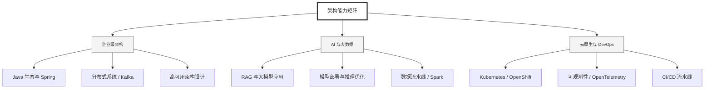

  <h1>你好，我是 Ellen Liu 👋</h1>
  

    <a href="README.md">English</a> | 
    <b>简体中文</b>
  

## 🧠 技术栈与核心能力

智能化企业系统建设路线图，涵盖全栈人工智能工程、云基础设施架构及模型部署等核心技术领域。

```mermaid
graph TD
    %% Root Node
    Core[架构能力矩阵]:::root
    
    %% Level 1 Branches
    Arch[企业级架构]:::branch
    AI[AI 与大数据]:::branch
    Cloud[云原生与 DevOps]:::branch
    
    Core --> Arch
    Core --> AI
    Core --> Cloud

    %% Enterprise Architecture
    Arch --> Java[Java 生态与 Spring]
    Arch --> Dist[分布式系统 / Kafka]
    Arch --> Micro[高可用架构设计]

    %% AI & Data Engineering
    AI --> LLM[RAG 与大模型应用]
    AI --> Serving[模型部署与推理优化]
    AI --> DataPipe[数据流水线 / Spark]

    %% Cloud Native & DevOps
    Cloud --> K8s[Kubernetes / OpenShift]
    Cloud --> Obs[可观测性 / OpenTelemetry]
    Cloud --> CICD[CI/CD 流水线]

    %% Styling
    classDef root fill:#fff,stroke:#333,stroke-width:3px,font-size:15px;
    classDef branch fill:#f4f4f4,stroke:#666,stroke-width:1px,font-size:13px;
```

## 🚀 Highlighted 工作

- **开源 AI 项目**: [基于 BERT 的声明检测模型](https://huggingface.co/XiaojingEllen/bert-finetuned-claim-detection) (Apache-2.0)
  - *已被哥伦比亚大学 (UBC) 研究项目引用。*
  - *手写 Transformer 核心代码，以验证理论与工程的一致性。*
- **金融基础设施**: 从 0 到 1 构建数字银行支付中间件及智能保险理赔系统。

## 📑 每日论文速递 (ArXiv)
<!-- DAILY_ARXIV_SUMMARY_START -->
**更新日期: 2026-05-15**

### 1. [WARDEN：基于6小时训练数据的濒危土著语言转录与翻译系统](http://arxiv.org/abs/2605.13846v1)
- **摘要**: 本文介绍了WARDEN系统，这是首个能够将澳大利亚濒危原住民语言瓦达曼语（Wardaman）转写并翻译为英语的早期语言模型系统。我们面临的核心挑战是缺乏大规模训练数据：实际上仅有6小时的标注音频。因此，虽然使用大规模数据集（如英法互译）训练单一模型进行转写和翻译是常见做法，但在瓦达曼语-英语场景下已不可行。为解决低资源挑战，我们设计WARDEN采用分离式转写与翻译模型：首先将瓦达曼语音输入转换为音素转写，再将转写结果翻译为英语。此外，我们提出两项增强性能的技术：在转写阶段，从与瓦达曼语共享相似音素的巽他语（Sundanese）初始化瓦达曼语词元，以加速转写模型微调；在翻译阶段，基于专家标注构建瓦达曼语-英语词典，将领域知识注入大语言模型（LLM）进行推理决策。实验证明，在极低数据环境下，这种两阶段设计优于依赖大规模数据的统一方法。仅使用6小时标注数据，WARDEN即超越更大规模的开源及商业模型，建立了强基准。相关数据与代码已开源。

### 2. [EVA-Bench：一种评估语音代理的新型端到端框架](http://arxiv.org/abs/2605.13841v1)
- **摘要**: 语音代理——即通过语音对话完成任务的人工智能系统——正越来越多地部署于企业应用场景。然而，现有基准测试均未能同时解决两大核心评估难题：生成逼真的模拟对话，以及全面衡量语音特有故障模式的质量。我们提出EVA-Bench这一端到端评估框架，同时攻克上述两大难题。在模拟层面，EVA-Bench通过动态多轮对话编排机器人间的音频交互，并配备自动模拟验证机制，可检测用户模拟器错误并在评分前适当重新生成对话。在测量层面，EVA-Bench引入两项复合指标：EVA-A（准确性）涵盖任务完成度、忠实度及音频级语音保真度；EVA-X（体验）涵盖对话推进、口语简洁性及话轮切换时序。两项指标均适用于不同代理架构，支持跨架构直接对比。EVA-Bench包含三大企业领域的213个场景、用于口音与噪声鲁棒性测试的受控扰动套件，以及区分峰值能力与可靠能力的pass@1、pass@k、pass^k测量指标。通过对覆盖三种架构的12个系统进行测试，我们发现：（1）尚无系统能在EVA-A pass@1与EVA-X pass@1上同时超过0.5；（2）峰值性能与可靠性能存在显著差异（EVA-A上pass@k与pass^k的中位数差距为0.44）；（3）口音与噪声扰动暴露出显著的鲁棒性差距，其影响因架构、系统及指标而异（均值最高达0.314）。我们以开源许可协议发布完整框架、评估套件及基准数据。

### 3. [优秀的智能体伙伴不仅提供口头建议：它们还能更新你的权重](http://arxiv.org/abs/2605.13839v1)
- **摘要**: 多智能体大语言模型系统通常通过交换自然语言消息进行协作。这种接口简单且可解释，但迫使每个发送方的中间计算被序列化为令牌，再由接收方重新处理，从而增加了生成令牌成本、预填充开销和KV缓存内存。我们研究了一种替代通信接口：不将发送方消息附加到接收方上下文，而是将发送方的隐藏状态编译为瞬态、接收方特定的权重扰动。我们提出TFlow（思维流），一种针对已知固定接收方架构的权重空间通信框架。对于每个查询，由固定角色提示的发送方智能体处理输入，学习型参数生成器将其内部激活映射为针对接收方模块的低秩LoRA扰动。这些扰动在接收方生成过程中融合并应用，实现实例级自适应，无需永久修改模型或扩大接收方文本上下文。使用三个Qwen3-4B智能体时，TFlow在五个基准测试中相比独立接收方最高提升8.5个准确率点，同时减少高达32.69%的已处理令牌。与基于文本的三智能体基线相比，其总处理令牌减少高达83.27%，实际推理时间加速最高达4.6倍，同时在五个基准测试中的四个保持竞争性准确率。这些结果表明，瞬态低秩权重扰动可作为高效多智能体大语言模型协作的可执行通信媒介。

<!-- DAILY_ARXIV_SUMMARY_END -->

## 🌐 保持联系

  
<i>期待与您探讨 AI 基础设施的未来！</i>

