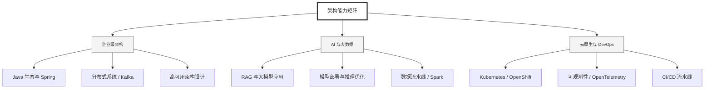

  <h1>你好，我是 Ellen Liu 👋</h1>
  

    <a href="README.md">English</a> | 
    <b>简体中文</b>
  

## 🧠 技术栈与核心能力

智能化企业系统建设路线图，涵盖全栈人工智能工程、云基础设施架构及模型部署等核心技术领域。

```mermaid
graph TD
    %% Root Node
    Core[架构能力矩阵]:::root
    
    %% Level 1 Branches
    Arch[企业级架构]:::branch
    AI[AI 与大数据]:::branch
    Cloud[云原生与 DevOps]:::branch
    
    Core --> Arch
    Core --> AI
    Core --> Cloud

    %% Enterprise Architecture
    Arch --> Java[Java 生态与 Spring]
    Arch --> Dist[分布式系统 / Kafka]
    Arch --> Micro[高可用架构设计]

    %% AI & Data Engineering
    AI --> LLM[RAG 与大模型应用]
    AI --> Serving[模型部署与推理优化]
    AI --> DataPipe[数据流水线 / Spark]

    %% Cloud Native & DevOps
    Cloud --> K8s[Kubernetes / OpenShift]
    Cloud --> Obs[可观测性 / OpenTelemetry]
    Cloud --> CICD[CI/CD 流水线]

    %% Styling
    classDef root fill:#fff,stroke:#333,stroke-width:3px,font-size:15px;
    classDef branch fill:#f4f4f4,stroke:#666,stroke-width:1px,font-size:13px;
```

## 🚀 Highlighted 工作

- **开源 AI 项目**: [基于 BERT 的声明检测模型](https://huggingface.co/XiaojingEllen/bert-finetuned-claim-detection) (Apache-2.0)
  - *已被哥伦比亚大学 (UBC) 研究项目引用。*
  - *手写 Transformer 核心代码，以验证理论与工程的一致性。*
- **金融基础设施**: 从 0 到 1 构建数字银行支付中间件及智能保险理赔系统。

## 📑 每日论文速递 (ArXiv)
<!-- DAILY_ARXIV_SUMMARY_START -->
**更新日期: 2026-04-04**

### 1. [批量上下文强化：一种面向高效推理的任务规模扩展法则](http://arxiv.org/abs/2604.02322v1)
- **摘要**: 采用思维链推理的大型语言模型虽能实现强劲性能，却存在过度消耗标记的问题，导致推理成本膨胀。现有提升效率的方法（如显式长度惩罚、难度估计器或多阶段课程学习）要么会降低推理质量，要么需要复杂的训练流程。我们提出批量上下文强化学习——一种极简的单阶段训练范式，仅通过简单的结构调整即可实现高效推理：训练模型在共享上下文窗口中同时解决N个问题，且仅以单实例准确率作为奖励依据。这种设计形成了隐式标记预算机制，并带来以下关键发现：（1）我们揭示了一种新颖的任务规模定律：在推理过程中，随着并行处理问题数N的增加，单问题标记使用量单调递减，而准确率下降幅度远低于基线方法，从而确立N作为可控吞吐量维度的地位。（2）BCR挑战了传统的准确率-效率权衡关系，在标准单问题推理场景中展现出"免费午餐"现象。在1.5B和4B参数规模的模型系列中，BCR在五大数学基准测试上持续保持或提升准确率的同时，将标记使用量降低了15.8%至62.6%。（3）定性分析揭示了模型自主调节效率的涌现能力：无需显式长度监督，模型即可自主消除冗余的元认知循环。（4）关键的是，我们通过实验证明隐式预算约束成功规避了显式长度惩罚固有的对抗性梯度和灾难性优化崩溃问题，为长度控制提供了高度稳定的约束型替代方案。这些结果验证了BCR的实用性，表明简单的结构化激励能够释放大语言模型中潜在的高密度推理能力。

### 2. [没有适用于多样性的单一最佳模型：为样本多样性学习路由机制](http://arxiv.org/abs/2604.02319v1)
- **摘要**: 当面对允许大量有效答案的提示时，全面生成这些答案是满足多样化用户需求的第一步。本文研究了如何系统性地引出全面有效的回答集合。为此，我们提出了**多样性覆盖率**这一评估指标，用于衡量预测答案集中每个**独特**答案所获质量评分总和，与同等规模下最优可能答案集的相对比值。基于该指标，我们对18个大语言模型进行评估，发现没有单一模型能在处理广泛开放式提示时始终主导多样性回答的生成。然而针对每个具体提示，总存在某个模型在生成多样性答案集方面显著优于其他模型。受此发现启发，我们设计了一个能根据查询预测最佳模型的调度器。在NB-Wildchat数据集上，经过训练的调度器性能超越单一最优模型基线（26.3%对比23.8%）。我们进一步验证了该方法在跨域数据集（NB-Curated）及不同答案生成提示策略上的泛化能力。本研究为在拥有多模型资源时生成全面答案的探索奠定了基础。

### 3. [依法而行：基于迭代式大语言模型自优化的监管规则结构化提取](http://arxiv.org/abs/2604.02276v1)
- **摘要**: 监管文件编码了基于大语言模型的系统必须遵守的具有法律约束力的义务。然而，将密集且具有层级结构的法律文本转化为机器可读规则，仍然是一个成本高昂且高度依赖专家参与的过程。我们提出De Jure——一个完全自动化、领域无关的流程，能够从原始文档中提取结构化监管规则，无需人工标注、领域特定提示或标注黄金数据。De Jure通过四个顺序阶段运行：将源文档规范化为结构化Markdown格式；通过大语言模型驱动将文本语义分解为结构化规则单元；基于19个维度（涵盖元数据、定义和规则语义）进行多标准的大语言模型作为裁判的评估；以及在有限再生预算内对低分提取结果进行迭代修复，其中上游组件会在规则单元评估前完成修复。

我们在涵盖金融、医疗和人工智能治理的三个监管语料库上，对四种模型进行了De Jure的评估。在金融领域，De Jure在提取质量上实现了持续且单调的改进，在三次裁判引导的迭代内达到峰值性能。De Jure能有效泛化至医疗和人工智能治理领域，在开源和闭源模型上均保持高性能表现。在基于检索增强生成的下游合规问答评估中，使用De Jure提取规则生成的回答在单规则检索深度下，73.8%的案例优于先前工作；在更广泛检索条件下，这一比例上升至84.0%，证实了提取保真度可直接转化为下游应用效用。这些结果表明，在复杂监管领域中，显式且可解释的评估标准可以替代人工标注，为基于监管的大语言模型对齐提供了一条可扩展且可审计的路径。

<!-- DAILY_ARXIV_SUMMARY_END -->

## 🌐 保持联系

  
<i>期待与您探讨 AI 基础设施的未来！</i>

