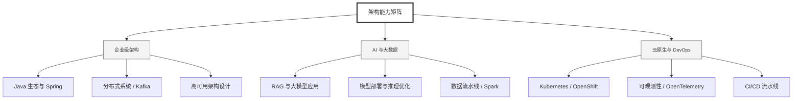

  <h1>你好，我是 Ellen Liu 👋</h1>
  

    <a href="README.md">English</a> | 
    <b>简体中文</b>
  

## 🧠 技术栈与核心能力

智能化企业系统建设路线图，涵盖全栈人工智能工程、云基础设施架构及模型部署等核心技术领域。

```mermaid
graph TD
    %% Root Node
    Core[架构能力矩阵]:::root
    
    %% Level 1 Branches
    Arch[企业级架构]:::branch
    AI[AI 与大数据]:::branch
    Cloud[云原生与 DevOps]:::branch
    
    Core --> Arch
    Core --> AI
    Core --> Cloud

    %% Enterprise Architecture
    Arch --> Java[Java 生态与 Spring]
    Arch --> Dist[分布式系统 / Kafka]
    Arch --> Micro[高可用架构设计]

    %% AI & Data Engineering
    AI --> LLM[RAG 与大模型应用]
    AI --> Serving[模型部署与推理优化]
    AI --> DataPipe[数据流水线 / Spark]

    %% Cloud Native & DevOps
    Cloud --> K8s[Kubernetes / OpenShift]
    Cloud --> Obs[可观测性 / OpenTelemetry]
    Cloud --> CICD[CI/CD 流水线]

    %% Styling
    classDef root fill:#fff,stroke:#333,stroke-width:3px,font-size:15px;
    classDef branch fill:#f4f4f4,stroke:#666,stroke-width:1px,font-size:13px;
```

## 🚀 Highlighted 工作

- **开源 AI 项目**: [基于 BERT 的声明检测模型](https://huggingface.co/XiaojingEllen/bert-finetuned-claim-detection) (Apache-2.0)
  - *已被哥伦比亚大学 (UBC) 研究项目引用。*
  - *手写 Transformer 核心代码，以验证理论与工程的一致性。*
- **金融基础设施**: 从 0 到 1 构建数字银行支付中间件及智能保险理赔系统。

## 📑 每日论文速递 (ArXiv)
<!-- DAILY_ARXIV_SUMMARY_START -->
**更新日期: 2026-04-17**

### 1. [从$P(y|x)$到$P(y)$：探索预训练空间中的强化学习](http://arxiv.org/abs/2604.14142v1)
- **摘要**: 尽管带有可验证奖励的强化学习（RLVR）通过优化条件分布P(y|x)显著提升了大型语言模型的推理能力，但其潜力从根本上受限于基础模型现有的输出分布。通过在预训练空间中优化边缘分布P(y)，能够将推理能力编码至模型中并保持广泛的探索能力，从而突破这一瓶颈。然而，传统预训练依赖静态语料库进行被动学习，导致分布偏移问题，阻碍了针对性的推理能力提升。本文提出预训练空间强化学习（PreRL），将奖励驱动的在线更新直接应用于P(y)。我们从理论和实验上验证了log P(y)与log P(y|x)之间的强梯度对齐关系，证明PreRL可作为标准强化学习的有效替代方案。更重要的是，我们揭示了PreRL中的关键机制：负样本强化（NSR）能成为推理能力的超强驱动引擎。NSR-PreRL能快速剪除错误推理空间，同时激发内生反思行为，使转换思维和反思思维分别提升14.89倍和6.54倍。基于这些发现，我们提出双空间强化学习（DSRL）——一种策略重生方案：先通过NSR-PreRL初始化模型以拓展推理边界，再转入标准强化学习进行细粒度优化。大量实验表明，DSRL始终优于现有基线方法，证明预训练空间剪枝能有效引导策略进入精炼的正确推理子空间。

### 2. [从感受到度量：理解并形式化用户如何对LLM进行氛围测试](http://arxiv.org/abs/2604.14137v1)
- **摘要**: 评估大型语言模型具有挑战性，因为基准测试分数往往难以反映模型在真实场景中的实用价值。用户通常转而依赖"氛围测试"——一种基于经验而非标准化的评估方式，例如结合自身工作流程对比不同模型在编码任务中的表现。尽管这种测试方式颇为流行，但其临时性和非结构化特点使其难以进行规模化分析与复现。本研究首先探究氛围测试的实际运作机制，进而将其系统化以支持结构化分析。我们首先分析了两类实证资源：(1)用户评估实践的调研数据，(2)来自博客和社交媒体的真实场景模型对比报告。基于这些资源，我们将氛围测试形式化为包含两个环节的过程：用户既个性化定制测试内容，又个性化设定响应评判标准。随后，我们提出概念验证评估框架，通过生成个性化提示词并采用用户感知的主观标准对比模型输出，实现了该形式化流程。在编码基准测试实验中，我们发现结合个性化提示与用户感知评估会改变模型偏好排序，这印证了氛围测试在实际应用中的价值。这些发现表明，系统化的氛围测试可作为连接基准分数与现实经验的有效桥梁。

### 3. [大语言模型表征中的反问句：一项线性探测研究](http://arxiv.org/abs/2604.14128v1)
- **摘要**: 反问句的提出并非为了获取信息，而是为了说服他人或表明立场。大型语言模型如何在内部表征这类问句，目前尚不明确。我们基于两个不同话语情境的社交媒体数据集，通过线性探针对LLM表征中的反问句进行分析，发现反问信号在模型早期层就已显现，且最稳定地体现在末词表征中。在同一数据集内，反问句与信息寻求型问句呈线性可分状态，并在跨数据集迁移中保持可检测性，其AUROC值约在0.7-0.8之间。然而，我们发现这种可迁移性并不等同于共享表征。在不同数据集上训练的探针应用于同一目标语料时，会产生不同的排序结果，其最高排名实例的重叠率通常低于0.2。定性分析表明，这种差异对应着不同的修辞现象：部分探针捕捉的是嵌入长篇论证中话语层面的修辞立场，而另一些则侧重于局部化、句法驱动的疑问行为。综合来看，这些发现表明LLM对反问句的表征并非通过单一共享方向编码，而是由多个强调不同线索的线性方向共同实现。

<!-- DAILY_ARXIV_SUMMARY_END -->

## 🌐 保持联系

  
<i>期待与您探讨 AI 基础设施的未来！</i>

