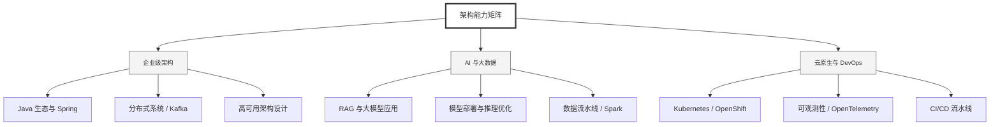

  <h1>你好，我是 Ellen Liu 👋</h1>
  

    <a href="README.md">English</a> | 
    <b>简体中文</b>
  

## 🧠 技术栈与核心能力

智能化企业系统建设路线图，涵盖全栈人工智能工程、云基础设施架构及模型部署等核心技术领域。

```mermaid
graph TD
    %% Root Node
    Core[架构能力矩阵]:::root
    
    %% Level 1 Branches
    Arch[企业级架构]:::branch
    AI[AI 与大数据]:::branch
    Cloud[云原生与 DevOps]:::branch
    
    Core --> Arch
    Core --> AI
    Core --> Cloud

    %% Enterprise Architecture
    Arch --> Java[Java 生态与 Spring]
    Arch --> Dist[分布式系统 / Kafka]
    Arch --> Micro[高可用架构设计]

    %% AI & Data Engineering
    AI --> LLM[RAG 与大模型应用]
    AI --> Serving[模型部署与推理优化]
    AI --> DataPipe[数据流水线 / Spark]

    %% Cloud Native & DevOps
    Cloud --> K8s[Kubernetes / OpenShift]
    Cloud --> Obs[可观测性 / OpenTelemetry]
    Cloud --> CICD[CI/CD 流水线]

    %% Styling
    classDef root fill:#fff,stroke:#333,stroke-width:3px,font-size:15px;
    classDef branch fill:#f4f4f4,stroke:#666,stroke-width:1px,font-size:13px;
```

## 🚀 Highlighted 工作

- **开源 AI 项目**: [基于 BERT 的声明检测模型](https://huggingface.co/XiaojingEllen/bert-finetuned-claim-detection) (Apache-2.0)
  - *已被哥伦比亚大学 (UBC) 研究项目引用。*
  - *手写 Transformer 核心代码，以验证理论与工程的一致性。*
- **金融基础设施**: 从 0 到 1 构建数字银行支付中间件及智能保险理赔系统。

## 📑 每日论文速递 (ArXiv)
<!-- DAILY_ARXIV_SUMMARY_START -->
**更新日期: 2026-04-24**

### 1. [“AI”能当医生吗？临床大语言模型中的共情、可读性与对齐研究](http://arxiv.org/abs/2604.20791v1)
- **摘要**: 大型语言模型（LLMs）在医疗领域的应用日益广泛，但其与临床标准的沟通一致性尚未得到充分量化。我们针对通用型与领域专用型大语言模型，在结构化医学解释与真实医患互动场景中开展多维度评估，重点分析语义保真度、可读性及情感共鸣度。基线模型相较于医生会放大情感极性（极端负面情绪占比：43.14-45.10% vs. 37.25%），且在GPT-5、Claude等大型架构中产生显著更高的语言复杂度（FKGL指数达16.91-17.60，而医生撰写的回答为11.47-12.50）。共情导向提示可降低极端负面情绪与年级水平复杂度（GPT-5的FKGL指数最多降低6.87分），但未能显著提升语义保真度。协作改写方案实现最优整体对齐效果：改写配置在医生回答的语义相似度上达到最高值（均值=0.93），同时持续改善可读性并降低情感极端性。双利益相关方评估显示，在认知标准维度无模型超越医生，而患者群体始终偏好改写版本在清晰度与情感基调上的表现。这些发现表明，大语言模型最有效的应用方式是作为协作沟通增强工具，而非临床专业知识的替代品。

### 2. [动态定价下的大语言模型增强货运谈判中的锚定与恢复让步策略](http://arxiv.org/abs/2604.20732v1)
- **摘要**: 货运经纪人在动态定价条件下每日协商数千条运价，模型在对话中频繁调整目标。传统的时间依赖让步框架使用固定形状参数β，无法适应这些更新。从实时价差推导β虽能实现适应性，但引入新问题：定价变动可能导致公式撤回先前报价，违反单调性。基于大语言模型的经纪人虽具灵活性，但需昂贵推理模型、产生非确定性定价，且易受提示注入攻击。

我们提出双索引锚定-恢复框架以解决上述局限。基于价差推导的β将每批货物的利润结构映射至正确让步姿态，而锚定-恢复机制确保在任意定价变动下报价保持单调非递减。所有定价决策仍由确定性公式完成；大语言模型（若使用）仅作为自然语言翻译层。基于115,125次谈判的实证评估表明，自适应β可根据市场环境调整行为：在窄价差中快速让步以优先达成交易和覆盖运力；在中宽价差中，其在经纪人节省方面达到或超越最优固定β基线。与不受约束的200亿参数大语言模型经纪人相比，该框架达成相近的协议率与节省效果。面对基于大语言模型的承运商（更现实的随机对手方）时，其维持可比节省效果且协议率高于规则型对手。通过将大语言模型与定价逻辑解耦，该框架可水平扩展至数千并发谈判，推理成本可忽略且决策透明。

### 3. [通过提示优化利用LLM作为裁判在自由文本法律问答中的倾向性](http://arxiv.org/abs/2604.20726v1)
- **摘要**: 本研究探讨了提示设计（prompt design）与裁判选择（judge selection）在基于大语言模型作为裁判（LLM-as-a-Judge）评估自由文本法律问答任务中的作用。我们系统考察了以下问题：自动任务提示优化是否优于人工中心化设计；优化效果是否因裁判反馈风格而异；以及优化后的提示能否在不同裁判间迁移。为此，我们在LEXam基准上采用ProTeGi方法，利用两位裁判（Qwen3-32B、DeepSeek-V3）的反馈对四个任务模型的提示进行优化，并测试跨裁判迁移效果。实验表明，自动优化始终优于基线，且宽松型裁判反馈带来的性能提升幅度和稳定性均高于严格型裁判反馈。基于宽松反馈优化的提示向严格裁判迁移的效果优于反向迁移。分析发现，宽松裁判提供包容性反馈，生成的提示具有更广泛的适用性；而严格裁判的约束性反馈则导致提示出现针对特定裁判的过拟合现象。本研究证明，基于训练数据算法化优化提示可超越人工中心化提示设计，且优化过程中裁判的倾向性会塑造提示的泛化能力。相关代码及优化提示已开源至 https://github.com/TUMLegalTech/icail2026-llm-judge-gaming。

<!-- DAILY_ARXIV_SUMMARY_END -->

## 🌐 保持联系

  
<i>期待与您探讨 AI 基础设施的未来！</i>

