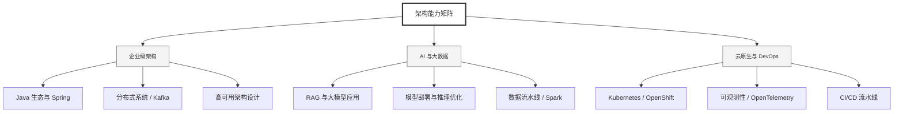

  <h1>你好，我是 Ellen Liu 👋</h1>
  

    <a href="README.md">English</a> | 
    <b>简体中文</b>
  

## 🧠 技术栈与核心能力

智能化企业系统建设路线图，涵盖全栈人工智能工程、云基础设施架构及模型部署等核心技术领域。

```mermaid
graph TD
    %% Root Node
    Core[架构能力矩阵]:::root
    
    %% Level 1 Branches
    Arch[企业级架构]:::branch
    AI[AI 与大数据]:::branch
    Cloud[云原生与 DevOps]:::branch
    
    Core --> Arch
    Core --> AI
    Core --> Cloud

    %% Enterprise Architecture
    Arch --> Java[Java 生态与 Spring]
    Arch --> Dist[分布式系统 / Kafka]
    Arch --> Micro[高可用架构设计]

    %% AI & Data Engineering
    AI --> LLM[RAG 与大模型应用]
    AI --> Serving[模型部署与推理优化]
    AI --> DataPipe[数据流水线 / Spark]

    %% Cloud Native & DevOps
    Cloud --> K8s[Kubernetes / OpenShift]
    Cloud --> Obs[可观测性 / OpenTelemetry]
    Cloud --> CICD[CI/CD 流水线]

    %% Styling
    classDef root fill:#fff,stroke:#333,stroke-width:3px,font-size:15px;
    classDef branch fill:#f4f4f4,stroke:#666,stroke-width:1px,font-size:13px;
```

## 🚀 Highlighted 工作

- **开源 AI 项目**: [基于 BERT 的声明检测模型](https://huggingface.co/XiaojingEllen/bert-finetuned-claim-detection) (Apache-2.0)
  - *已被哥伦比亚大学 (UBC) 研究项目引用。*
  - *手写 Transformer 核心代码，以验证理论与工程的一致性。*
- **金融基础设施**: 从 0 到 1 构建数字银行支付中间件及智能保险理赔系统。

## 📑 每日论文速递 (ArXiv)
<!-- DAILY_ARXIV_SUMMARY_START -->
**更新日期: 2026-03-25**

### 1. [TiCo：面向口语对话模型的时间可控训练](http://arxiv.org/abs/2603.22267v1)
- **摘要**: 我们提出TiCo，这是一种简单的后训练方法，旨在使口语对话模型能够遵循时间约束指令，并生成时长可控的响应。这种能力对于现实世界中的口语系统（如语音助手和交互式智能体）具有重要价值，因为控制响应时长可以提升交互质量。然而，尽管现有模型在生成自然口语响应方面表现出色，但它们缺乏时间意识，难以遵循与时长相关的指令（例如"请生成一段约15秒的回复"）。通过对开源和商业口语对话模型的实证评估，我们发现它们经常无法满足此类时间控制要求。TiCo通过让模型在生成过程中借助口语时间标记（例如<10.6秒>）来估计已用说话时间，从而解决了这一局限。这些标记帮助模型保持时间意识，并调整剩余内容以满足目标时长。TiCo方法简单高效：仅需少量数据且无需额外的问答对，而是依赖自生成和强化学习。实验结果表明，TiCo在保持响应质量的同时，显著提升了模型对时长约束的遵循能力。

### 2. [更高的可访问性可能加剧生成式人工智能中的歧视问题。](http://arxiv.org/abs/2603.22260v1)
- **摘要**: 数亿人依赖大型语言模型（LLM）进行教育、工作和医疗活动。然而众所周知，这些模型会复制并放大训练数据中存在的社会偏见。此外，基于文本的交互界面仍对许多用户构成障碍，例如读写能力有限者、运动功能障碍者或仅使用移动设备者。语音交互有望提升可访问性，但与文本不同，语音携带的身份线索难以被用户隐藏，这引发了人们对可访问性提升是否可能以公平性为代价的担忧。本文研究表明，支持音频功能的大型语言模型存在系统性性别歧视——仅根据说话者语音就会使回答偏向性别刻板印象的形容词和职业，其偏见放大效应甚至超过基于文本的交互。由此可见，语音界面并非简单将文本模型扩展至新模态，而是引入了与副语言线索相关的独特偏见机制。补充调查证据（样本量=1000）显示，不常使用聊天机器人的用户最抗拒未声明的属性推断，且在发现此类操作时最可能停止使用。为探索潜在缓解策略，我们证明通过音高调节可系统性调控性别歧视性输出。总体而言，我们的研究揭示了人工智能发展中的一个关键矛盾：通过语音界面提升可访问性的努力，同时创造了新的歧视路径，这要求我们必须同步解决公平性与可访问性问题。

### 3. [SPA：一个简单却难以超越的知识注入基准线](http://arxiv.org/abs/2603.22213v1)
- **摘要**: 尽管大型语言模型（LLM）已在海量数据上进行预训练，但其在专业性强、数据稀缺的领域仍存在知识覆盖不全的问题，这促使学界广泛研究通过合成数据生成进行知识注入的方法。我们提出SPA（规模化提示工程增强）方法——一种简洁却难以被超越的基线方案，它通过少量精心设计的提示模板生成大规模合成数据以实现知识注入。系统性对比实验表明，SPA在多项指标上优于现有强基线方法。此外，我们发现先前方法存在两个关键局限：（1）基于强化学习的方法虽能在小规模场景下提升基于LLM的数据增强的标记效率，但随着数据规模扩大，其多样性会急剧衰减，导致收益递减；（2）多阶段提示方法虽可能优于简单增强方案，但经过精细提示调优后，其优势可能消失。我们的研究结果表明，对于知识注入任务，精心设计的提示模板结合直接的大规模数据增强能产生超乎预期的效果。我们希望SPA能为该领域的后续研究提供坚实的基线参考。代码已开源：https://github.com/Tangkexian/SPA。

<!-- DAILY_ARXIV_SUMMARY_END -->

## 🌐 保持联系

  
<i>期待与您探讨 AI 基础设施的未来！</i>

