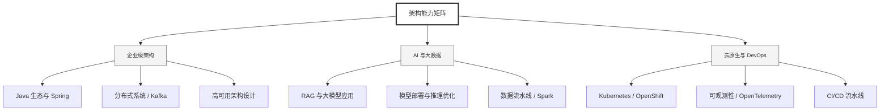

  <h1>你好，我是 Ellen Liu 👋</h1>
  

    <a href="README.md">English</a> | 
    <b>简体中文</b>
  

## 🧠 技术栈与核心能力

智能化企业系统建设路线图，涵盖全栈人工智能工程、云基础设施架构及模型部署等核心技术领域。

```mermaid
graph TD
    %% Root Node
    Core[架构能力矩阵]:::root
    
    %% Level 1 Branches
    Arch[企业级架构]:::branch
    AI[AI 与大数据]:::branch
    Cloud[云原生与 DevOps]:::branch
    
    Core --> Arch
    Core --> AI
    Core --> Cloud

    %% Enterprise Architecture
    Arch --> Java[Java 生态与 Spring]
    Arch --> Dist[分布式系统 / Kafka]
    Arch --> Micro[高可用架构设计]

    %% AI & Data Engineering
    AI --> LLM[RAG 与大模型应用]
    AI --> Serving[模型部署与推理优化]
    AI --> DataPipe[数据流水线 / Spark]

    %% Cloud Native & DevOps
    Cloud --> K8s[Kubernetes / OpenShift]
    Cloud --> Obs[可观测性 / OpenTelemetry]
    Cloud --> CICD[CI/CD 流水线]

    %% Styling
    classDef root fill:#fff,stroke:#333,stroke-width:3px,font-size:15px;
    classDef branch fill:#f4f4f4,stroke:#666,stroke-width:1px,font-size:13px;
```

## 🚀 Highlighted 工作

- **开源 AI 项目**: [基于 BERT 的声明检测模型](https://huggingface.co/XiaojingEllen/bert-finetuned-claim-detection) (Apache-2.0)
  - *已被哥伦比亚大学 (UBC) 研究项目引用。*
  - *手写 Transformer 核心代码，以验证理论与工程的一致性。*
- **金融基础设施**: 从 0 到 1 构建数字银行支付中间件及智能保险理赔系统。

## 📑 每日论文速递 (ArXiv)
<!-- DAILY_ARXIV_SUMMARY_START -->
**更新日期: 2026-04-30**

### 1. [递归式多智能体系统](http://arxiv.org/abs/2604.25917v1)
- **摘要**: 递归或循环语言模型近期作为一种新的扩展维度出现，通过在潜在状态上迭代优化同一模型计算来深化推理。我们将这种扩展原则从单一模型推广至多智能体系统，并提出问题：智能体协作本身能否通过递归实现扩展？为此，我们提出RecursiveMAS——一种递归多智能体框架，将整个系统统一为潜在空间中的递归计算。RecursiveMAS通过轻量级RecursiveLink模块将异构智能体连接为协作循环，支持分布内潜在思维生成与跨智能体潜在状态传递。为优化该框架，我们开发了内外环学习算法，通过跨递归轮次的共享梯度信用分配实现迭代式全系统协同优化。运行时复杂度与学习动态的理论分析表明，RecursiveMAS比标准文本型MAS更高效，且在递归训练中保持梯度稳定。实验方面，我们在4种代表性智能体协作模式下实例化RecursiveMAS，并在涵盖数学、科学、医学、搜索与代码生成的9个基准测试中进行评估。与先进的单/多智能体及递归计算基线相比，RecursiveMAS平均准确率提升8.3%，端到端推理速度提升1.2至2.4倍，令牌使用量减少34.6%至75.6%。代码与数据已发布于https://recursivemas.github.io。

### 2. [DV-World：在真实场景中评估数据可视化智能体的基准](http://arxiv.org/abs/2604.25914v1)
- **摘要**: 现实世界的数据可视化（DV）需要原生环境支撑、跨平台演进以及主动意图对齐。然而，现有基准测试常受限于代码沙箱环境、单一语言创作任务以及完美意图假设。为弥合这些差距，我们提出DV-World——一个包含260个任务的基准测试，旨在评估DV代理在真实世界专业生命周期中的表现。DV-World涵盖三大领域：DV-Sheet聚焦原生电子表格操作，包括图表与仪表盘创建及诊断修复；DV-Evolution要求跨多种编程范式适配并重构参考可视化制品以适应新数据；DV-Interact则通过模拟真实世界模糊需求的用户模拟器，实现主动意图对齐。我们的混合评估框架整合了数值精度导向的表格值对齐（Table-value Alignment）与基于评分标准的MLLM-as-a-Judge语义视觉评估。实验表明，当前最先进模型整体性能不足50%，暴露出其在应对现实数据可视化复杂挑战时的关键缺陷。DV-World为引导开发方向提供了逼真的测试平台，助力培养企业工作流所需的多维专业能力。相关数据与代码已开源至\href{https://github.com/DA-Open/DV-World}{项目主页}。

### 3. [从语法到情感：大型语言模型中情感推理的机制分析](http://arxiv.org/abs/2604.25866v1)
- **摘要**: 大型语言模型（LLMs）正越来越多地应用于情感敏感的人机交互场景，然而关于情感识别在模型内部如何表征的认知仍十分有限。本研究通过稀疏自编码器（SAEs）探究LLMs情感识别的内在机制。通过分析各层稀疏特征激活模式，我们识别出稳定的三阶段信息流，其中情感相关特征仅在最终阶段显现。进一步研究表明，情感表征既包含跨情感共享特征，也包含情感特异性特征。通过分层因果追踪，我们定位到一组对情感预测具有显著影响的关键特征，并发现这些特征的数量与因果效应强度因情感类别而异——其中"厌恶"情感的表征较其他情感更为薄弱且分散。最后，我们提出一种兼具可解释性与数据效率的因果特征调控方法，该方法在显著提升多模型情感识别性能的同时，基本保持语言建模能力，且这些改进可泛化至多个情感识别数据集。总体而言，本研究系统揭示了LLMs情感识别的内部机制，并提出了一种高效、可解释且可控的模型性能优化方案。

<!-- DAILY_ARXIV_SUMMARY_END -->

## 🌐 保持联系

  
<i>期待与您探讨 AI 基础设施的未来！</i>

