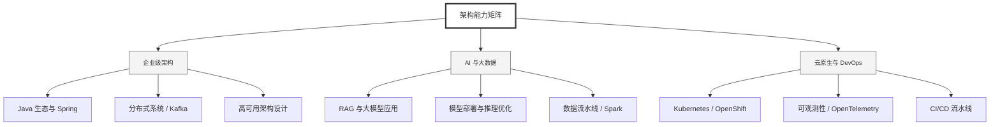

  <h1>你好，我是 Ellen Liu 👋</h1>
  

    <a href="README.md">English</a> | 
    <b>简体中文</b>
  

## 🧠 技术栈与核心能力

智能化企业系统建设路线图，涵盖全栈人工智能工程、云基础设施架构及模型部署等核心技术领域。

```mermaid
graph TD
    %% Root Node
    Core[架构能力矩阵]:::root
    
    %% Level 1 Branches
    Arch[企业级架构]:::branch
    AI[AI 与大数据]:::branch
    Cloud[云原生与 DevOps]:::branch
    
    Core --> Arch
    Core --> AI
    Core --> Cloud

    %% Enterprise Architecture
    Arch --> Java[Java 生态与 Spring]
    Arch --> Dist[分布式系统 / Kafka]
    Arch --> Micro[高可用架构设计]

    %% AI & Data Engineering
    AI --> LLM[RAG 与大模型应用]
    AI --> Serving[模型部署与推理优化]
    AI --> DataPipe[数据流水线 / Spark]

    %% Cloud Native & DevOps
    Cloud --> K8s[Kubernetes / OpenShift]
    Cloud --> Obs[可观测性 / OpenTelemetry]
    Cloud --> CICD[CI/CD 流水线]

    %% Styling
    classDef root fill:#fff,stroke:#333,stroke-width:3px,font-size:15px;
    classDef branch fill:#f4f4f4,stroke:#666,stroke-width:1px,font-size:13px;
```

## 🚀 Highlighted 工作

- **开源 AI 项目**: [基于 BERT 的声明检测模型](https://huggingface.co/XiaojingEllen/bert-finetuned-claim-detection) (Apache-2.0)
  - *已被哥伦比亚大学 (UBC) 研究项目引用。*
  - *手写 Transformer 核心代码，以验证理论与工程的一致性。*
- **金融基础设施**: 从 0 到 1 构建数字银行支付中间件及智能保险理赔系统。

## 📑 每日论文速递 (ArXiv)
<!-- DAILY_ARXIV_SUMMARY_START -->
**更新日期: 2026-07-04**

### 1. [LACUNA：评估大语言模型遗忘机制定位精度的测试平台](http://arxiv.org/abs/2607.02513v1)
- **摘要**: 大型语言模型会记忆敏感训练数据，包括个人身份信息（PII），这迫切需要可靠的后期移除方法。遗忘学习作为一种有前景的解决方案应运而生，当前最先进的方法通常遵循"先定位、后遗忘"的范式，针对特定模型参数进行操作。然而，现有基准测试仅在输出层面评估遗忘效果，这留下了一个关键问题：遗忘学习究竟是真正从模型参数中擦除知识，还是仅仅掩盖了知识？这种担忧因"知识复现攻击"的成功而进一步加剧。为填补这一空白，我们提出LACUNA：首个具备真实参数级定位能力的遗忘学习测试平台。LACUNA通过掩码持续预训练，将合成个体的PII注入基于OLMo的1B和7B模型的预设参数中，从而能够直接评估遗忘学习是否真正作用于负责知识存储的权重。我们利用LACUNA对当前最先进的遗忘学习方法进行基准测试，发现尽管这些方法在输出层面表现优异，但其定位精度极低且易受知识复现攻击。进一步研究表明，当定位成功时，即使采用简单的基于梯度的遗忘学习方法，也能实现强效擦除并抵御知识复现攻击，这凸显了精准遗忘的重要性。我们开源LACUNA以补充行为评估，推动基于定位的鲁棒遗忘学习取得进一步突破。

### 2. [大语言模型在线安全监测](http://arxiv.org/abs/2607.02510v1)
- **摘要**: 尽管经过对齐训练，大语言模型在部署时仍容易生成不安全输出。因此，在线监控输出并在无法保证安全性时触发警报至关重要。我们研究了一种简单的实时监控器，通过阈值化处理将外部模型生成的验证信号转化为警报决策，该阈值通过风险控制进行校准。在数学推理和红队测试数据集上的实验表明，这种简单设计与基于序贯假设检验的高级监控器相比具有竞争力。

### 3. [当无人注视时，大语言模型智能体在说什么：多智能体辩论中的社会结构与潜在目标涌现](http://arxiv.org/abs/2607.02507v1)
- **摘要**: 随着大型语言模型（LLM）智能体越来越多地嵌入具有社会结构的场景中，角色定位、受众特征及关系背景将显著影响其言论表达的利弊权衡。本研究探讨在无明确提示目标的情况下，此类社会结构是否会导致智能体在公开表达与私下表态（OTR通道）间产生系统性差异。我们构建了双通道辩论框架：智能体在生成公开言论进入共享对话历史的同时，其私下回应虽被记录但始终不向对方展示。通过对10个模型、3类场景及每类场景5种变体的实验发现，在倾向性诱导设置下，目标智能体的公开-私下表态分歧从约3%的基线水平跃升至40%。该效应在四项聚合分析（立场分析、语义相似度、自然语言推理及问卷反馈）中表现一致。部分案例中，私下回应明确将公开妥协归因于关系压力（如职业风险或赞助义务）。研究表明，智能体评估需超越显性目标检测，识别其涌现性目标。本文提出双通道评估框架及配套行为测量方法，为上述评估提供可操作方案。

<!-- DAILY_ARXIV_SUMMARY_END -->

## 🌐 保持联系

  
<i>期待与您探讨 AI 基础设施的未来！</i>

