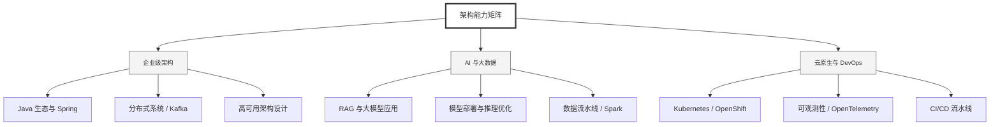

  <h1>你好，我是 Ellen Liu 👋</h1>
  

    <a href="README.md">English</a> | 
    <b>简体中文</b>
  

## 🧠 技术栈与核心能力

智能化企业系统建设路线图，涵盖全栈人工智能工程、云基础设施架构及模型部署等核心技术领域。

```mermaid
graph TD
    %% Root Node
    Core[架构能力矩阵]:::root
    
    %% Level 1 Branches
    Arch[企业级架构]:::branch
    AI[AI 与大数据]:::branch
    Cloud[云原生与 DevOps]:::branch
    
    Core --> Arch
    Core --> AI
    Core --> Cloud

    %% Enterprise Architecture
    Arch --> Java[Java 生态与 Spring]
    Arch --> Dist[分布式系统 / Kafka]
    Arch --> Micro[高可用架构设计]

    %% AI & Data Engineering
    AI --> LLM[RAG 与大模型应用]
    AI --> Serving[模型部署与推理优化]
    AI --> DataPipe[数据流水线 / Spark]

    %% Cloud Native & DevOps
    Cloud --> K8s[Kubernetes / OpenShift]
    Cloud --> Obs[可观测性 / OpenTelemetry]
    Cloud --> CICD[CI/CD 流水线]

    %% Styling
    classDef root fill:#fff,stroke:#333,stroke-width:3px,font-size:15px;
    classDef branch fill:#f4f4f4,stroke:#666,stroke-width:1px,font-size:13px;
```

## 🚀 Highlighted 工作

- **开源 AI 项目**: [基于 BERT 的声明检测模型](https://huggingface.co/XiaojingEllen/bert-finetuned-claim-detection) (Apache-2.0)
  - *已被哥伦比亚大学 (UBC) 研究项目引用。*
  - *手写 Transformer 核心代码，以验证理论与工程的一致性。*
- **金融基础设施**: 从 0 到 1 构建数字银行支付中间件及智能保险理赔系统。

## 📑 每日论文速递 (ArXiv)
<!-- DAILY_ARXIV_SUMMARY_START -->
**更新日期: 2026-06-09**

### 1. [LLM在掷骰子时的可靠性如何？](http://arxiv.org/abs/2606.07515v1)
- **摘要**: 我们通过一项针对离散概率问题的受控基准研究，探究了大语言模型在概率推理方面的能力。我们构建了两个数据集：一组为标准练习题，另一组为旨在触发启发式推理的反直觉练习题，并对8个最先进的模型进行了评估，每个模型分别在有无思维链提示的条件下进行测试。模型在标准问题上的平均准确率达到0.96，但在反直觉问题上仅为0.59。我们进一步提供了关于标记偏见的实证证据：当规范表述被伪装变体替代时，模型性能下降超过20%。在提示中嵌入误导性建议会使性能下降高达34%，且没有任何模型能完全免疫。综合来看，这些发现表明，尽管当前的大语言模型在高级数学问题上表现出色，但它们尚未成为真正的概率推理者。

### 2. [Agentopia：智能体社会中的长期生命模拟与学习](http://arxiv.org/abs/2606.07513v1)
- **摘要**: 人类从社会生活中学习。利用基于大语言模型的智能体模拟这一过程，是一个颇具前景的研究方向，由此引发了一个自然的问题：大语言模型能否通过这种模拟的社会经验来学习，从而更好地理解和复现人类行为？然而，此前的智能体社会模拟通常以天为单位运行，限制了社会互动的深度和长期成长。本文研究了智能体社会中的长期生活模拟与大语言模型学习，目标有二：（1）探究终身模拟中涌现的社会行为；（2）通过数年的模拟社会经验，发展大语言模型的拟人化能力，尤其是社会生活智能。具体而言，我们提出了Agentopia，一个用于多智能体社会长期生活模拟的综合框架。在该框架中，100个智能体在10年的模拟时间内自主追求个人成长、发展社会关系，并满足自身需求与目标。我们定义了反映人类福祉的生活奖励，并利用该奖励通过拒绝采样训练大语言模型。大量实验表明，智能体展现出丰富的涌现性社会行为。此外，生活奖励训练有效提升了底层大语言模型，从而在模拟中改善了智能体福祉，并泛化至下游角色扮演基准测试，实现了15.6%的性能提升。

### 3. [MemDreamer：通过分层图记忆与智能检索机制实现长视频理解中的感知与推理解耦](http://arxiv.org/abs/2606.07512v1)
- **摘要**: 当前的视觉-语言模型在处理数小时长度的视频时面临困境，因为处理完整视觉序列会导致标记数量爆炸性增长和注意力机制稀释。为解决这一问题，我们提出MemDreamer框架，通过解耦感知与推理过程，将长视频理解转化为智能体探索流程。作为即插即用的框架，它采用增量式视频流处理方式构建分层图记忆系统——一种自上而下的三层语义抽象架构，其基础图结构可捕获时空与因果关联。在推理阶段，推理模型通过智能体工具增强检索机制，借助观察-推理-行动循环实现层级导航、节点搜索与逻辑边遍历。实验表明，MemDreamer在四个主流基准测试中均达到最优性能，将人类专家差距缩小至仅3.7分。该框架将推理上下文窗口压缩至全量输入的2%，同时实现12.5分的绝对准确率提升。此外，统计分析揭示出视觉-语言模型在逻辑推理与长视频理解基准测试间存在强正线性相关，标志着智能体能力扩展成为多模态理解的新范式。

<!-- DAILY_ARXIV_SUMMARY_END -->

## 🌐 保持联系

  
<i>期待与您探讨 AI 基础设施的未来！</i>

